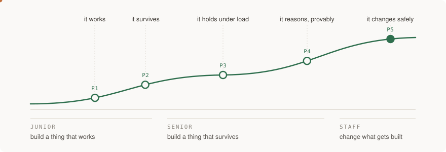

# junior → staff

An end-to-end guide to being a software engineer, for someone who will build
most of the code by directing an AI and needs to be able to **judge what comes
back**.

Three tiers. Five projects. The same system growing the whole way, rather than
five unrelated toys.

---

## Why this exists

Most roadmap repos are a list of things to learn with links attached. They go
stale, nobody finishes them, and they teach the names of technologies rather
than the judgment that decides between them.

This one is built on a different bet: **the part of engineering that does not
get automated is knowing what to ask for, what good looks like, and how to tell
when you have been handed something that is plausible and wrong.** So every
section here carries four things a roadmap does not:

- the **failure it prevents**, concretely
- what to **ask Claude for**, in words, and why the ask is shaped that way
- **how you would know it is wrong** — checks that can actually go red
- a **slice of the running project**, with acceptance criteria you can check yourself

If every external link in this repo died tomorrow, it would still teach. That is
the standard it is written to. See [docs/STYLE.md](docs/STYLE.md) for the rules
every section follows.

---

## How to use it

1. **Read a section.** They are written to be read, not skimmed.
2. **Build the slice.** Each section adds one thing to the project you already
   have. Use Claude for it; the section tells you what to ask.
3. **Run the checks.** Every section has a "how you would know it is wrong".
   Actually run them. A green result you never tried to make go red is not
   evidence of anything.
4. **Move on when the acceptance criteria pass**, not when you feel finished.

You do not have to do the tiers in order if you already work at that level. You
do have to do the projects in order — each one is the previous one under more
pressure.

Longer version: [docs/HOW-TO-USE.md](docs/HOW-TO-USE.md).

---

## The five projects

| | project | what it proves you can do |
|---|---|---|
| **P1** | it works | ship a small full-stack thing with auth, data and tests that bite |
| **P2** | it survives | the same system with CI/CD, infrastructure as code, backups and enough observability to debug it at 3am |
| **P3** | it holds under load | queues, caching, idempotency and rate limits, then break it on purpose and measure what happens |
| **P4** | it reasons, provably | an AI feature with a real evaluation harness, guardrails, and a cost and latency budget |
| **P5** | it changes safely | a migration of the system you built, with a design doc, a rollout plan, kill criteria and a written postmortem |

Each project has its own brief in [projects/](projects/) with scope, acceptance
criteria, the architecture decisions you are being asked to make, and the
failures you should deliberately induce.

---

## The sections

### Junior — build a thing that works

You can take a requirement and produce something that runs, and you can tell
whether it runs.

| | section | what it buys you |
|---|---|---|
| 01 | [The change loop](tiers/01-junior/01-the-change-loop/) | how a change gets from an idea into running software, and why review capacity is now the bottleneck |
| 02 | [Working with an AI that writes the code](tiers/01-junior/02-working-with-an-ai/) | specification and verification — the two skills that did not get cheaper |
| 03 | [Frontend](tiers/01-junior/03-frontend/) | where rendering happens, where state lives, and accessibility as a legal floor |
| 04 | [Backend](tiers/01-junior/04-backend/) | the request lifecycle and every point at which it can stop |
| 05 | [Data and databases](tiers/01-junior/05-data-and-databases/) | the schema is the part you cannot take back |
| 06 | [Testing](tiers/01-junior/06-testing/) | making breakage loud instead of silent |
| 07 | [Shipping it](tiers/01-junior/07-shipping-it/) | environments, configuration, secrets, and dependencies as attack surface |

### Senior — build a thing that survives

It keeps working under load, when a dependency fails, when somebody else changes
it, and at three in the morning while you are asleep.

| | section | what it buys you |
|---|---|---|
| 08 | System design | the thinking process, not the interview ritual |
| 09 | Reliability | SLOs, error budgets, degradation, backpressure, idempotency |
| 10 | Observability | answering "what happened?" without guessing, and what that costs |
| 11 | Security | authorisation, secrets, and the supply chain you did not know you had |
| 12 | Delivery | CI/CD, infrastructure as code, progressive rollout |
| 13 | Data at scale | caching, queues, consistency, and what actually breaks first |
| 14 | Performance and cost | finding both, and the fact that they are the same skill |
| 15 | [AI systems](tiers/02-senior/15-ai-systems/) | retrieval, evaluation harnesses, guardrails, cost and latency budgets |

### Staff — change what gets built

Your leverage stops being the code you write. It becomes the decisions you make
and the engineers you make faster.

| | section | what it buys you |
|---|---|---|
| 16 | [Scope and leverage](tiers/03-staff/16-scope-and-leverage/) | what actually changes at staff, and the four archetypes |
| 17 | [Writing that decides](tiers/03-staff/17-writing-that-decides/) | design docs and RFCs: non-goals, alternatives, and why the trade-offs are the content |
| 18 | Technical strategy | synthesising strategy from real decisions, and why a good vision is boring |
| 19 | Migrations | de-risk, enable, **finish** — and why most are abandoned at 80% |
| 20 | Risk and incidents | operating under failure, and postmortems that change something |
| 21 | Making other engineers faster | sponsorship versus mentorship, platform quality, and glue work |

---

## Status

Under construction, in the open. Sections land one at a time and each one is
complete when it lands — there are no stubs pretending to be chapters. A section
with no link next to it is not written yet, and is not pretending to be.

Written and checked: **10 of 21 sections**, all five project briefs indexed, P1 complete.
Last updated 2026-09-21.

Nothing here is "production-ready" by assertion. Where something is unverified,
it says so.
