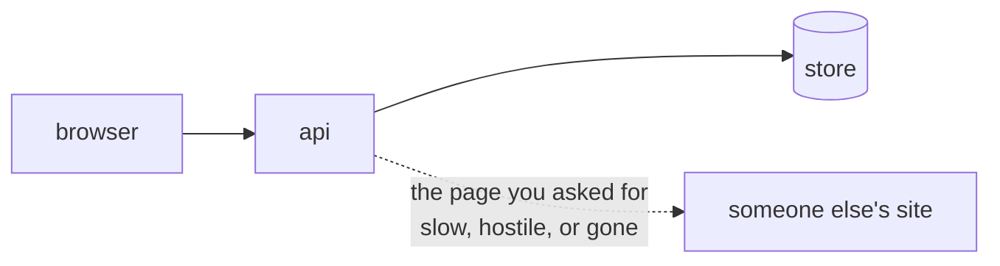
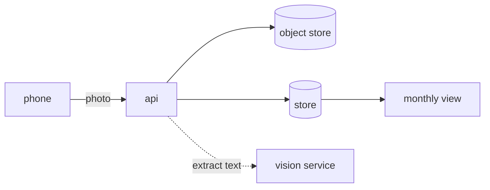
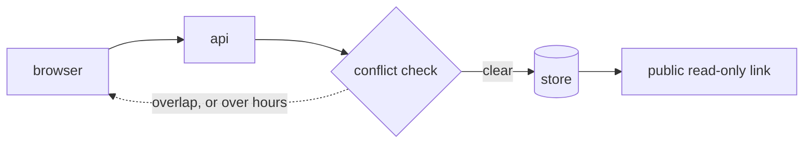
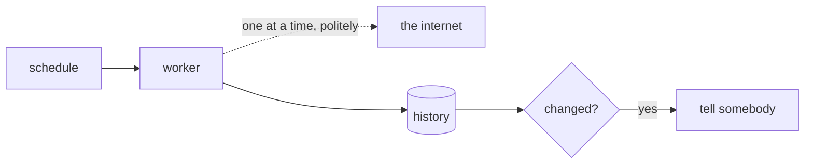
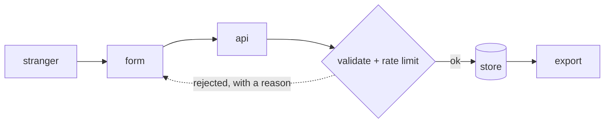

# Act 1 · Junior — five projects

> Build a thing that works · a weekend each · pick one
>
> Integrates sections [01](../../tiers/01-junior/01-the-change-loop/) through
> [07](../../tiers/01-junior/07-shipping-it/). Do the section projects first if
> you want the pieces separately; do one of these if you want the whole shape.

Five different systems, all the same shape underneath. That is deliberate: once
you have built one of these you will recognise the skeleton in almost every
small product you ever meet, and the variation is in *which part is hard*.


**Where the difficulty sits, per project** — this is how you choose:

| | project | the part that is actually hard |
|---|---|---|
| 1 | a shared reading list | authorisation, and a fetch you do not control |
| 2 | a receipt tracker | extracting structure from a photograph, and money |
| 3 | a shift schedule | constraints and conflicts, and two people editing |
| 4 | a link-rot watcher | work on a schedule, and telling somebody |
| 5 | a public form | untrusted input, from strangers, at volume |

Pick the one whose hard part you least want to do. That is where the learning is.

---

## 1. A shared reading list

*A group adds links, tags them, marks them read, and sees what the group is reading.*

**Build**

Sign-in, add a URL, the system fetches the page title, tag it, mark it read, see
everyone's. This is the same system the [spine](../../projects/) uses, so if you
pick this one you can carry it through all five spine projects without starting
again.



**The thought process**

The first real decision is not technical. It is **what "shared" means**: one
group, or groups? Because "one group" is a system with users, and "groups" is a
system with memberships, and that is a different schema, a different
authorisation rule and a different set of screens. Deciding late costs you a
migration in a project that has no migrations yet.

Then the one people get wrong: **what owns "read"?** Marking something read is a
fact about a person *and* an item, not about the item. If you put a boolean on
the item, the second user to mark it read will silently mark it for everybody,
and you will not notice until somebody complains that their list is wrong.

Third: the fetch is somebody else's server. It can be slow, absent, enormous, or
deliberately hostile. You decide whether the user waits for it, and whichever
you choose, the timeout is yours to pick.

**How to organise the prompts**

```
I am building a shared reading list. Before any code: write the data
model and the endpoints, and tell me the three decisions in this design
most likely to be wrong.

Do not write code yet.
```

Argue with the answer. Specifically, check whether "read" is on the item.

```
Implement only sign-up and sign-in, with tests. Stop when I can run it
and log in.
```

```
Add the rule that a person can only edit or delete their own items.
Write the test for somebody else's item FIRST and show me it failing
before you add the check.
```

```
Now the fetch. It must have a timeout I chose, and a URL that hangs,
404s or returns no title must still leave a saved item with the failure
visible rather than swallowed.

Show me all four cases.
```

**On AWS**

The smallest honest deployment: an **App Runner** service or a single small
**EC2** instance, with **RDS** PostgreSQL behind it. Why not Lambda for this
one — a request that waits on an outbound fetch is billed for the waiting, and
you will want a long-lived connection pool to the database, which Lambda makes
awkward (you need **RDS Proxy** to do it well, which is another service and
another bill).

**S3** for anything uploaded, **Parameter Store** for configuration and secrets
(the standard tier is free, where Secrets Manager charges per secret per month).
**Route 53** plus **ACM** for a name and a certificate.

The free-tier shape worth knowing: App Runner has no permanent free tier, so for
learning, one `t4g.micro` behind an Application Load Balancer, or simply a
public IP and no load balancer at all, is cheaper and teaches you more about what
a load balancer was doing for you.

**What productionising it means**

Somebody who is not you can deploy it from the README. Secrets are injected, not
committed. There is a backup and you have restored from it. The fetch cannot
hang the whole app. And the authorisation rule has a test that fails when you
remove the check — that one rule is the difference between a demo and something
you would let a group of friends use.

**The learning**

Almost every small product is this: identity, a store, a list, and one call to
someone else's computer. The hard parts are never the list. They are who is
allowed to do what, and what happens when the other computer misbehaves.

**How you would know it is wrong**

- Sign in as one user and send a delete for another user's item **directly**, not through the UI. It must refuse.
- Turn off your network and add a URL. The failure should be visible, the record sane.
- Two accounts, same item, one marks it read. Check the other's list.
- Deploy from a clean clone in a fresh directory, on a machine that has never seen the project.

**Stage it**

1. Auth and an empty list, deployed and reachable.
2. Items, tags, and the authorisation rule with its failing-first test.
3. The fetch, with its four failure cases.
4. Backups, a restore you have actually done, and the README a stranger can follow.

---

## 2. A receipt tracker

*Photograph a receipt, get the total and the category, see the month.*

**Build**

Upload a photo, extract merchant, date and total, let the person correct it,
categorise it, and show a monthly summary.



**The thought process**

The decision that shapes everything: **extraction is a suggestion, not a
result.** Any system that treats a model's reading of a crumpled receipt as
fact will be wrong a few per cent of the time, silently, about money. So the
data model needs both the extracted value and the corrected one, and the
interface needs a correction step that is faster than typing it fresh.

Then **money**, which has its own rules and punishes ignorance. Never floats.
Integer minor units with the currency stored beside them. A receipt in another
currency is not the same number, and "convert at today's rate" is a decision
with an audit trail attached.

Third: a photograph is large, and the upload happens over a phone connection
that will drop. Do you accept the upload and process later, or make them wait?
The answer determines whether you need a queue in Act 1 or can defer it to Act 2.

**How to organise the prompts**

```
I am building a receipt tracker. The extraction step is a model and will
sometimes be wrong about money.

Design the data model so that an extracted value and a human-corrected
value are both first-class, and so that I can later measure how often
extraction was right. Do not write code yet.
```

The second clause is the valuable one: it makes the schema support an
evaluation you have not built yet.

```
Implement the upload path only: photo in, stored, a record created,
nothing extracted yet. Include the case where the upload dies halfway.
```

```
Now extraction. Store the raw model output verbatim alongside the parsed
fields. If parsing fails, the record must still exist with the failure
attached and be correctable by hand.
```

```
Money handling: integer minor units, currency stored explicitly, and a
test that a total of 19.99 survives a round trip through the database
and back to the screen unchanged.
```

**On AWS**

**S3** for the images, with a lifecycle rule, and **presigned PUT URLs** so the
phone uploads straight to S3 and your API never handles the bytes — that single
decision removes your biggest scaling problem before you have it.

For extraction, **Amazon Textract** is the purpose-built answer for receipts
specifically (it has an expense-analysis mode that returns merchant, date and
total as fields rather than as text). **Bedrock** with a vision-capable model is
the flexible alternative and is better when you want structure Textract does not
know about. **Rekognition** is the wrong tool here — it detects objects and
faces, not document structure. Being able to make that three-way distinction is
the point of the exercise.

**DynamoDB** suits this better than a relational store if each receipt is a
self-contained document you fetch by user and month; **RDS** is better the moment
you want to ask cross-cutting questions ("how much on transport last year").
Decide from the queries, not from fashion.

**What productionising it means**

Uploads are presigned and size-capped. The image store has a lifecycle policy so
it does not grow forever. Extraction failures are visible and correctable rather
than silently dropped. There is a number for extraction accuracy, measured on
receipts you corrected. And the cost per receipt is known, because a vision call
per upload is a real per-unit cost.

**The learning**

The interesting engineering in any AI feature is the correction path and the
measurement, not the model call. Build the place where a human disagrees with
the machine and you have built the only thing that can tell you whether the
feature works.

**How you would know it is wrong**

- Upload a receipt you have already read. Compare field by field.
- Upload something that is not a receipt. It must fail visibly, not invent a total.
- Enter 19.99 and check the stored value is 1999 and it renders back as 19.99.
- Kill the upload mid-flight. There should be no half-record pointing at no image.
- Correct ten extractions, then compute the accuracy. That is your baseline.

**Stage it**

1. Upload and store, with the failure case.
2. Extraction, raw output kept, failures correctable.
3. Money done properly, with the round-trip test.
4. The monthly view, and the accuracy number.

---

## 3. A shift schedule

*Who works when, with conflicts caught before they are saved.*

**Build**

People, shifts, assignments. Assigning somebody to two overlapping shifts is
refused with a reason. A read-only link a person can open without an account.



**The thought process**

This one is about **where a rule lives**. The overlap check can sit in the
interface, in the application, or in the database as a constraint. Only the last
is true when two people press save at the same moment — and the fact that the
first two feel sufficient until they are not is the whole lesson.

Then time, which is harder than it looks: a shift crossing midnight, a week
starting on Sunday somewhere and Monday elsewhere, a daylight-saving transition
where a local hour happens twice. Store instants in UTC, store the intended
timezone separately, and never do arithmetic on local strings.

Third: the read-only link. A URL anyone can open is an authorisation decision
disguised as a convenience. Unguessable, revocable, and it must not expose
anything beyond the shifts — no phone numbers, no other groups.

**How to organise the prompts**

```
I am building a shift schedule. Write the data model, and tell me for
each rule I have (no overlaps, maximum hours per week) whether it can be
enforced in the database itself or only in application code, and why.

Do not write code yet.
```

```
Implement the overlap rule as a database constraint. Then write a test
that fires two conflicting assignments CONCURRENTLY and asserts exactly
one succeeded.

Show me that test failing against an application-only check first.
```

That sequence is the project. Watching the application-level check let both
writes through is worth more than any explanation of race conditions.

```
Timezones: store instants in UTC with the intended zone alongside.
Write tests for a shift crossing midnight and one crossing a
daylight-saving boundary.
```

```
The public link: unguessable, revocable, and returning only shift times
and names. Show me exactly what it exposes.
```

**On AWS**

**RDS** PostgreSQL, because you want real constraints — exclusion constraints
over time ranges are a genuine reason to choose Postgres for this, and they are
the shortest route to a rule that holds under concurrency. DynamoDB can be made
to work with careful key design, and this is the clearest case in Act 1 where a
relational store is simply the better answer.

For the public link, **CloudFront** in front of a small cached read path, so a
link shared in a group chat does not load your database once per person. Keep
the token check at the origin, not in CloudFront.

Reminders, if you add them: **EventBridge Scheduler** for a one-off "your shift
starts in an hour" and **SES** or **SNS** to deliver it. Scheduler over a cron
Lambda here because one-off scheduled events at arbitrary times are exactly what
it is for, and rolling that yourself means a table and a poller.

**What productionising it means**

The rule holds under concurrent writes, and there is a test proving it. Times
survive a daylight-saving boundary. The public link can be revoked and you have
revoked one. And somebody other than the author can read the schedule and
believe it, which is the actual product.

**The learning**

A rule enforced where the data lives is a rule. Anywhere else it is a strong
suggestion, and the difference only shows up when two people act at once — which
is precisely when it matters and precisely when you are not watching.

**How you would know it is wrong**

- Fire two conflicting assignments at the same instant. Exactly one must survive.
- Create a shift over a daylight-saving change and check the duration is what you meant.
- Open the public link in a private window. Check what it shows — and what it does not.
- Revoke a link and confirm it stops working.

**Stage it**

1. People and shifts, no rules.
2. The overlap rule in the database, with the concurrency test.
3. Timezones and the two boundary tests.
4. The public link, with revocation.

---

## 4. A link-rot watcher

*Give it URLs, and it tells you when one dies.*

**Build**

A list of URLs, a weekly check of each, a record of what changed, and a message
when something breaks.



**The thought process**

The first decision is **what counts as dead**. A 404 is easy. A 200 returning a
parked-domain page is the hard case, and the honest answer involves comparing to
what the page looked like last time. Which means this project is really about
*history*, not about checking — you are building a record of states, and the
alert is a diff.

Then **being a good citizen**. You are making automated requests to other
people's servers. One at a time per host, a real user agent that says who you
are, honour a 429, and back off. The engineering and the manners are the same
work here.

Third: **the alert is the product.** Nobody wants a weekly email listing 200
working links. They want to hear when something broke, once, with enough context
to act. A watcher that emails every run gets filtered within a fortnight and then
it is not a watcher.

**How to organise the prompts**

```
I am building a link-rot watcher. Before code: what states can a URL be
in beyond up and down? For each, say how I would distinguish it from the
others using only what an HTTP response gives me.

Be honest about the ones I cannot reliably distinguish.
```

The last line is the important one, and the answer shapes the whole design.

```
Implement the checker for ONE url: fetch with a timeout I chose, record
status, final URL after redirects, response size, and a hash of the
main content. Store it as a new row, never an update.
```

Append-only is the design decision. It is what makes the diff possible later.

```
Now the diff: given two consecutive checks of the same URL, decide
whether something meaningful changed. Distinguish a real change from
noise — a tracking parameter, a timestamp on the page, an ad.
```

```
Rate limiting: one request per host at a time, honour 429 with backoff,
and a user agent that identifies the tool. Show me the code path that
runs when a host returns 429.
```

**On AWS**

This is the best fit for serverless in Act 1, and worth doing that way to feel
the difference. **EventBridge Scheduler** fires weekly, a **Lambda** fans the
URLs out onto **SQS**, and a second Lambda consumes the queue with a
concurrency limit set deliberately low so you do not hammer anyone. SQS gives
you retries and a dead-letter queue for free, which is most of what a job runner
is.

Why SQS and not EventBridge for the fan-out: EventBridge routes *events* to
*targets* and does not hold a backlog you can drain at your own pace, which is
exactly what you want when the work is polite by design. Why not Step Functions:
it is the right answer when the workflow has branches and human steps, and here
the workflow is "do this for each one".

**DynamoDB** suits the history well — partition by URL, sort by timestamp, and
"the last two checks for this URL" becomes one cheap query. Set a TTL so history
does not grow for ever. Delivery by **SES** if you want email you control, or a
webhook if you want it in a chat.

**What productionising it means**

It runs whether or not you remember, and **its own failure is visible** — a
watcher that silently stops looks exactly like a watcher reporting nothing wrong,
which is the most repeated failure mode there is. Alarm on the absence of a run.
Politeness is enforced in code rather than intended. Alerts are deduplicated so
one dead link is one message, not one a week for ever.

**The learning**

Anything that watches needs something watching it, and the alert design is the
product. Both of those generalise to every monitoring system you will ever touch,
including the ones in the senior tier.

**How you would know it is wrong**

- Point it at a URL you control and break it on purpose. Time how long until you are told.
- Stop the schedule. Something must notice within a run or two.
- Point it at a page with a live timestamp. It must not report a change every week.
- Make a host return 429 and confirm it backs off rather than retrying immediately.

**Stage it**

1. One URL, checked by hand, history appended.
2. The diff, with the noise cases.
3. The schedule and the queue, with politeness enforced.
4. Alerts, deduplicated, plus an alarm on the run not happening.

---

## 5. A public form

*Strangers submit structured data, and what arrives is usable.*

**Build**

A public form, validation on both sides, spam resistance, and an export the
person who owns it can actually use.



**The thought process**

Everything here follows from one fact: **the input is hostile and you do not
control the client.** So client-side validation is a courtesy to honest people,
and server-side validation is the only validation. Say that out loud before you
build, because the temptation to trust a validated form is strong when you wrote
the form.

Then the tension that makes this interesting: **every anti-spam measure costs a
real person something.** A captcha costs everybody a few seconds and costs some
people access entirely. A honeypot field costs nothing and catches less. Rate
limiting by IP punishes offices and universities behind one address. There is no
free option, and picking is the work.

Third: **the export is the product.** The person who owns this form does not want
a database, they want a file that opens. Which means thinking about how a
spreadsheet mangles things — a leading zero, a long number, a date, a field
starting with `=`.

**How to organise the prompts**

```
I am building a public form that strangers submit. List every way the
input can be hostile or malformed, including the ones that are not
attacks: pasted formatting, emoji, a 40,000 character answer, a
submission sent twice by a double-tap.

Do not write code yet.
```

```
Implement server-side validation against a schema. Then show me the
same submission being rejected when I bypass the form entirely and post
directly to the endpoint.
```

That second half is the whole point: prove the server does not trust the client.

```
Anti-spam: implement a honeypot and per-IP rate limiting. Tell me
exactly which real users each one inconveniences, and what a
determined submitter would do to get past both.
```

```
The export: CSV that survives a spreadsheet. Handle a value starting
with = or +, a leading zero, a number long enough to become scientific
notation, and a newline inside a field. Show me each case opening
correctly.
```

**On AWS**

The form itself is static: **S3** plus **CloudFront** and it costs almost
nothing. The submit endpoint is the one place that needs care, and **API
Gateway** in front of a **Lambda** is the natural shape — API Gateway gives you
throttling and request validation as configuration, before your code runs,
which is exactly where you want a flood to stop.

**WAF** on the CloudFront distribution is the managed answer to abusive traffic,
with rate-based rules that act before anything of yours executes. It bills per
month plus per request, so it is a real decision rather than a default.

Storage: **DynamoDB** for append-only submissions, which is what these are.
For the export, generate the file into **S3** and hand out a presigned URL that
expires, rather than streaming it from your API — the same move as the receipt
uploads, in the other direction.

**What productionising it means**

A flood costs you a bounded amount of money, because the throttle is in front of
the compute rather than inside it. Every rejection tells the honest person what
to fix. The export opens in a spreadsheet without mangling anything. And you know
what one submission costs, because a public endpoint is a public invitation to
find out the hard way.

**The learning**

Anything reachable by strangers is a cost you have handed to other people's
discretion, and the defences all have a price paid by somebody legitimate.
Deciding who pays it is engineering, not configuration.

**How you would know it is wrong**

- Post directly to the endpoint, bypassing the form. Validation must still hold.
- Submit a field starting with `=` and open the export in a spreadsheet.
- Submit the same thing twice quickly. Decide what should happen, then check it did.
- Send a thousand submissions in a minute from one address. Confirm the throttle fires and the bill does not.
- Read a rejection message as an honest person would. Does it say what to fix?

**Stage it**

1. Form and server-side validation, proved by bypassing the client.
2. Anti-spam, with the cost to real people written down.
3. The export, with the four spreadsheet cases.
4. Throttling in front of the compute, and a measured cost per submission.
