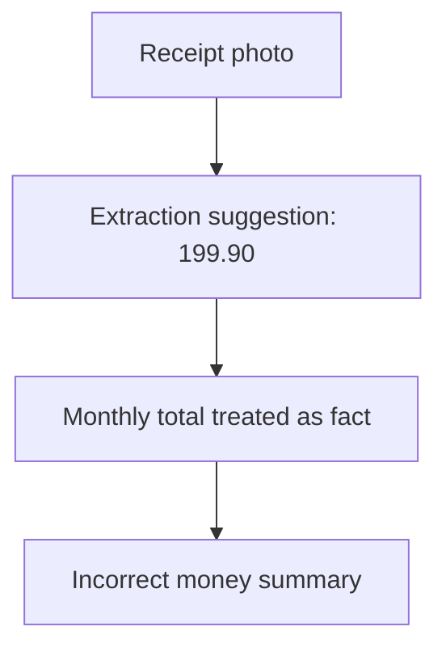
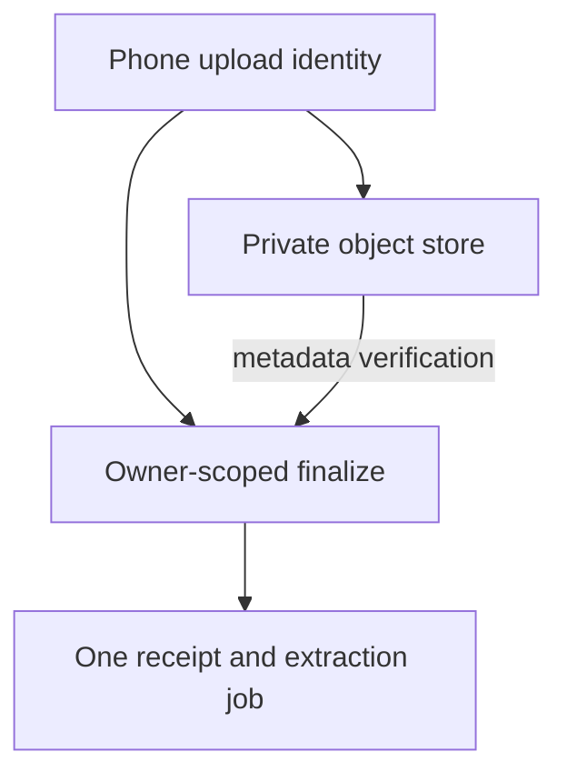
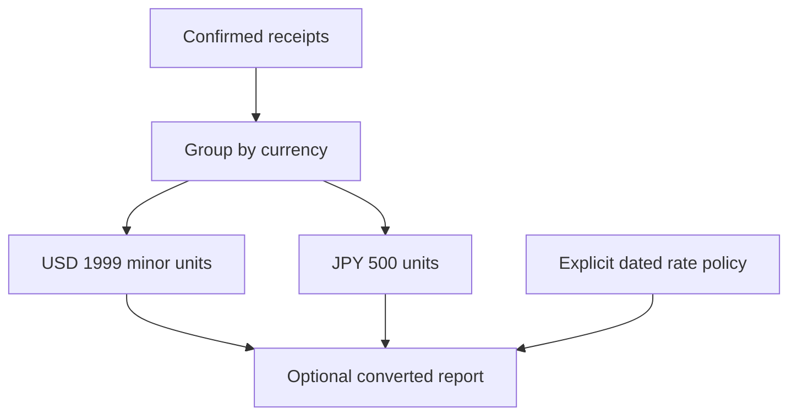
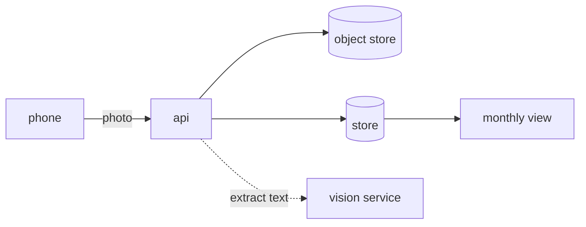

# 2. A receipt tracker

## The reviewer's brief

> A receipt photo says USD 19.99, but OCR suggests 199.90. Users must correct it without losing the evidence needed to measure extraction quality. What enters the monthly total before confirmation?

This is a **constructed practice brief**, not an attributed company question.
Prerequisites: [the act index](../README.md) and [the tier starting point](../../../tiers/01-junior/01-the-change-loop/README.md). This page is a build brief; it does not ship a runnable application. The original build and prompt sequence below defines the implementation checkpoints.

| Case | Exact input or workload | Expected outcome |
|---|---|---|
| Small example | Photo suggestion 19990 minor units USD; human correction 1999 USD. | Persist both; confirmed monthly total increases by 1999 USD, with provenance linking the correction. |
| Boundary / failure | An interrupted upload has no complete image, or the image is not a receipt. | Keep an explicit incomplete/failed record or clean it up; do not invent an amount or count an unconfirmed total. |
| Scope | Currency stored with exact decimal/minor-unit representation; no implicit exchange-rate conversion. | Explain any additional assumption before implementing it. |

Before looking at the guidance, state the invariant in one sentence and trace the example. In interview practice, implement or sketch independently, then reveal the reasoning. On the AI path, use the prompts below and verify each checkpoint before the next request.

## Baseline and the failure to explain



A plausible extraction is not an authoritative financial record. The correction path and provenance are part of the data contract.

<details>
<summary>Reveal the approach and decisions</summary>

Upload privately, verify finalization, store raw output with access/retention controls, and represent suggestion versus confirmation separately. The invariant is that totals use the selected authoritative amount and explicit currency. Define currency scale; not every currency has two minor digits.

</details>

## Follow-up 1 · The upload is retried

**Changed requirement:** The phone loses the completion response and submits the same upload ID twice. What is counted? Predict which boundary must change before opening the design.

<details>
<summary>Expected reasoning and changed diagram</summary>

Use an owner-scoped upload identity, verify object metadata and finalize idempotently. A repeated completion must not create another receipt or queue an unbounded duplicate extraction.



</details>

## Follow-up 2 · Several currencies

**Changed requirement:** The month contains USD 19.99 and JPY 500. What does the summary show? State what evidence would make you reject your first design.

<details>
<summary>Expected reasoning and changed diagram</summary>

Group totals by currency unless conversion is explicitly requested. Conversion needs rate source, rate date, rounding and audit trail; adding 1999 and 500 would combine different units.



</details>

## Evidence to bring to review

Build in three stops: reproduce the small case and baseline failure; implement the protected boundary; then replay both changed requirements with captured outputs. Record commands, fixtures, and observed results in your implementation README. A diagram is a prediction until those checks run.

**Senior expectation:** Prove upload retry safety and corrected exact-money totals. **Additional lead scope:** Own retention, correction audit and conversion policy. Completion demonstrates practice evidence; it does not establish interview readiness or multi-team delivery experience.

## Build and prompt sequence

*Photograph a receipt, get the total and the category, see the month.*

**Build**

Upload a photo, extract merchant, date and total, let the person correct it,
categorise it, and show a monthly summary.



**The thought process**

The decision that shapes everything: **extraction is a suggestion, not a
result.** Any system that treats a model's reading of a crumpled receipt as
fact will be wrong a few per cent of the time, silently, about money. So the
data model needs both the extracted value and the corrected one, and the
interface needs a correction step that is faster than typing it fresh.

Then **money**, which has its own rules and punishes ignorance. Never floats.
Integer minor units with the currency stored beside them. A receipt in another
currency is not the same number, and "convert at today's rate" is a decision
with an audit trail attached.

Third: a photograph is large, and the upload happens over a phone connection
that will drop. Do you accept the upload and process later, or make them wait?
The answer determines whether you need a queue in Act 1 or can defer it to Act 2.

**How to organise the prompts**

```
I am building a receipt tracker. The extraction step is a model and will
sometimes be wrong about money.

Design the data model so that an extracted value and a human-corrected
value are both first-class, and so that I can later measure how often
extraction was right. Do not write code yet.
```

The second clause is the valuable one: it makes the schema support an
evaluation you have not built yet.

```
Implement the upload path only: photo in, stored, a record created,
nothing extracted yet. Include the case where the upload dies halfway.
```

```
Now extraction. Store the raw model output verbatim alongside the parsed
fields. If parsing fails, the record must still exist with the failure
attached and be correctable by hand.
```

```
Money handling: integer minor units, currency stored explicitly, and a
test that a total of 19.99 survives a round trip through the database
and back to the screen unchanged.
```

**On AWS**

**S3** for the images, with a lifecycle rule, and **presigned PUT URLs** so the
phone uploads straight to S3 and your API never handles the bytes — that single
decision removes your biggest scaling problem before you have it.

For extraction, **Amazon Textract** is the purpose-built answer for receipts
specifically (it has an expense-analysis mode that returns merchant, date and
total as fields rather than as text). **Bedrock** with a vision-capable model is
the flexible alternative and is better when you want structure Textract does not
know about. **Rekognition** is the wrong tool here — it detects objects and
faces, not document structure. Being able to make that three-way distinction is
the point of the exercise.

**DynamoDB** suits this better than a relational store if each receipt is a
self-contained document you fetch by user and month; **RDS** is better the moment
you want to ask cross-cutting questions ("how much on transport last year").
Decide from the queries, not from fashion.

**What productionising it means**

Uploads are owner-scoped and verified at finalization. A presigned PUT URL
is not by itself a general content-length-range policy; use an appropriate
upload policy/enforcement boundary and verify actual object size/type before
accepting the receipt. Clean up abandoned objects. The image store has a lifecycle policy so
it does not grow forever. Extraction failures are visible and correctable rather
than silently dropped. There is a number for extraction accuracy, measured on
receipts you corrected. And the cost per receipt is known, because a vision call
per upload is a real per-unit cost.

**The learning**

The interesting engineering in any AI feature is the correction path and the
measurement, not the model call. Build the place where a human disagrees with
the machine and you have built the only thing that can tell you whether the
feature works.

**How you would know it is wrong**

- Upload a receipt you have already read. Compare field by field.
- Upload something that is not a receipt. It must fail visibly, not invent a total.
- Enter 19.99 and check the stored value is 1999 and it renders back as 19.99.
- Kill the upload mid-flight. There should be no half-record pointing at no image.
- Correct ten extractions, then compute the accuracy. That is your baseline.

**Stage it**

1. Upload and store, with the failure case.
2. Extraction, raw output kept, failures correctable.
3. Money done properly, with the round-trip test.
4. The monthly view, and the accuracy number.

---

[Back to the ordered project index](../README.md)
