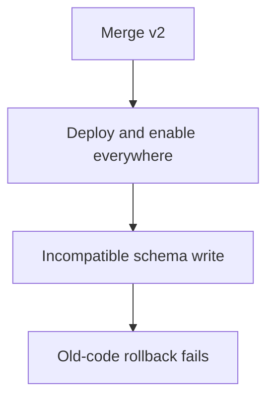
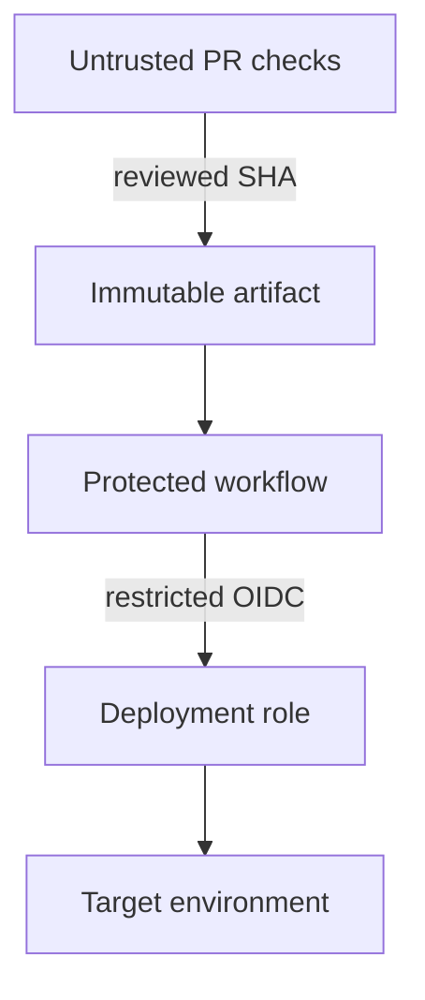
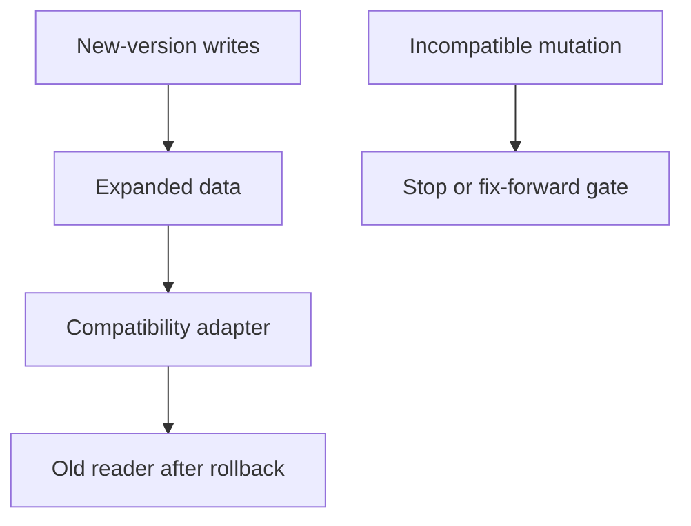

# 2. Twenty deploys a day

## The reviewer's brief

> You need frequent small deployments, but rollback sometimes restores old code that cannot read newly written data. Build a release path that makes that boundary explicit. What exactly can one rollback action reverse?

This is a **constructed practice brief**, not an attributed company question.
Prerequisites: [the act index](../README.md) and [the tier starting point](../../../tiers/02-senior/08-system-design/README.md). This page is a build brief; it does not ship a runnable application. The original build and prompt sequence below defines the implementation checkpoints.

| Case | Exact input or workload | Expected outcome |
|---|---|---|
| Small example | Artifact v2 deploys with flag off; flag enables new UI for 1%, then 10%; schema remains v1/v2 compatible. | Each cohort has recorded health; disabling the flag stops new feature entry while both code versions can still read persisted data. |
| Boundary / failure | v2 deletes a required column before v1 is retired. | Block rollout; code rollback cannot restore the dropped data. |
| Scope | Scratch environments for destructive rebuild drills; observed rollback time applies only to the rehearsed failure. | Explain any additional assumption before implementing it. |

Before looking at the guidance, state the invariant in one sentence and trace the example. In interview practice, implement or sketch independently, then reveal the reasoning. On the AI path, use the prompts below and verify each checkpoint before the next request.

## Baseline and the failure to explain



A feature flag changes admission to code paths; it does not undo database mutations or already-started operations.

<details>
<summary>Reveal the approach and decisions</summary>

Build immutable artifacts, restrict deployment identity, stage compatible schema expansion, then release by measurable cohort. The invariant is compatibility for all supported readers/writers at each rollout stage. Record irreversible boundaries before changing data.

</details>

## Follow-up 1 · A PR changes CI

**Changed requirement:** An untrusted pull request edits the deploy script. May it receive the production role? Predict which boundary must change before opening the design.

<details>
<summary>Expected reasoning and changed diagram</summary>

No. Run untrusted checks without privileged credentials; deploy only the reviewed immutable artifact from a protected workflow with narrowly scoped OIDC trust.



</details>

## Follow-up 2 · Rollback follows new writes

**Changed requirement:** The new version has accepted data the old reader cannot understand. What recovery remains? State what evidence would make you reject your first design.

<details>
<summary>Expected reasoning and changed diagram</summary>

Use a prebuilt compatibility adapter/reverse projection or fix forward; otherwise pause the new write path and reconcile. The rollout gate must test a v1 read of a v2 write, not merely version labels.



</details>

## Evidence to bring to review

Build in three stops: reproduce the small case and baseline failure; implement the protected boundary; then replay both changed requirements with captured outputs. Record commands, fixtures, and observed results in your implementation README. A diagram is a prediction until those checks run.

**Senior expectation:** Rehearse actual serving-version rollback and cross-version data fixtures. **Additional lead scope:** Define cross-team release gates and data irreversibility decisions. Completion demonstrates practice evidence; it does not establish interview readiness or multi-team delivery experience.

## Build and prompt sequence

*Shipping becomes so unremarkable you would do it on a Friday afternoon.*

**Build**

A pipeline where merging means deploying, the infrastructure is described in the
repository, releases are separate from deploys, and rolling back is one action
you have actually taken.

**The thought process**

The first decision is **what gates a merge**, and the temptation is everything.
Every gate costs time on every change, forever, and a slow pipeline is why
people batch up work — which is the thing that makes deploys dangerous. So the
question is not "what could we check" but "what has actually broken, and what is
the cheapest check that would have caught it".

Second: **deploy and release are different events.** Getting code onto machines
and turning a feature on for people are separate decisions, and separating them
is what makes rollback cheap — a flag flip is seconds where a deploy is minutes.

Third, the one that is easy to skip: **the pipeline is the most privileged thing
you own.** It holds credentials and runs code from pull requests. Before adding
capability to it, ask what somebody who controlled a pull request could do with
that capability.

**How to organise the prompts**

```
Write my deployment as stages, with what each stage can access.

For each stage, tell me what somebody who controlled the contents of a
pull request could do with that access. Rank by damage.
```

That second question reliably finds a step with more power than it needs.

```
Now the infrastructure as code. Everything the running system needs,
described in the repo. Then tell me what is currently in my account that
this description does NOT cover.
```

The gap list is the real output. There is always something created by hand.

```
Implement one feature behind a flag, deployed dark. Show me the deploy
happening with the feature off, then the release as a flag change with
no deploy.
```

```
Roll back. Not in theory — deploy, roll back, and show me the previous
version serving. Then tell me what in my system does NOT roll back.
```

**On AWS**

**GitHub Actions** with an **OIDC role** rather than stored access keys. That
one change is the single biggest security improvement available to a small
project: no long-lived cloud credential exists to leak. **CodeBuild** earns its
place when you need to be inside a VPC or want a bigger machine than a hosted
runner; **CodePipeline** when you want approval gates and a visual pipeline
across accounts.

Infrastructure as code: **Terraform** or **OpenTofu** if you want to be
portable, **CDK** if you are staying on AWS and would rather write a programming
language than a configuration one. CDK synthesizes **CloudFormation**;
Terraform/OpenTofu normally manage resources through providers and their own
state, not through CloudFormation underneath them. The real
decision is state — where the state file lives and who can write it — and an
**S3** bucket with versioning plus a lock is the minimum that stops two people
destroying each other's work.

Progressive delivery: **CodeDeploy** does canary and linear shifts for ECS and
Lambda without you building anything, which is the strongest argument for it.
Feature flags can be **AppConfig** (with its own gradual rollout and a
built-in rollback on a CloudWatch alarm) or a third-party service; the AppConfig
argument is that the rollout and the alarm live in the same place as your
metrics.

**What productionising it means**

Merging deploys, and nobody runs a command by hand. You destroyed the
infrastructure and rebuilt it from the repository at least once. Rollback has
been done, deliberately, and timed. No long-lived cloud credential exists in CI.
And every flag has an owner and a removal date, because a flag without one is a
permanent fork in your code.

**The learning**

Deploy frequency is a safety property, not a speed one. Small changes shipped
often are easier to judge, easier to revert and easier to attribute — and the
reason teams batch up work is almost always that their pipeline is slow, which
makes the pipeline a safety problem.

**How you would know it is wrong**

- Deploy a version that crashes on start. Something must catch it before it takes traffic.
- Destroy and rebuild from the repo in a scratch account or region.
- Revoke whatever credential CI uses. The deploy must fail, and then work again once rotated.
- Roll back and time it. That is evidence for the rehearsed failure and workload, not a universal worst-case recovery bound.
- Find your oldest feature flag and ask who owns it.

**Stage it**

1. Merge deploys, one environment, nothing by hand.
2. Infrastructure in code, with the gap list closed.
3. Deploy dark, release by flag, both demonstrated.
4. A rollback you have performed and timed.

---

[Back to the ordered project index](../README.md)
