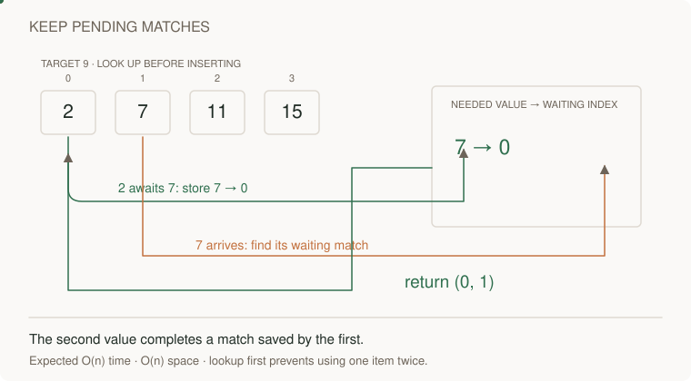
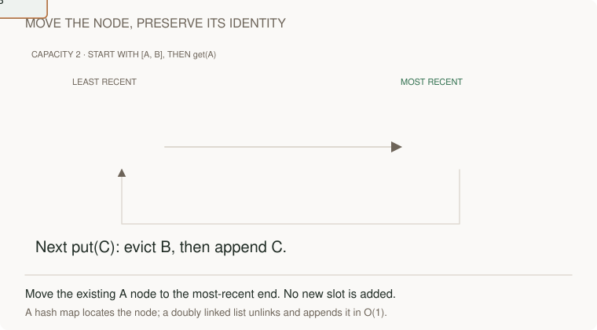

# Motion gallery

Persistent diagrams with purposeful motion. Every animation has a readable static alternative. Timing is illustrative.

[Learning paths](../../README.md) · [Draw the architecture](../../paths/interviews/architecture/whiteboard.md) · [Coding route](../../paths/interviews/coding/README.md)

 | Concept | Motion | Static |
|---|---|---|
| Remember the complement | [Play](map-lookup.svg) | [Still](map-lookup-still.svg) |
| A window that never moves backward | [Play](window-moves.svg) | [Still](window-moves-still.svg) |
| Two boundaries, one prefix value | [Play](prefix-counts.svg) | [Still](prefix-counts-still.svg) |
| Keep the first qualifying index | [Play](binary-halving.svg) | [Still](binary-halving-still.svg) |
| A graph becomes distance layers | [Play](bfs-frontier.svg) | [Still](bfs-frontier-still.svg) |
| A warmer day empties the stack | [Play](monotonic-stack.svg) | [Still](monotonic-stack-still.svg) |
| Candidates flow into a minimum | [Play](dp-choice.svg) | [Still](dp-choice-still.svg) |
| Move the node, preserve its identity | [Play](lru-order.svg) | [Still](lru-order-still.svg) |
| Contain the configuration failure | [Play](config-cohorts.svg) | [Still](config-cohorts-still.svg) |
| Retries multiply across layers | [Play](retry-tree.svg) | [Still](retry-tree-still.svg) |
| Keep capacity above incoming demand | [Play](rollout-capacity.svg) | [Still](rollout-capacity-still.svg) |
| A late event meets a version guard | [Play](version-projection.svg) | [Still](version-projection-still.svg) |
| Route around a hot key | [Play](partition-skew.svg) | [Still](partition-skew-still.svg) |
| Admission follows completion | [Play](worker-slots.svg) | [Still](worker-slots-still.svg) |
| One load, six waiting callers | [Play](cache-coalescing.svg) | [Still](cache-coalescing-still.svg) |
| Duplicate delivery, one stored result | [Play](conditional-result.svg) | [Still](conditional-result-still.svg) |
| Separate permission from bytes | [Play](direct-upload.svg) | [Still](direct-upload-still.svg) |
| The older response arrives last | [Play](browser-race.svg) | [Still](browser-race-still.svg) |
| Expiry jitter spreads the refresh wave | [Play](cache-expiry.svg) | [Still](cache-expiry-still.svg) |
| A buffer is a reservoir, not capacity | [Play](backpressure.svg) | [Still](backpressure-still.svg) |
| A circuit opens, then probes recovery | [Play](circuit-breaker.svg) | [Still](circuit-breaker-still.svg) |
| Acknowledged here, not visible everywhere | [Play](replication-lag.svg) | [Still](replication-lag-still.svg) |
| Close the commit-to-publish gap | [Play](transaction-outbox.svg) | [Still](transaction-outbox-still.svg) |
| Children spend the parent's remaining budget | [Play](deadline-budget.svg) | [Still](deadline-budget-still.svg) |
| Store burst credit, refill over time | [Play](token-bucket.svg) | [Still](token-bucket-still.svg) |
| Lease connections within a fixed budget | [Play](connection-pool.svg) | [Still](connection-pool-still.svg) |
| Move admissions, drain existing work | [Play](traffic-shift.svg) | [Still](traffic-shift-still.svg) |
| Independent work can share the wait | [Play](io-waterfall.svg) | [Still](io-waterfall-still.svg) |
| Repair the heap along one branch | [Play](heap-sift.svg) | [Still](heap-sift-still.svg) |
| One prefix opens several completions | [Play](trie-prefix.svg) | [Still](trie-prefix-still.svg) |
| Choose, explore, undo, try the next branch | [Play](backtracking.svg) | [Still](backtracking-still.svg) |
| Overlap extends the current interval | [Play](merge-intervals.svg) | [Still](merge-intervals-still.svg) |
| A separator eliminates a whole range | [Play](index-seek.svg) | [Still](index-seek-still.svg) |
| Contain the slow neighbor | [Play](bulkhead.svg) | [Still](bulkhead-still.svg) |
| Save the suffix before reversing a link | [Play](linked-pointer-reversal.svg) | [Still](linked-pointer-reversal-still.svg) |
| Return one branch, combine two locally | [Play](recursion-return-state.svg) | [Still](recursion-return-state-still.svg) |
| Edit distance advances through solved prefixes | [Play](dp-edit-frontier.svg) | [Still](dp-edit-frontier-still.svg) |
| Parse the whole input before short-circuit evaluation | [Play](parser-precedence.svg) | [Still](parser-precedence-still.svg) |

## Remember the complement

[Open animation](map-lookup.svg) · [Static diagram](map-lookup-still.svg)

## A window that never moves backward

[Open animation](window-moves.svg) · [Static diagram](window-moves-still.svg)

## Two boundaries, one prefix value

[Open animation](prefix-counts.svg) · [Static diagram](prefix-counts-still.svg)

## Keep the first qualifying index

[Open animation](binary-halving.svg) · [Static diagram](binary-halving-still.svg)

## A graph becomes distance layers

[Open animation](bfs-frontier.svg) · [Static diagram](bfs-frontier-still.svg)

## A warmer day empties the stack

[Open animation](monotonic-stack.svg) · [Static diagram](monotonic-stack-still.svg)

## Candidates flow into a minimum

[Open animation](dp-choice.svg) · [Static diagram](dp-choice-still.svg)

## Move the node, preserve its identity

[Open animation](lru-order.svg) · [Static diagram](lru-order-still.svg)

## Contain the configuration failure

[Open animation](config-cohorts.svg) · [Static diagram](config-cohorts-still.svg)

## Retries multiply across layers

[Open animation](retry-tree.svg) · [Static diagram](retry-tree-still.svg)

## Keep capacity above incoming demand

[Open animation](rollout-capacity.svg) · [Static diagram](rollout-capacity-still.svg)

## A late event meets a version guard

[Open animation](version-projection.svg) · [Static diagram](version-projection-still.svg)

## Route around a hot key

[Open animation](partition-skew.svg) · [Static diagram](partition-skew-still.svg)

## Admission follows completion

[Open animation](worker-slots.svg) · [Static diagram](worker-slots-still.svg)

## One load, six waiting callers

[Open animation](cache-coalescing.svg) · [Static diagram](cache-coalescing-still.svg)

## Duplicate delivery, one stored result

[Open animation](conditional-result.svg) · [Static diagram](conditional-result-still.svg)

## Separate permission from bytes

[Open animation](direct-upload.svg) · [Static diagram](direct-upload-still.svg)

## The older response arrives last

[Open animation](browser-race.svg) · [Static diagram](browser-race-still.svg)

## Expiry jitter spreads the refresh wave

[Open animation](cache-expiry.svg) · [Static diagram](cache-expiry-still.svg)

## A buffer is a reservoir, not capacity

[Open animation](backpressure.svg) · [Static diagram](backpressure-still.svg)

## A circuit opens, then probes recovery

[Open animation](circuit-breaker.svg) · [Static diagram](circuit-breaker-still.svg)

## Acknowledged here, not visible everywhere

[Open animation](replication-lag.svg) · [Static diagram](replication-lag-still.svg)

## Close the commit-to-publish gap

[Open animation](transaction-outbox.svg) · [Static diagram](transaction-outbox-still.svg)

## Children spend the parent's remaining budget

[Open animation](deadline-budget.svg) · [Static diagram](deadline-budget-still.svg)

## Store burst credit, refill over time

[Open animation](token-bucket.svg) · [Static diagram](token-bucket-still.svg)

## Lease connections within a fixed budget

[Open animation](connection-pool.svg) · [Static diagram](connection-pool-still.svg)

## Move admissions, drain existing work

[Open animation](traffic-shift.svg) · [Static diagram](traffic-shift-still.svg)

## Independent work can share the wait

[Open animation](io-waterfall.svg) · [Static diagram](io-waterfall-still.svg)

## Repair the heap along one branch

[Open animation](heap-sift.svg) · [Static diagram](heap-sift-still.svg)

## One prefix opens several completions

[Open animation](trie-prefix.svg) · [Static diagram](trie-prefix-still.svg)

## Choose, explore, undo, try the next branch

[Open animation](backtracking.svg) · [Static diagram](backtracking-still.svg)

## Overlap extends the current interval

[Open animation](merge-intervals.svg) · [Static diagram](merge-intervals-still.svg)

## A separator eliminates a whole range

[Open animation](index-seek.svg) · [Static diagram](index-seek-still.svg)

## Contain the slow neighbor

[Open animation](bulkhead.svg) · [Static diagram](bulkhead-still.svg)

## Save the suffix before reversing a link

[Open animation](linked-pointer-reversal.svg) · [Static diagram](linked-pointer-reversal-still.svg)

## Return one branch, combine two locally

[Open animation](recursion-return-state.svg) · [Static diagram](recursion-return-state-still.svg)

## Edit distance advances through solved prefixes

[Open animation](dp-edit-frontier.svg) · [Static diagram](dp-edit-frontier-still.svg)

## Parse the whole input before short-circuit evaluation

[Open animation](parser-precedence.svg) · [Static diagram](parser-precedence-still.svg)
