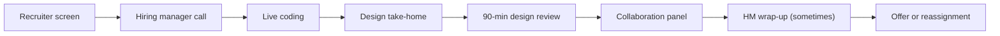
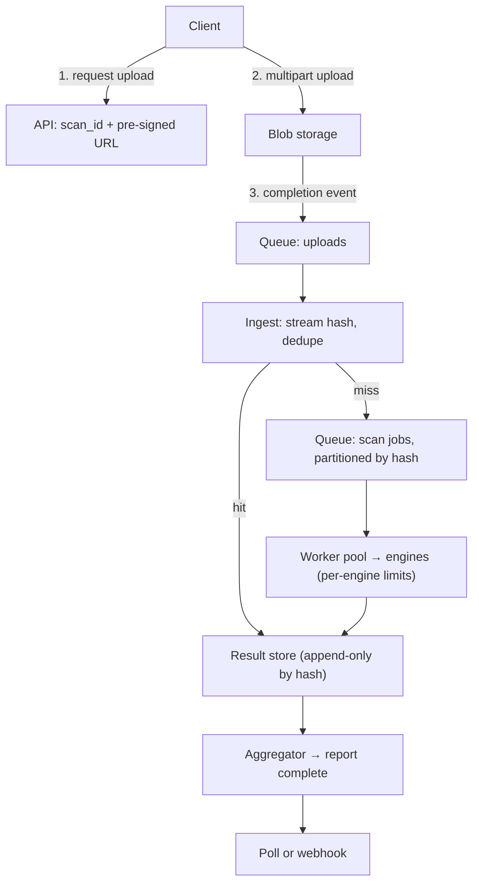

# CrowdStrike · senior cloud backend engineering

## Your worked rehearsal: a file-scanning platform, then the same loop on endpoint telemetry

A customer uploads a file. The platform hashes it, stores it once, fans it out to many scanning engines, and produces one report the customer can poll or be notified about. Uploads arrive in bursts, files can be gigabytes, the same file is uploaded by thousands of tenants, and scanners fail or run slow. This is the design case reported most often for CrowdStrike senior loops, usually handed out one or two days ahead and then defended for ninety minutes.

Work the case first. Then run the same reasoning on the company's actual shape: millions of agents sending telemetry, a decision needed in seconds, and a control plane that must never push a bad change to every endpoint at once. The rest of this page is the loop itself, round by round, with every reported question, the company's own published architecture, and drills that match.

**Starting point:** these drills are build briefs. Implement in a local file or draw the requested architecture. The worked answers are explanations, not supplied applications. Choose one drill per session, then change one requirement after the baseline works.

◆ Official source (job posting, engineering blog, company page)◒ Candidate report (dated, unverified)◇ Original drill or simulation

**Who this page is for.** Senior Engineer / Sr. Software Engineer on a cloud backend or platform team (the "Cloud" reqs, not the Windows/macOS/Linux sensor teams, which add operating-system internals). The reference posting is Senior Engineer – Cloud, US Remote, req R30109, posted September 2026. Its requirements are quoted in the room section below.

**Evidence policy.** Checked 25 September 2026. Candidate reports span 2019–2025 and are dated anecdotes, not transcripts; a Glassdoor login wall blocked the individual senior reports, so the Glassdoor material here is limited to its public summary statistics and search snippets. No question on this page is claimed to be "most asked"; the reported ones are labeled ◒ and everything else is ◇. Ask your recruiter for the round list, allowed AI tools, language, and whether design is a take-home.

## The room · design is where the loop is decided

**How it may feel:** coding is passable-medium and interviewers say so; design is long, deep, and the place where candidates fail or get leveled down. One CrowdStrike employee's advice on Blind (April 2025) was blunt: be pleasant, be "passable at leetcode," and show real depth in design. Another candidate called their design rounds "the most comprehensive and in-depth" they had seen, at about two hours. Expect to explain *why* each box exists, what it costs, and what happens when it fails, with product names discouraged ("say OLTP, queue, API and blob storage").

**What the reference posting asks for (◆ R30109, verbatim topics):** backend microservices with containers (Docker/Kubernetes), message queues (Kafka/RabbitMQ), service mesh patterns; AWS managed services (RDS, Lambda, S3), Infrastructure as Code (Terraform/CloudFormation), auto-scaling, CI/CD, multi-region; Redis for caching and sessions, Kafka for event streaming, Postgres with query optimization, ElasticSearch/OpenSearch; REST APIs (Spring Boot/Gin) with JWT/OAuth, versioning, rate limiting, OpenAPI; Go, Python, or Java with concurrency patterns; distributed tracing (Jaeger/Zipkin), ELK, Prometheus/Grafana, root-cause analysis across services. The team's stated work: "endpoint management platforms," "sensor telemetry and system debuggability," event-driven systems, "conduct root cause analysis for critical issues," and "telecommuting is permitted 100% of the time from anywhere within the US." Base band posted at $265,000–$285,000 plus bonus and equity.

**Ask first, in every round:** How many endpoints and events per second? Is at-least-once acceptable or is deduplication required downstream? What is the latency budget from event to decision? How are tenants isolated? What may the agent do on a customer's machine? What is the rollback story for anything pushed to endpoints?

## The loop, end to end

Reported shapes vary by team and year. The most common senior shape from 2021–2025 reports is: recruiter screen → hiring manager call → live coding → design as a take-home defended live → collaboration/behavioral panel → sometimes a hiring-manager wrap-up call. Some teams replace the take-home with a live design; some add a second coding round; older reports mention a "design presentation" with the question sent ahead and a code-review component.

| Stage | Length | Who | Format and what is evaluated | Evidence |
| --- | --- | --- | --- | --- |
| Recruiter screen | 30 min | Recruiter | Background, motivation, level, location, comp expectations, remote-first fit; stack alignment (Go, Python, AWS) | ◒ multiple guides; ◆ posting |
| Hiring manager call | 45–60 min | Hiring manager, often *before* coding | Current work, microservices, event-driven systems, scaling and error-handling scenarios; past projects with repeated "why"; sometimes one conceptual technical question | ◒ LeetCode Nov 2025 (London); ◒ Blind Aug 2025; ◒ designgurus |
| Live coding | 45–60 min | Senior engineer | 1–2 problems in a shared editor (LeetCode/HackerRank-like), language of your choice; medium, occasionally "low end of hard"; real-world framing; may be extended to streaming or concurrency | ◒ Blind 2023, 2025; ◒ Glassdoor snippets |
| Design take-home | Prompt 1–2 days ahead; 4–8 h of work reported for coding take-homes | You | A document describing a system to design (VirusTotal-like file scanning is the repeated case); prepare a deck or diagrams | ◒ Blind 2019, 2022, 2023, 2025; ◒ LeetCode 2025; ◒ enginebogie 2025 |
| Design review | 90 min (reports of ~2 h) | 2–3 engineers, sometimes with the HM | Defend the take-home; scale to "billions of requests and big files"; pros and cons of every choice; failure modes, concurrent uploads, users competing for the same resource; sometimes a second broad prompt (a site for millions of visitors) | ◒ Blind May 2020; ◒ Blind Oct 2022; ◒ Blind Aug 2025 |
| Collaboration / behavioral panel | 45–60 min | Potential teammates, sometimes a peer manager | Remote-first async work, code review, cross-team dependencies, incidents, persuasion, mentoring; values | ◒ techprep, designgurus, techinterview |
| Domain / cloud architecture round (senior) | 60 min, not always present | Engineer | Cloud and security architecture: telemetry, isolation, encryption at rest, audit logging | ◒ techprep, techinterview |
| Hiring-manager wrap-up | 30 min, not always present | Hiring manager | "Recap the process and answer questions"; reported both before offers and before reassignment to another team | ◒ Blind Aug 2025 |
| Decision | days to weeks | Recruiter | Reported 5 days to a verbal offer at best; multi-week silences and ghosting also reported | ◒ Blind 2021, 2023, 2025 |

**Glassdoor public statistics (◒, August 2026 snapshot):** Software Engineer, 36 interviews, difficulty 2.8/5, 26% positive experience, 17 days average to hire, stages reported as phone interview 33%, one-on-one 21%, presentation 16%, skills test 12%, group panel 9%. Senior Software Engineer, 15 interviews, difficulty 2.9/5, 30% positive, 30 days average. Company-wide average is 29 days. Read the low positivity as "slow recruiter communication," which is the complaint in nearly every negative report, not as "hard questions."

**Two process facts worth planning around.** First, the hiring manager owns the hire and frequently interviews first; that call carries weight and is where you get leveled. Second, design is the round where candidates report being down-leveled from Senior to Engineer III; one November 2025 candidate passed coding and design and was told the team would consider them for Engineer III, then heard nothing. Treat the design review as the interview.

## Recruiter screen · thirty minutes that set your level

**What they cover (◒):** your background in two minutes, why CrowdStrike, why now, current comp and expectations, location and remote eligibility, start date, and a stack check against the posting (Go, Python, AWS, Kafka). Some recruiters ask a "basic cybersecurity awareness" question; for cloud roles this is "do you know what an endpoint sensor does," not a quiz.

**Say it in this shape:** one sentence on scope (a critical-path service you owned end to end), one on scale (events, tenants, or records), one on what changed for customers. Then the stack list, in the posting's order.

**Ask before you hang up (each one changes your prep):**
- Which rounds, in what order, and is design a take-home or live?
- Which language for coding, and are AI assistants allowed in any round? (No public report establishes CrowdStrike's AI policy; assume off unless told otherwise.)
- Is this req leveled Senior I or Senior II? What band?
- Is there a domain or cloud-architecture round in addition to design?
- Who is the hiring manager and which product does the team own?

**Reported rejection reasons at this stage (◒):** comp misalignment, unclear about the role, poor communication. Have a number ready; the posting band is public.

## Hiring manager call · past decisions, and why

**Reported content (◒, three independent 2025 reports):** "questions on current work experience, microservices architectures, event driven systems, few questions on scaling and error handling scenarios" (London, Nov 2025); "present a past project, plenty of why questions, one conceptual technical question" (Aug 2025); "past projects and decisions you made, how you handle conflict" (Aug 2025). The manager is deciding whether you are the level on the req and whether they want you on-call next to them.

**Question bank (◒ reported themes, ◇ original phrasings in the same shape):**

| Theme | Questions you should be able to answer in under three minutes each |
| --- | --- |
| Current system | Walk me through the system you own. What talks to what? Where does state live? What is the write path? Who calls you and what do they expect? |
| Event-driven design | Where do you use a queue and why? What happens when a consumer falls behind? How do you handle a poison message? At-least-once or exactly-once, and how do you know? |
| Scaling | What was the last thing that stopped scaling? How did you find it? What did you change and what did it cost? What would break next at 10×? |
| Error handling | Describe a failure that crossed service boundaries. How did you localize it? What did you add so it is caught earlier next time? |
| Decisions | Pick a design decision you made. What were the alternatives? Why this one? What would you change now? |
| Ownership | Tell me about something nobody owned that you picked up. What did you find? |
| Migration | Have you replaced a live system? How did you roll it out, and how would you have rolled back? |
| Conceptual (one, reported) | Explain idempotency to a new engineer. What is backpressure? How does a consumer group commit offsets? What is the difference between a cache and a queue in your design? |
| Fit | Why CrowdStrike? Why leave? What do you want to be doing in two years? How do you work when the team is spread across time zones? |

**How to prepare it:** write five of your own systems as one-page designs first (boxes, data, failure, rollback). Every "why" question is answered from those pages. Managers report following each answer with two or three more "whys"; if your page has the alternatives on it, you never run out.

## Coding rounds · medium, real-world, and ready to become a stream

**Format (◒):** a shared editor that "looks like LeetCode or HackerRank," your language, one or two problems in 45–60 minutes, "not a pure DSA type question," framed as real work (logs, events, machines). Difficulty is reported as medium, sometimes "the high end of medium," occasionally "low end of hard," and it varies by interviewer. Interviewers often ask you to extend a working solution to a streaming input or a concurrent one, and race conditions were explicitly reported as a topic. One senior backend candidate reported running out of time with a nearly-working solution; finish a correct baseline before optimizing.

**Reported problems and problem shapes (◒):**

| Reported item | Where reported | What it actually tests |
| --- | --- | --- |
| Number of islands (DFS on a 2D grid) | LeetCode Nov 2025, enginebogie 2025 | Graph traversal, visited state, recursion depth on large grids |
| Time-based key-value store | Blind (Hotwire commenter) | Sorted structure per key, binary search, then time complexity under questioning |
| Design a FIFO / LRU cache: insert, lookup, evict, with pseudocode | Blind Aug 2025 (EM loop) | Hash map plus ordered structure, O(1) operations, capacity |
| Read log records, group by machine, return the busiest; then handle an endless stream with memory limits | designgurus guide | Hash aggregation, then bounded memory, sketches or windows |
| Encode and decode strings | techprep / interviewquery | Length-prefix framing, delimiter safety |
| Network delay time (shortest path) | techprep / interviewquery | Dijkstra with a heap |
| Is subsequence | techprep / Glassdoor snippet | Two pointers |
| Number of dice rolls with target sum; all combinations of n dice with m faces (recursive) | techprep / Glassdoor snippet | Recursion and memoization |
| All primes up to N | Glassdoor snippet | Sieve |
| Kth largest in an unsorted array; longest common subsequence; palindrome check; inorder traversal | scaleengineer profile | Heap or quickselect; DP; two pointers; iterative stack |
| "Queries on handling race conditions" | Glassdoor snippet | Locking, atomic updates, idempotent writes |

### Choose a coding exercise · twelve original drills in CrowdStrike's shapes ◇

Choose one for 35–45 minutes. Each has a testable contract; the stretch column is what the interviewer will ask next.

| Drill and exact ask | Example to settle before coding | Senior stretch (reported follow-up shapes) |
| --- | --- | --- |
| 01 · Busiest host: from `(host, ts)` records return the host with the most events | `a,a,b` → `a` | Stream of unknown length with a 1 GB memory cap; top-k per rolling 5-minute window |
| 02 · Deduplicate telemetry by `(sensor_id, seq)` within a 10-minute window | `s1:7, s1:7, s1:8` → two events | Bounded dedupe state, TTL eviction, what is lost when the process restarts |
| 03 · Time-based KV: `set(k,v,t)`, `get(k,t)` returns the latest value at or before `t` | `set(a,1,5); get(a,7)` → 1; `get(a,4)` → none | Millions of keys, hot keys, concurrent writers, memory bound |
| 04 · LRU cache with `get`/`put` in O(1) | capacity 2: `put a; put b; get a; put c` → b evicted | Thread safety, TTL, eviction metrics, cache stampede on miss |
| 05 · Islands: count connected regions of `1`s in a grid | `[[1,1,0],[0,0,1]]` → 2 | Grid too large for recursion; iterative BFS; union-find for streaming edges |
| 06 · Rate limiter: `allow(tenant, t)` with 100 events/second per tenant, token bucket | capacity 2, refill 1/s at `t=0,0,0.5,1` → `T,T,F,T` | Distributed across instances; Redis unavailable; clock skew; noisy-tenant isolation |
| 07 · Log parser: parse `ts level service msg`, count errors per service per minute | two ERROR lines same minute → 2 | Malformed lines, multiline stack traces, gigabyte files via iterators |
| 08 · Merge k sorted event streams by timestamp without dropping equal timestamps | `[1,3]+[1,2]` → `1,1,2,3` | Backpressure when one stream stalls; late events beyond a watermark |
| 09 · Length-prefix encode/decode a list of strings | `["a","bc"]` → `1:a2:bc` → back | Binary-safe framing, partial frames over a socket |
| 10 · Dependency order: run tasks after all prerequisites | `a→c, b→c` → `a,b,c` or `b,a,c` | Cycle detection, failure propagation, retries with idempotent effects |
| 11 · Shortest path: minimum time for a signal to reach all nodes | edges `1→2(1), 1→3(4), 2→3(1)` → 2 | Negative or missing nodes; streaming edge updates |
| 12 · Interval merge: collapse overlapping `[start,end)` outage windows | `[0,5),[3,8),[10,12)` → two intervals | Sorted input arriving out of order; per-tenant windows |

### Concurrency mini-bank · Go first, Python second ◇

The posting names Go, Python, or Java "with concurrency patterns," and race conditions are a reported coding topic. Be able to write these from memory in Go and explain the Python equivalent.

| Drill | Go shape | Python shape | What they probe |
| --- | --- | --- | --- |
| Worker pool: N workers consume jobs, results collected in order of completion | goroutines + `chan Job` + `sync.WaitGroup` | `concurrent.futures.ThreadPoolExecutor`, or `asyncio` with a `Queue` | Bounded concurrency, clean shutdown, no goroutine leak |
| Bounded buffer between a fast producer and slow consumer | buffered channel as the buffer; `select` with a `done` channel | `queue.Queue(maxsize)` | Backpressure instead of unbounded memory |
| Cancel work on timeout | `context.WithTimeout`, check `ctx.Done()` in the loop | `asyncio.wait_for` | Deadline propagation to downstream calls |
| Thread-safe counter map | `sync.Mutex` around a map, or `sync.Map`, or sharded locks | `threading.Lock` | Mutex vs channel; when atomics suffice |
| Fan-out / fan-in with error collection | `errgroup.Group`, first error cancels the rest | `asyncio.gather(return_exceptions=True)` | Partial failure semantics |
| Prove there is a race | `go test -race` on the unsynchronized version | `threading` with a shared list and no lock | Do you know the tool, not only the concept |

**Interviewer-reported expectation:** "Interviewer sucks at leetcode as well" was one CrowdStrike employee's phrasing. Clean, tested, narrated code beats a clever one-liner you cannot explain.

## Design take-home and review · the round that decides the level

### The reported case: a VirusTotal-like scanning platform ◒

Reported independently in 2019 ("design presentation, question provided beforehand, Sr. role"), 2022 ("they gave me a take-home system design problem"), 2023 ("whiteboarding of VirusTotal with requirements provided days in advance; Cassandra and consistent hashing came up"), 2025 (London: "take home assignment question on design virustotal like system... file uploads, hashing, blob storage, db sharding, scaling, async flow in event driven architecture"), 2025 (Dublin: "design virustotal"), and on PracHub as "Design a file upload and scanning report system" (Jan 2026). A second reported design prompt is "design a website to accommodate millions of visitors." A third, on PracHub (Oct 2025), is "design a scalable worker pool for template jobs," where a function renders `{{db_host}}`-style placeholders and must run at scale.

**Reported review questions (◒):** how would you scale to billions of requests and very large files; why this store and not that one, with pros and cons; how do you handle concurrent uploads of the same file; what happens when users compete for the same resource; how would you shard; walk me through the async flow. One hiring manager reportedly warned that "Amazon people often fail because they rely on pre-built solutions like DynamoDB and SNS"; CrowdStrike employees advised "be ready to explain how those AWS technologies work... don't rely on infinite scalability... be prepared to explain cost and tradeoffs" and "don't use any technology names, say OLTP, queue, API and blob storage."

### Worked session · the scanning platform, defended for ninety minutes ◇

**Interviewer:** "Users upload files. We scan each file with many engines and return one report. Design it. Assume 10,000 uploads per second at peak, files up to 2 GB, and that the same file is uploaded by many customers."

**Clarify aloud:** Is a report required synchronously, or can the client poll or be notified? Are engines third-party with rate limits? Is a scan result reusable across tenants for the same content hash? Retention of files versus reports? Tenant isolation requirement for stored files? Must we support re-scanning old files when engines update?

**Requirements you state, with numbers:** 10k uploads/s peak, median 200 KB, p99 50 MB, max 2 GB → roughly 2 GB/s median ingress and bursts far above. Twenty engines per file at 100 ms–30 s each. Report available within 60 s for 95% of files. At-least-once scanning is fine; the report must be idempotent per `(content_hash, engine_version)`.

| User action | Expected behavior | Why it matters |
| --- | --- | --- |
| Upload 200 KB file | 202 Accepted with `scan_id`; report within seconds | Async by default; never block on twenty engines |
| Upload a file already scanned yesterday | Report served from cache by content hash; no new scans | Dedupe by hash is the biggest cost lever |
| Two tenants upload the same file at the same second | One scan, two `scan_id`s pointing at one result | Concurrent-upload race the review will ask about |
| 2 GB file | Multipart direct-to-blob upload with pre-signed URL; server never proxies bytes | Big-file question |
| Engine X is down | Report shows 19/20 with X pending; retry with backoff; never blocks the report | Partial failure |
| Same request retried by a flaky client | Same `scan_id` via idempotency key | Idempotency |
| Tenant floods 1M uploads | Per-tenant quota and queue lane; others unaffected | Noisy-neighbor isolation |

**Think in public, main path:** client requests an upload → API returns a pre-signed blob URL and a `scan_id` → client uploads directly to blob storage → a completion event carries `(scan_id, tenant, blob_key)` → an ingest service computes the content hash (streaming, chunked) and checks a `hash → result` store → on miss it writes a scan job to a queue partitioned by hash → a worker pool fans the job out to engines with per-engine concurrency limits → each engine result is written as an append-only row `(hash, engine, version, verdict, ts)` → an aggregator marks the report complete when all engines report or a deadline passes → the client polls `GET /scans/{id}` or receives a webhook.

**Storage choices, stated as categories first:** blob store for bytes (content-addressed key so duplicates collapse); a wide-column or LSM store for engine results keyed by hash (write-heavy, append-only, TTL by retention); an OLTP store for tenant-facing metadata (`scan_id`, tenant, status); a cache in front of the hash lookup. Only after that name products, and say why: Cassandra-style stores fit because writes dominate and rows are naturally partitioned by hash; the OLTP store stays small because it holds pointers, not results.

**The concurrent-upload race, answered:** both ingest workers compute the same hash. Use an atomic claim on `hash` (a conditional insert of a `scanning` marker with a lease). The loser attaches its `scan_id` to the winner's result and exits. If the winner dies, the lease expires and the next claimant re-runs; results are idempotent by `(hash, engine, version)`, so a double run is waste, not corruption.

**Sharding and consistent hashing, answered:** partition the results store and the job queue by content hash; the key is uniform by construction, so no hot shard from a viral file except at the cache, which is where a hot hash belongs. Add nodes with consistent hashing so only 1/N of keys move; tenants are not a partition key because one tenant can be 40% of traffic.

**Failure modes to volunteer before they ask:** blob completion events lost (reconcile by listing new objects hourly); queue backlog (auto-scale workers on lag, shed by tenant priority); engine rate limits (token bucket per engine, deferred lanes); poison files that crash an engine (sandbox the engine, quarantine after N crashes, never block the report); re-scan on engine update (backfill job walking the hash index, low priority lane).

**Follow-up 1 (senior):** "Now the same file is 40% of all uploads today." Answer: the hash cache absorbs it; the concern moves to the metadata store's `scan_id` write rate, so batch those writes and keep the report pointer-only. **Follow-up 2 (staff):** "Make it multi-region with a regional outage." Answer: region-local blob and queue, results replicated asynchronously by hash, a global read path that tolerates a stale miss (re-scan is safe), and an explicit statement of what is lost for how long.

Debrief · what a strong ninety minutes contains

Numbers before boxes; six to eight boxes, not twenty; one main path drawn and then walked for one file; every store justified by its write/read shape; the concurrent-upload race handled with a claim, not a lock across the fleet; costs named (engine minutes, blob egress, cache memory); one trade-off you dislike stated plainly. Interviewers at CrowdStrike report caring more about "why" than about diagram polish.

### Choose an architecture exercise · nine prompts in the company's own shape

The first three are reported cases; the rest are original and built from the posting's language and the engineering blog.

| Prompt | Initial requirement | Change the requirement | Evidence |
| --- | --- | --- | --- |
| File scanning platform | Upload, scan with many engines, one report | Same-file dedupe across tenants; 2 GB files; engine outage; re-scan on engine update | ◒ reported 2019–2026 |
| Site for millions of visitors | Serve pages and an API at scale | Cache invalidation, regional failover, write spikes | ◒ reported 2020 |
| Worker pool for template jobs | Render templates with placeholders at scale | Priorities, retries, poison jobs, per-tenant fairness | ◒ PracHub Oct 2025 |
| Telemetry ingestion from millions of endpoints | Accept events, store, query | At-least-once vs dedupe; backpressure; offline agents with local buffers; 10× burst on Monday morning | ◇ from the posting and blog |
| Detection pipeline | Raise an alert within seconds of an event | Late events, windowing, false-positive cost, per-tenant rule versions | ◇ |
| Push a content or rule update to every endpoint | Deliver a new detection config to all sensors | Ring-based rollout, canary, golden signals, customer pinning, instant rollback, a bad update that crashes 1% of hosts | ◇ built from the company's post-2024 resilience posts |
| Endpoint management control plane (the R30109 team's words) | Track sensor versions, health, and policy per host; run commands | Millions of hosts reporting every 5 minutes; command fan-out with acknowledgement; stale hosts; multi-tenant RBAC | ◇ |
| Searchable event store | Store weeks of events, query by host and time | Hot vs cold tiers, retention TTL, index size, a query that scans a year | ◇ |
| Rate limiter and distributed queue | Standard building blocks | Redis down; clock skew; exactly-one consumer per partition | ◇ |

## What the company has published about its own systems ◆

Everything in this section comes from CrowdStrike's engineering blog and product pages. It is the vocabulary interviewers use and the scale they will assume. Use the numbers when you size a design; interviewers notice.

### Sensor to cloud, and Threat Graph

- One lightweight sensor per host streams behavioral telemetry ("more than 400 different types of endpoint behavior") to the cloud. The cloud correlates "trillions of events per day"; the graph reported "3.5 million blocking decisions every second." Threat Graph stores over 40 PB and serves upward of 70 million requests per second.
- Roughly six of seven Threat Graph API calls are writes. The store is append-only: records are never updated; a modification is a new record, a delete is a delete marker. This is the reason the team chose LSM-tree databases (Apache Cassandra, RocksDB) over B-tree stores: WAL append, sorted memtable, immutable SSTables, background compaction that also implements TTL. CrowdStrike contributed Cassandra's TimeWindowCompactionStrategy in 2016.
- The graph schema is deliberately simple: one table holds both vertices and edges as an adjacency list, with a type column distinguishing vertex details, edges, and delete markers; one sequential read returns a vertex and its relationships. Their stated principle: "complexity is the enemy of scale."
- New telemetry types are onboarded through a DSL (HashiCorp HCL/HIL) that generates Go handlers, so domain experts add event types without writing pipeline code; handlers register per event type on a Kafka event bus.

### Kafka at a trillion events a day

- Kafka carries "over 1 trillion events per day." The single largest cluster reached 15 million events per second, 600+ brokers, and 800+ partitions at 500 GB each before it hit topic-level scaling limits and broker-connection overhead.
- The fix was sharding into multiple independent clusters with identical topics, where data on any shard is indistinguishable from any other. Shards have states: active (read/write), read-only (producers skip, consumers drain), inactive. Producers and consumers use shard-aware client libraries. Capacity rule: keep 1/(N−1) headroom so one shard's traffic fits in the rest (four shards → each ≤ 67%). They avoided per-customer or per-source topic segregation to keep data fungible.
- Consumers are Go microservices with concurrent worker pools and round-robin assignment. Offsets advance only after a batch completes; individual failures are managed separately. Three tiers of retry: runtime retries (about 99% succeed), a redrive topic for later reprocessing, then cold storage; 3 runtime × 5 redrive = 15 attempts, then a dead-letter store for audit. Automatic throttling weights failures above successes (exponential back-off pressure); a failure-rate threshold halts the consumer entirely and lets the orchestrator restart it. Lesson they published: never classify malformed events as failures, or throttling and shutdown cascade. Library: confluent-kafka-go over librdkafka, wrapped internally.
- Monitoring: Burrow for consumer lag, a custom Kafka Monitor into Prometheus, Grafana alerting, KEDA to autoscale consumers on lag, black-box monitors that inject sample events to measure end-to-end latency, and an AlertResponder that restarts stuck stateless jobs before paging. They coordinate this across "more than 300 microservices." SLIs: data-loss rate and latency.

### Services, protocols, logging

- gRPC for internal service communication (Falcon Sandbox team): HTTP/2 multiplexing and streaming, Protocol Buffers as the contract, `protoc-gen-validate` rules in the proto files, generated code published to a package manager; measured up to 4× faster and 3× less resource use than REST for structured data, modest gains for opaque file transfer.
- Go logging: moved from a singleton Logrus wrapper to zerolog behind a small in-house interface; structured JSON; performance at "trillions of weekly events" was the driver.
- Falcon Data Replicator delivers raw events to customer S3 as semi-structured JSON with a common `event_simpleName`; hundreds of event types, schema evolves over time, terabytes per day.

### The platform today

- Enterprise Graph unifies Threat Graph, Asset Graph, Risk Graph, Intel Graph, and Falcon LogScale (Next-Gen SIEM) behind a semantic data model and federated query engine (C-Query). Charlotte AI agents run triage, investigation, natural-language search, and workflow automation on top; AgentWorks lets customers build agents with RBAC and audit trails.
- Modules an interviewer may name: EDR, Identity Protection, Cloud Security, Next-Gen SIEM/LogScale, Falcon for IT (osquery and Python via the same sensor). Market position: a Leader in Gartner's 2026 Endpoint Protection Magic Quadrant for the seventh consecutive time.

### July 19, 2024, and what "resilient by design" means in an interview

- What happened (◆ preliminary post-incident report): a Rapid Response Content update, Channel File 291 with two IPC Template Instances, went out at 04:09 UTC; a bug in the Content Validator let a problematic instance through; the sensor's content interpreter did an out-of-bounds memory read and Windows hosts crashed; the update was reverted at 05:27 UTC. Earlier IPC instances in March–April had deployed fine, and the March stress test had passed, which created false confidence. No fuzzing or fault injection had been run on that content type.
- What changed (◆): a ring-based, automated Content Distribution System guided by golden signals; canary deployment first, then staged rollout; customer content pinning and per-host-group update schedules; a content quality dashboard; Falcon Super Lab testing thousands of OS, kernel, hardware, and application combinations; sensor self-recovery that moves a crash-looping host to safe mode; a remediation toolkit; external code reviews; a Chief Resilience Officer; ISO 22301 certification.
- Why it matters for you: since then, candidates report at least one behavioral question about a time you caught, escalated, or shipped a risky change and how you weighed blast radius against speed, and that "deployment deliberation is expected, not viewed as slowness." If you designed a staged rollout with a rollback plan and a monitoring gate, that is your story. If you once shipped something that hurt customers and owned the fix, that is also your story, and it lands well here.

### Vocabulary to use without hesitation

At-least-once, idempotent consumer, consumer group, partition key, offset commit after batch, redrive, dead-letter, backpressure, throttling, consumer lag, hot and cold tiers, TTL compaction, append-only, LSM/SSTable/memtable, content-addressed storage, consistent hashing, shard headroom, canary, ring deployment, golden signals, blast radius, content pinning, tenant isolation, noisy neighbor, black-box monitor, SLI/SLO, distributed trace, service mesh, IaC.

## Collaboration and behavioral panel · values, incidents, and remote work

**Stated values (◆ company pages):** "Fanatical About the Customer," "Relentlessly Focused on Innovation," "Limitless Passion drives Unlimited Potential," and the team mantra "One Team. One Fight." The company describes itself as mission-focused ("we stop breaches"), hiring "based on their merits and alignment to our mission," and looking for people who "consider problems from all angles" in "an open, collaborative environment." Employee quotes on record: "a high-trust environment where individuals are given a lot of autonomy, but also the tools they need" (an engineering manager); "a company where they actually do what they preach" (a principal engineer). Some third-party guides cite "We Stop Breaches" and "We Win as One" as interview value labels; the official pages use the wording above.

**Format (◒):** a "collaboration panel" of potential teammates, sometimes a peer manager, 45–60 minutes, STAR answers, with remote-first async work as an explicit lens. Expect the panel to have heard about you from the hiring manager.

**Question bank.** ◒ marks reported questions or reported themes; ◇ marks original questions in the same shape.

| Area | Questions |
| --- | --- |
| Incidents | ◒ Tell me about a time you handled a major production incident. ◒ Walk me through your decision-making during a major incident. ◒ Tell me about a time you asked for help early and avoided an outage. ◇ Tell me about an incident you caused. ◇ What did you change afterward so it cannot recur? |
| Risk and blast radius (post-2024) | ◒ Tell me about a time you caught, escalated, or shipped a risky change; how did you weigh blast radius against speed? ◇ Describe a rollout you slowed down on purpose. ◇ When did you roll something back, and how did you decide? |
| Persuasion | ◒ How did you convince a team to adopt a new technical direction? ◒ How did you convince leadership to prioritize a security (or reliability) initiative? ◇ Tell me about a design review where you were wrong. |
| Remote collaboration | ◒ Describe mentoring a junior engineer remotely. ◒ How do you handle code review and cross-team dependencies across time zones? ◇ How do you make a decision when the other team is asleep? |
| Problem solving | ◒ How do you approach problems you have never seen before? ◒ Share an instance where you resolved a challenging issue. ◇ Tell me about a bug that took days to find. |
| Ownership | ◇ Tell me about work nobody owned that you picked up. ◇ Tell me about a defect outside your team's system that you fixed anyway. |
| Conflict | ◒ Provide an example of managing a disagreement with a colleague. ◒ Tell me about working with a difficult colleague. |
| Adaptability and change | ◒ Explain how you handled significant changes in a work environment. ◒ Tell me about a time a leader or a plan changed mid-project. |
| Leadership | ◒ Discuss a situation where you led a project or initiative. ◇ Tell me about leading without the title. |
| Failure and growth | ◒ Describe a failure and what you learned. ◒ What are your strengths and weaknesses? |
| Customer | ◇ Tell me about a time you traded engineering elegance for a customer outcome. ◇ How do you know a change actually helped a customer? |
| Fit | ◒ Why CrowdStrike? ◒ Why are you leaving your current job? ◒ Tell me about yourself. ◇ What does "one team, one fight" look like on a bad day? |

**Prepare six stories, each under three minutes**, and map every story to two of the areas above. The company's own language for a good story is customer impact and safety, not velocity. A useful set for a cloud backend senior: a migration you owned end to end with a staged rollout; a cross-system root cause you drove; something orphaned you took over; a platform you designed from scratch; a cost or performance fix with a number; a time you slowed down for safety or owned a mistake.

## Cloud and security architecture round · what "domain depth" means for a cloud role

For sensor teams this round is operating-system internals; for cloud teams it is the same design skills with a security lens. Third-party guides and the posting agree on the topics:

| Topic | The question behind it | A plain, defensible answer |
| --- | --- | --- |
| Tenant isolation | How is one customer's data kept from another in shared infrastructure? | Tenant ID in every key and every query; row-level or partition-level isolation; per-tenant encryption keys for stored bytes; quotas per tenant so one cannot starve others |
| Encryption at rest and in transit | Where are keys, who can read what? | KMS-managed keys, envelope encryption for blobs, TLS everywhere internally, secrets rotated without redeploys |
| Audit logging | Can you prove who did what? | Append-only audit stream separate from application logs, immutable storage, retention by policy, alerts on access to sensitive tables |
| Telemetry quality and false positives | Why does noise matter? | A false positive costs an analyst's time and erodes trust; a false negative is a breach; state which you tune for and how you measure both |
| Least privilege | How do services authenticate to each other? | Short-lived identities, scoped tokens (JWT/OAuth per the posting), mTLS via a service mesh, no long-lived shared secrets |
| Threat modeling basics | What would an attacker do to this design? | Walk the data flow, name the trust boundaries, list the top three abuses (replay, injection, privilege escalation) and the control for each |
| Deployment safety | How do you ship to millions of hosts without breaking them? | Canary, rings, golden signals, automatic halt, customer pinning, rollback measured in minutes, and a test lab that mirrors customer variety |

You do not need threat-research depth. You need to sound like someone who has protected customer data in production and knows the cost of a false alarm.

## Hiring-manager wrap-up, decision, leveling, and negotiation

- **The wrap-up call (◒ Aug 2025):** described by the recruiter as a chance to "recap the process and answer questions." Commenters report it preceding both offers and a reassignment to a different hiring manager whose team had headcount. Treat it as a real conversation: ask about the team's roadmap, on-call rotation and page volume, how the July 2024 changes affected this team's release process, and what the first ninety days look like.
- **Leveling (◒):** engineering levels reported as Engineer I/II/III → Senior Engineer I → Senior Engineer II → Principal. Promotion from Engineer III to Senior is reported anywhere from one to five years; Senior I is not terminal. Design is where down-leveling happens; a candidate told they were being considered for Engineer III instead of Senior after passing the loop is a reported outcome.
- **Negotiation (◒ one detailed 2025 report):** a candidate leveled Senior Software Engineer 1 in Redmond moved an unstated mid-$300K package to $435K ($225K base, $183K equity, $27K bonus) using competing final-loop results and strong feedback; "all the negotiation happened in the initial recruiter call after the final loop." A commenter noted the posted Senior 1 base cap was $215K on that req, so base can move above a posted band. Equity is CRWD RSUs, four-year vest with a one-year cliff; ask about first-year cliff mitigation.
- **Timeline honesty (◒):** best case five days to a verbal offer; common case a week or two of silence; documented cases of months of "in process" and ghosting, including after positive feedback. A CrowdStrike employee's own comment: "CS recruiting process needs work as far as communications go." Keep other processes moving and follow up weekly without apology.

## Questions to ask them, by round

| Round | Ask |
| --- | --- |
| Recruiter | Round list and order; take-home or live design; language; AI policy; level and band; who the hiring manager is |
| Hiring manager | What does the team own, in one sentence? What broke last quarter? How do releases to endpoints work on this team after 2024? What would a great first ninety days look like? |
| Coding | What is the production version of this problem on your team? |
| Design review | Which part of this would your team push back on hardest? What scale number did I get most wrong? |
| Panel | How does a decision get made when the people involved are in three time zones? What does on-call actually look like: rotation length, pages per week, last bad night? |
| Wrap-up | Is this req scoped Senior I or II, and what distinguishes them on this team? |

## A compressed preparation plan · ten to fourteen days

1. **Days 1–3, your own systems as designs.** Write five one-page designs of systems you have owned: boxes, data flow, where state lives, what failed, what you would change. These answer the hiring manager's "why" chain and seed every behavioral story.
2. **Days 2–10, coding, one drill a day from the bank above,** in the language you will use, narrated aloud, with tests. Do the stretch version of at least four (streaming input, memory cap, concurrency). Write the worker pool and the rate limiter twice.
3. **Days 3–8, the scanning platform take-home, end to end,** as if it were assigned: numbers, main path, stores by category, the concurrent-upload race, sharding, failure modes, cost. Then do it again for endpoint telemetry ingestion and for a content rollout with rings. Practice the ninety-minute defense with someone asking "why" after every box.
4. **Two hours on the posting's gaps:** distributed tracing (what a span is, what you look for), Terraform (state, plan/apply, modules), Kubernetes (deployment, HPA, readiness), service mesh (mTLS, retries, circuit breaking). Aim for two fluent minutes each, not depth.
5. **One hour on the company's own numbers** from the section above, so your designs use their scale.
6. **Six behavioral stories, three minutes each,** including one risky-change or incident story told with blast radius, detection, rollback, and what changed afterward.
7. **The day before:** re-read the posting, re-read your five designs, sleep.

## Day-of checklist

- Shared editor tested in your browser; language chosen; a scratch file with your worker-pool and rate-limiter skeletons in reach if allowed (ask).
- For the design review: your diagram exported as an image and as a PDF; the numbers on the first slide; a one-slide "trade-offs I dislike."
- For every round: state assumptions before answering; give the baseline before the optimization; say the failure mode before they ask.
- After each round: send the recruiter a one-line note. Their inbox is the bottleneck.

## Evidence · sources, dates, and limits

**Official (◆).** [Senior Engineer – Cloud (US Remote), R30109](https://crowdstrike.wd5.myworkdayjobs.com/en-US/crowdstrikecareers/job/USA---Sunnyvale-CA/Senior-Engineer---Cloud--Sunnyvale--CA--US-Remote-_R30109) (posting, Sept 2026). Engineering blog: [Sharding Kafka](https://www.crowdstrike.com/en-us/blog/how-we-improved-scale-and-reliability-by-sharding-kafka/), [Fault-tolerant Kafka consumers in Go](https://www.crowdstrike.com/en-us/blog/improving-fault-tolerance-in-apache-kafka-best-practices/), [Monitoring streaming infrastructure](https://www.crowdstrike.com/en-us/blog/how-to-monitor-streaming-data-infrastructure-at-scale/), [LSM trees and Threat Graph](https://www.crowdstrike.com/en-us/blog/how-log-structured-merge-trees-enable-crowdstrike-to-process-trillions-of-events-per-day/), [Building a high-performance graph database](https://www.crowdstrike.com/en-us/blog/3-best-practices-for-building-high-performance-graph-database/), [Threat Graph DSL ingestion](https://www.crowdstrike.com/en-us/blog/how-crowdstrike-threat-graph-leverages-dsl-to-improve-data-ingestion-part-1/), [Big data, graph, and the cloud](https://www.crowdstrike.com/en-us/blog/big-data-graph-and-the-cloud-three-keys-to-stopping-todays-threats/), [gRPC between microservices](https://www.crowdstrike.com/en-us/blog/improving-performance-and-reliability-of-microservices-communication-with-grpc/), [Logging with Go](https://www.crowdstrike.com/en-us/blog/logging-with-go/), [Architecture of agentic defense](https://www.crowdstrike.com/en-us/blog/architecture-of-agentic-defense-inside-the-falcon-platform/), [Preliminary post-incident report, July 2024](https://www.crowdstrike.com/en-us/blog/falcon-content-update-preliminary-post-incident-report/), [Resilient by design](https://www.crowdstrike.com/en-us/blog/reflecting-on-building-resilience-by-design/), [Channel file analysis](https://www.crowdstrike.com/en-us/blog/tech-analysis-channel-file-may-contain-null-bytes/). Company pages: [Our people and values](https://www.crowdstrike.com/en-us/about-us/sustainability/social-mission/), [Gartner 2026 MQ announcement](https://ir.crowdstrike.com/news-releases/news-release-details/crowdstrike-named-leader-2026-gartnerr-magic-quadranttm-endpoint). Third-party: [Databricks on Falcon Data Replicator](https://www.databricks.com/blog/2021/05/20/building-a-cybersecurity-lakehouse-for-crowdstrike-falcon-events.html).

**Candidate reports (◒).** [LeetCode, Nov 2025, London senior loop](https://leetcode.com/discuss/post/7349209/crowdstrike-interview-experience-by-anon-ltlw/); [enginebogie, 2025, SDE3 three rounds](https://enginebogie.com/interview/experience/crowdstrike-software-development-engineer-3/1092); Blind threads: [senior onsite prep, Apr 2025](https://www.teamblind.com/post/crowdstrike-onsite-fz2nqrxp), [HM wrap-up call, Aug 2025](https://www.teamblind.com/post/crowdstrike-hm-call-after-interview-loop-88odsywb), [feedback timeline, Oct 2025](https://www.teamblind.com/post/crowdstrike-interview-feedback-timeline-7tzrpug2), [full-stack HM round and take-home, Aug 2025](https://www.teamblind.com/post/crowdstrike-interview-bgj0l4js), [pair programming and take-home design, Mar 2025](https://www.teamblind.com/post/crowdstrike-interviews-axbquqdy), [system design prep, Amazon SDE2](https://www.teamblind.com/post/crowdstrike-system-design-prep-b3niqcox), [Sr SWE process, Aug 2023](https://www.teamblind.com/post/crowdstrike-sr-swe-interview-process-ctvediyn), [awful experience, Jun 2023](https://www.teamblind.com/post/crowdstrike-awful-interview-experience-nbeyxtyd), [Dublin senior, design VirusTotal](https://www.teamblind.com/post/crowdstrike-interview-eo6zzmv3), [onsite case study, May 2020](https://www.teamblind.com/post/crowdstrike-interview-qy5nkjnq), [onsite feedback, Dec 2021](https://www.teamblind.com/post/crowdstrike-onsite-jedrzykj), [SWE rounds after coding project, Nov 2021](https://www.teamblind.com/post/crowdstrike-interviews-xm6bak0j), [design presentation, Dec 2019](https://www.teamblind.com/post/crowdstrike-interview-mnxxp3ow), [EM coding round, Aug 2025](https://www.teamblind.com/post/crowdstrike-coding-interview-a838cwhe), [Senior SWE 1 offer, Aug 2025](https://www.teamblind.com/post/crowdstrike-senior-software-engineer-1-43njmfqz), [Engineer 3 to Senior](https://www.teamblind.com/post/crowdstrike-engineer-3-gt-senior-engineer-2bvaauht), [IC4 platform prep, May 2023](https://www.teamblind.com/post/have-an-interview-with-crowdstrike-6malhrz8), [sensor team senior, Sept 2024](https://www.teamblind.com/post/crowdstrike-interview-mvs3njho). Aggregators, which edit and summarize reports: [Glassdoor Software Engineer summary stats](https://www.glassdoor.com/Interview/CrowdStrike-Software-Engineer-Interview-Questions-EI_IE795976.0,11_KO12,29.htm), [Glassdoor Senior Software Engineer](https://www.glassdoor.com/Interview/CrowdStrike-Senior-Software-Engineer-Interview-Questions-EI_IE795976.0,11_KO12,36.htm) (login-walled; statistics via search snippets), [PracHub system design list](https://prachub.com/companies/crowdstrike/categories/system-design), [Exponent behavioral list](https://www.tryexponent.com/questions?company=crowdstrike), [TechPrep process](https://www.techprep.app/blog/crowdstrike-interview-process), [techinterview.org guide](https://www.techinterview.org/companies/crowdstrike-interview-guide/), [designgurus process](https://www.designgurus.io/answers/detail/what-is-crowdstrike-interview-process-reddit), [designgurus system design](https://www.designgurus.io/answers/detail/how-to-pass-crowdstrike-system-design-interview), [designgurus guide](https://www.designgurus.io/blog/crowdstrike-interview-guide), [scaleengineer Senior Engineer I profile](https://scaleengineer.com/interviews/crowdstrike/senior-engineer-i-software-engineer), [finalroundai](https://www.finalroundai.com/blog/crowdstrike-interview-process), [Built In culture page](https://builtin.com/company/crowdstrike/faq/culture-values).

**Limits.** Reports come from several countries, levels, and years; teams differ; a recruiter's word overrides this page. Aggregator sites recycle each other, so agreement between them is not independent confirmation. Interview Query's guide returned rate-limit errors during checking and is not cited. Nothing here is a leaked question bank; the reported items are what candidates chose to publish.

The illustrated brand mark on the studio page is an unofficial visual cue; this independent guide is not affiliated with or endorsed by CrowdStrike.
