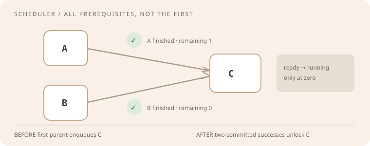
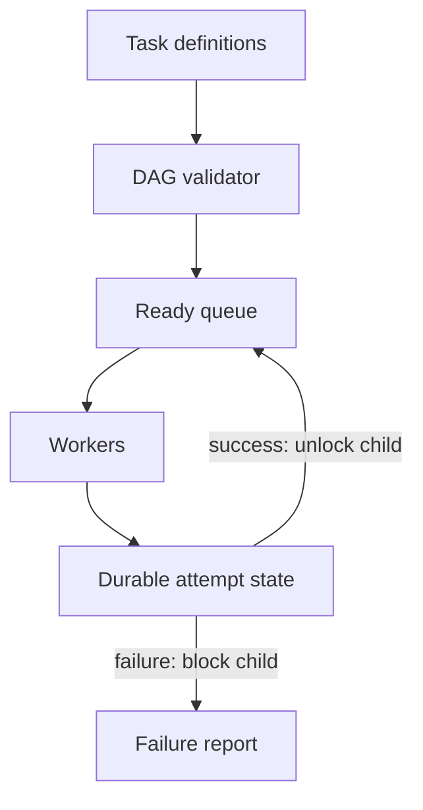
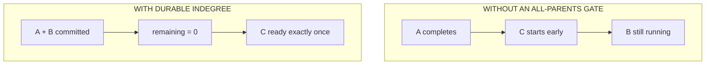

# Databricks · senior backend / product engineering

A [2026 anonymized candidate account summarized by Interview Query](https://www.interviewquery.com/guides/databricks-software-engineer) mentions a dependency scheduler, multithreaded logger, a graph problem, and a bookshop architecture discussion across interviews. This is **one edited, unverified report**, not a measured question-frequency list. Databricks' [Lakebase product](https://www.databricks.com/product/lakebase) grounds the data-platform follow-ups below; its features are not evidence of interview questions.

## The room · correctness under concurrency

**How it may feel:** a small algorithm becomes a service with retries, failures, tenants, and data isolation. For the reported scheduler/logger categories, show an invariant and a thread-safe handoff before optimizing throughput. A bookshop design is reported in one anonymized account; other design prompts here are original.

**Ask first:** Is order required or only dependency correctness? Are failures retryable? What does a run ID mean? How many tasks/tenants? Must the logger flush on process exit?

## Coding bench · eight drills

Only categories 01–03 are mentioned by that single candidate summary; exact inputs, wording, and frequency remain unknown.

| Drill and exact ask | Example to settle before coding | Senior stretch |
| --- | --- | --- |
| 01 · DAG scheduler: emit a task only when all prerequisites complete | `A→C,B→C` → `C` after both | Cycle rejection, failure propagation; worked mock below |
| 02 · Concurrent logger: multiple producers append, one worker flushes in order | producers `a,b` → once each in queue order | Bounded queue, shutdown, disk failure |
| 03 · Graph: detect cycle and show one witness path | `a→b→c→a` → cycle `[a,b,c,a]` | Very large graphs and incremental updates |
| 04 · CIDR consolidation of adjacent IP ranges | two contiguous `/25` blocks → `/24` when aligned | IPv6 and overlap boundaries |
| 05 · Snapshot iterator across a mutable collection | snapshot `[a,b]`, then add `c` → `a,b` | Memory/time trade-off of MVCC |
| 06 · Rolling hit counter in a half-open window | at `t=60`, hits at `0,1,60`, last 60s → 2 | Out-of-order events |
| 07 · Merge sorted event runs without losing duplicates | `[1,3]` + `[1,2]` → `[1,1,2,3]` | Spill to disk and backpressure |
| 08 · Idempotent SQL-style upsert by `(tenant,event_id)` | replay `e1` with same payload → one row | Conflicting replay, transaction isolation |

## Design board · five prompts

| Prompt | Initial requirement | Change the requirement |
| --- | --- | --- |
| Bookshop service · reported theme | Catalog, cart, checkout | Inventory reservation and payment idempotency |
| Event ingest · original | Accept append-only events | Schema evolution and replay |
| Batch scheduler · original | Run dependent jobs | Multi-tenant quotas and regional outage |
| Operational-to-analytics sync · original | Copy changed rows | Late updates, deletes, backfill, lakehouse freshness |
| Query service · original | Run isolated tenant queries | Hot tenants, runaway scans, cost budgets |

## Niche mock · schedule the work, not the hope

**Interviewer:** “Implement `run(tasks, dependencies, workers=2)`; no task starts before all prerequisites finish. Tasks can fail. Make the first version deterministic; then tell me what changes with several workers and a crash.”

**Clarify aloud:** Dependencies are directed `prerequisite → dependent`; each task has an ID; a task runs at most once per attempt; failed prerequisite blocks its descendants; cycles are invalid input. Decide whether to return an ordered completion log or statuses per ID.

| Input / event | Expected | Edge |
| --- | --- | --- |
| `A→C, B→C`; `A` finishes | `C` still waiting | All prerequisites, not any one |
| `B` then finishes | `C` becomes ready once | Concurrent completion race |
| `A→B→A` | Reject before running | Cycle |
| `A→C`; `A` fails | `C=blocked` | Failure propagation |
| Duplicate completion event for `A` | No second enqueue | Idempotency |
| No tasks | Empty result | Empty graph |

**Think in public:** indegree per task and reverse adjacency. Enqueue indegree-zero tasks; on a *committed* success, decrement each child once; move a child to ready exactly at zero. Topological precheck rejects cycles in O(V+E), with O(V+E) space. For concurrency, protect transitions (`waiting→ready→running→succeeded/failed`) atomically and bind completions to attempt IDs.

**Before / after:** the animation contrasts enqueueing `C` when the first parent finishes with counting down *both* prerequisites. The box diagram adds the durable boundary a thread-only solution lacks.

**Follow-up 1 (senior):** “A worker crashes after side effects but before reporting success.” Retry with attempt IDs and idempotent downstream effects; distinguish at-least-once execution from exactly-once business outcome. **Follow-up 2 (staff):** “The platform serves hundreds of tenants.” Add fair scheduling, tenant quotas, per-region recovery, dead-letter policy, lag metrics, and a bounded graph-size contract. Explain how you migrate scheduler state while work is running.

Debrief · what a strong answer contains

Draw the DAG and state transitions before threading. Name cycle detection, shared-state synchronization, duplicate completion, and crash replay. On bookshop design, distinguish inventory reservation from charge; show payment idempotency and compensating outcomes rather than a single database box labeled “transaction.”

**Evidence:** [Interview Query's anonymized report](https://www.interviewquery.com/guides/databricks-software-engineer) (edited candidate summary, Q3 2026; not independently verified) and [official product context](https://www.databricks.com/product/lakebase). Other drills and architecture extensions are original practice, checked 22 September 2026.
