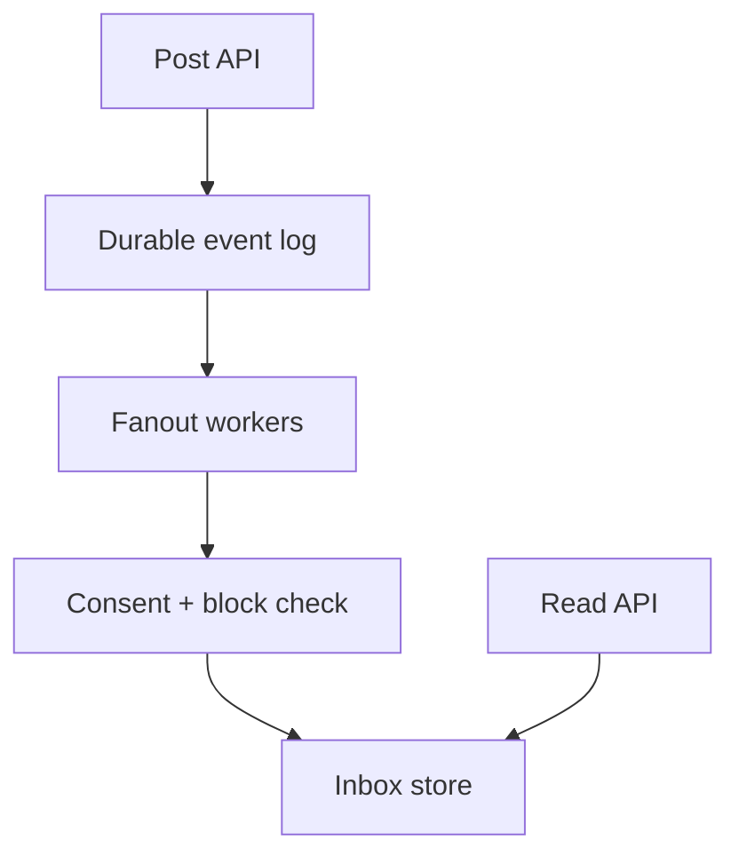

# Meta · senior product engineering

Meta's [published full-loop guide](https://d3no4ktch0fdq4.cloudfront.net/public/course/files/Meta_SWE_full_loop_guide.pdf) describes coding, system/product design, and behavioral conversations, generally 45 minutes each in a four-to-six-interview loop. It discusses solving two coding problems in roughly 40 minutes and evaluating communication, problem solving, and verification. A [self-reported E5 *infrastructure* account](https://www.reddit.com/r/leetcode/comments/1pfmd8u/my_meta_e5_infra_interview_experience_coding_ai/) from within the past year describes tree/graph and array/string coding, a staged AI coding exercise, design, and behavioral rounds. Infra is not product; that report is a single anecdote, **not a general Meta E5 blueprint**.

## The room · time-boxed clarity

**How it may feel:** little time to spend on an elaborate preamble. State constraints, choose an invariant, write executable code, and walk through a boundary test. On design, give the client-to-storage story first, then zoom into the highest-risk decision. This describes preparation for the official format; the specific questions below are not a verified “most asked” list.

**Ask first:** Is this a product architecture or large-scale system design round? Can you run code? What inputs are promised? Is the AI exercise present, and what tools are permitted?

## Coding bench · eight original drills

The first three mirror *categories* in one E5 infra report, not its exact prompts; the remainder are original practice.

| Drill and exact ask | Example to settle before coding | Senior stretch |
| --- | --- | --- |
| 01 · Tree: lowest common ancestor when nodes may be missing | tree `a→b,c`, query `(b,x)` → none | One traversal with presence tracking; skewed tree |
| 02 · Graph: shortest path in unweighted friend edges | `a—b—c`, `a—d`, target `c` → 2 | Disconnected graph and privacy-filtered nodes |
| 03 · Array: count subarrays summing to `k` with negatives | `[1,-1,1], k=1` → 3 | Prefix frequencies, integer range |
| 04 · Top-k notifications by `(time,id)` | equal time `a,b` → deterministic order | Multiple shards, cursor stability |
| 05 · Interval merge of video-watch ranges | `[0,2),[2,4)` → `[0,4)` | Half-open semantics and streaming input |
| 06 · Sliding-window distinct viewers | `a,b,a` in last 3 events → 2 | Approximate counts at high scale |
| 07 · LRU media metadata cache | capacity 2, `a,b,get(a),c` → evict `b` | Thread safety and stale versions |
| 08 · Progressive mini-system: implement inbox then add `mark_read` and dedupe | replay `e1` twice → one unread item | Revise design live, document AI use if permitted |

## Design board · five original prompts

| Prompt | First-pass requirement | Interviewer changes it |
| --- | --- | --- |
| Messenger-style chat | Send and read messages | Offline sync and per-device ordering |
| Home feed | Followed-user posts | Ranking, removals, celebrity accounts |
| Notifications | Alert on a new reply | Fanout, batching, opt-out, retries |
| People search | Search public profiles | Freshness, privacy and blocked users |
| Stories | Publish expiring media | View counts, deletion, cost |

## Niche mock · notification fanout

**Interviewer:** “When someone posts, notify their followers. Design a product API and service for ordinary and very large accounts. What does a user see if they were offline?”

**Clarify aloud:** Is a notification required for every post or only opted-in accounts? Exactly-once display or at-least-once delivery? What is the retention period? Assume per-recipient opt-in, eventually visible inbox, 30-day retention, and idempotency key `(post_id, recipient_id, channel)`.

| Action | Expected observable behavior | Edge |
| --- | --- | --- |
| Alice posts, Bob opted in | Bob gets one inbox item | Baseline |
| Queue redelivers Alice's event | Still one item | Deduplication |
| Bob opts out before fanout reaches him | No new item | Consent at processing time |
| Alice deletes the post | Item removed or tombstoned promptly | Privacy/cache invalidation |
| Celebrity with 20M followers posts | Post API returns without 20M synchronous writes | Hot-key and backpressure |
| Bob signs in on two devices | Both converge to same read state | Device sync |

**Think in public:** a synchronous loop on the post-write path couples latency to follower count. Write the post and an outbox event transactionally; consume with idempotent inbox writes. Segment high-degree senders: fanout-on-read or hybrid only when it beats precomputation, with a clear freshness contract. Distinguish inbox item identity from push delivery attempt.

**Follow-up 1 (senior):** “The notification queue is six hours behind.” Prioritize recent/interactive traffic, cap retries, expose lag, and make the inbox serve the durable source rather than claim eventual processing is instantaneous. **Follow-up 2 (staff):** “A privacy deletion crosses regions while push has already gone out.” Specify what can be recalled, enforce checks before new deliveries, build deletion propagation and audit metrics; avoid promising retractable push notifications.

Debrief · what a strong answer contains

For coding, check two nontrivial cases before optimizing and spend time explaining complexity. For architecture, label write, queue, worker, permission boundary, read model, and failure-handling. For behavioral, prepare an example where you changed a technical decision after feedback and can quantify the outcome. The infrastructure anecdote is an optional AI-tool rehearsal, not evidence the product loop uses AI coding.

**Evidence:** [Official Meta guide](https://d3no4ktch0fdq4.cloudfront.net/public/course/files/Meta_SWE_full_loop_guide.pdf) (undated PDF; verify with recruiter) and [one E5 infrastructure candidate account](https://www.reddit.com/r/leetcode/comments/1pfmd8u/my_meta_e5_infra_interview_experience_coding_ai/) (self-report within a year). The exercises are original, checked 22 September 2026.
