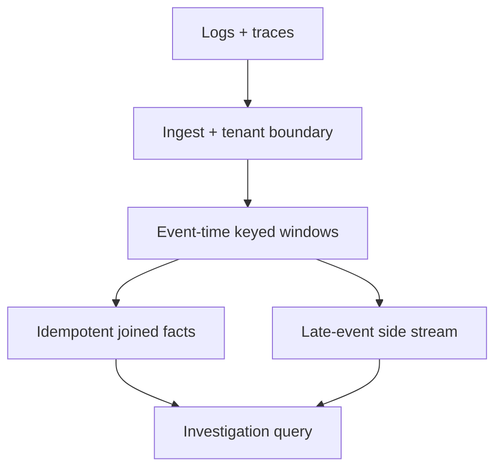
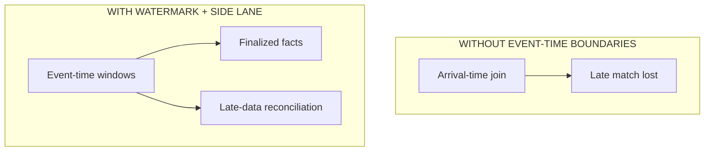
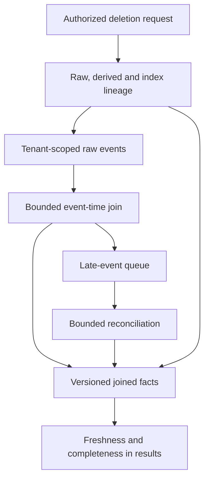

# Observe Inc. · senior backend / product engineering

## Your worked rehearsal: join late telemetry and show whether results are complete

An engineer opens a trace and expects to see related log events. Those events can arrive late, be repeated, or share a trace ID with data from another tenant. A join result therefore needs both an access boundary and an explicit completeness policy.

Implement the event-time join for the stated ten-second window, then explain bounded lateness, overload, and deletion of derived results. The model is an original practice service. It is not a description of Observe’s internal implementation.

**Starting point:** these drills are build briefs. Implement in a local file or draw the requested architecture. The worked answer is an explanation, not a supplied end-to-end application. Choose one drill per session, then change one requirement after the baseline works.

Observe describes a [product](https://www.observeinc.com/) that correlates logs, metrics, and traces with context, ingestion, and investigation workflows. We did **not** find a reliable, recent senior SWE candidate report giving a stable interview loop. **Everything below is an original simulation grounded in the public product domain; none is a claimed Observe interview question.** Ask the recruiter for the actual round structure.

## The room · the answer must survive noisy data

**Practice pressure:** telemetry arrives late, duplicates, lacks identifiers, and spikes when systems fail. A pretty dashboard is only useful if it preserves the provenance and uncertainty of its answer. Set an acceptable latency, retention, and cardinality budget before proposing boxes. This is a rehearsal frame, not a candidate-experience claim.

**Ask first:** Which signals share a trace ID? Do we have event time or ingestion time? What happens to a join after its window expires? Which tenant can query which fields? What is the query-cost ceiling?

## Choose a coding exercise · eight original drills

| Drill and exact ask | Example to settle before coding | Senior stretch |
| --- | --- | --- |
| 01 · Join log and trace events by `(tenant,trace_id)` within 10s event-time window | log at 9, trace at 12 → match | Out-of-order arrivals and watermark; mock below |
| 02 · Rolling p95 on the last 5 minutes | latencies `[10,20,30,40,100]` → 100 with nearest-rank rule | Approximation and mergeability |
| 03 · Bounded ingest buffer | capacity 2; third event → explicit backpressure | Spill, loss semantics, fairness |
| 04 · Per-tenant cardinality guard | keys `a,b,a`, cap 2 → accept all; `c` → reject | Noisy labels and top-k fallback |
| 05 · Parse structured log line with escaped delimiter | `a\|b|200` → two fields | Malformed records and size limits |
| 06 · Prefix index for service names | query `pay` → sorted `pay-api,pay-worker` | Updates and memory |
| 07 · Dedupe at-least-once telemetry | `event-id=7` twice → one aggregate increment | Expiring keys and late replays |
| 08 · Alert state machine with 2/3 bad windows | `bad,good,bad` → firing | Recovery hysteresis and missing data |

## Choose an architecture exercise · five original prompts

| Prompt | Initial requirement | Change the requirement |
| --- | --- | --- |
| Telemetry ingestion | Accept logs and traces | Outage burst and backpressure |
| Trace-log correlation | Click from trace to matching logs | Missing IDs and late data |
| Alert evaluation | Notify on sustained p99 rise | Quiet hours, dedupe, missing data |
| Multi-tenant investigation | Query one team's telemetry | Cost guardrails and fine-grained field access |
| Retention and archive | Keep hot data for 7 days | Legal deletion and cold replay |

## Worked session · correlation with a closing window

**Interviewer:** “A trace span and a log line can arrive in either order. Join them by tenant and trace ID if their event times are within 10 seconds. How will a user know the result is complete?”

**Clarify aloud:** Distinguish *event time* from arrival time. Assume `(tenant, trace_id, event_id)` unique, absolute timestamp difference ≤10s, duplicates ignored, and 30s tolerated lateness. Events after the watermark are retained in a separate late-data path, not silently inserted into already-finalized counts.

| Events | Expected | Edge |
| --- | --- | --- |
| log `t=10`, span `t=12`, same tenant/trace | One pair | Baseline |
| span arrives before log | Same one pair | Arrival order |
| same trace ID in another tenant | No pair | Isolation boundary |
| log `t=10`, span `t=21` | No pair | Window boundary |
| log `t=10`, span `t=20` | One pair | Inclusive 10s boundary |
| same log delivered twice | One pair | Duplicate delivery |
| matching log arrives after watermark | Late-data counter/reconciliation | Completeness is conditional |

**Think in public:** index unmatched entries by `(tenant, trace_id)` and event time; on receipt, probe opposite type in `[t−10,t+10]`, emit idempotent pair IDs, then evict only when the watermark proves a match cannot still arrive under the assumed lateness bound. Complexity O(log n + matches) per event with a time index, memory proportional to open windows and cardinality. Publish “provisional” versus “finalized” status to users.

**Before / after:** the animation shows why a late log cannot be treated as if the arrival clock were the event clock. Redraw the diagram with the watermark and side stream before adding a dashboard.

**Follow-up 1 (senior):** “A bad deploy increases events 50×.” Bound state per tenant, partition by tenant/trace, signal partial results, shed or spool according to loss contract, and measure watermark lag. **Follow-up 2 (staff):** “A customer deletes a trace while cold storage and derived joins retain it.” Trace lineage across raw, derived, index, cache, and archive; specify deletion propagation, audits, tenant-specific encryption or retention, and an observable completion SLO.

### Worked extension: make late reconciliation and deletion explicit

A watermark is a progress estimate under an assumed lateness policy. It does not make late events impossible. Route events arriving after finalization to a visible late-data path. If reconciliation can revise a result, publish a new version and define whether the UI shows provisional, finalized, or revised evidence.

When deleting a trace, include derived pair IDs, indexes, cached query results, and retained archives in the deletion plan. Mark completion only when the declared scope is satisfied. A raw-event deletion alone does not remove an already materialized join. During a 50× burst, enforce a tenant state budget and report partial evidence according to the loss policy instead of silently returning incomplete results as complete.

Debrief · what a strong answer contains

Never confuse missing telemetry with healthy service. Give a correctness contract for duplicates and lateness, a memory/cardinality budget, a visible completeness state, and a reproducible investigation path. The architecture is a practice design, not a claim about Observe's actual internals.

**Evidence:** [Observe's official product overview](https://www.observeinc.com/) is domain context only. No verified recent senior candidate loop was found as of 22 September 2026; verify role and format directly.
