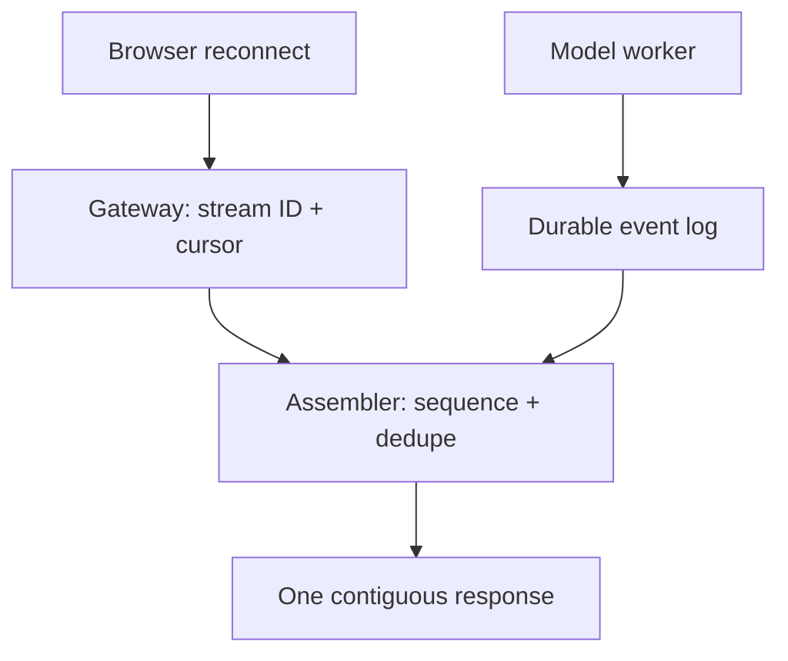
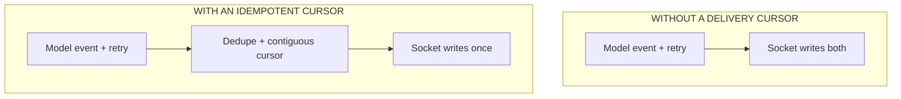
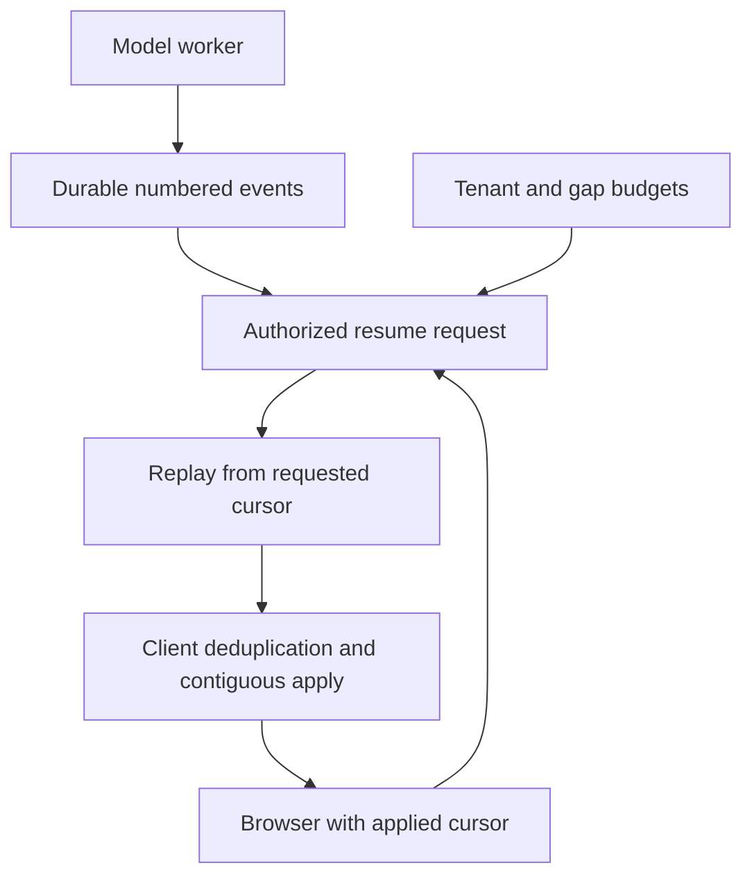

# OpenAI · senior product engineering

## Your worked rehearsal: assemble a stream and recover after a reconnect

A chat interface receives an answer as numbered text chunks. The connection drops after the browser displays part of the answer. On reconnect, older chunks may arrive again and later chunks may arrive before a missing earlier chunk.

Implement a single-stream assembler first. Its output is the contiguous text the user may display. Then explain what state must become durable when a gateway can restart. The coding and design tables offer alternative drills, while the worked mock below is one complete session.

**Starting point:** these drills are build briefs. Implement in a local file or draw the requested architecture. The worked answer is an explanation, not a supplied end-to-end application. Choose one drill per session, then change one requirement after the baseline works.

The public [interview guide](https://openai.com/interview-guide/) says technical formats vary by team and can include pair programming, take-homes, and technical tests. Engineering evaluation includes solution design, code quality, performance, tests, and collaboration. The final stage typically spans four to six hours with four to six people. AI-tool rules depend on the exercise; ask before using one. **None of the exercises below is presented as a reported OpenAI question.**

## The room · ambiguity before syntax

**How it may feel:** a changing requirement tests whether you can make the boundary explicit, deliver a dependable slice, and explain why it stays dependable. This is our *inference from published criteria*, not a candidate-verified difficulty score. Expect to say your assumptions aloud, test the failure path, and communicate trade-offs without hiding behind abstractions.

**Ask first:** Is this the user-facing chat product or a platform service? Is output ordering guaranteed? What is the retry contract? Can a client resume? Which AI tools are allowed in *this* round?

## Choose a coding exercise · eight original drills

Choose one for 35–45 minutes. Each has a testable contract; the “stretch” column raises it toward a senior conversation.

| Drill and exact ask | Example to settle before coding | Senior stretch |
| --- | --- | --- |
| 01 · Per-tenant token bucket: `allow(tenant, t)` returns a boolean, capacity 2, refill 1/10s | calls at `t=0,0,9,10` → `T,T,F,T` | Atomic update under concurrent calls; clock skew and Redis availability |
| 02 · Stream assembler: emit contiguous chunks by sequence number, ignore exact duplicate retries | `2:B, 0:A, 1:C, 1:C` → `ACB` | Conflicting duplicate, bounded gaps, cancellation; worked mock below |
| 03 · Deadline budget: propagate an absolute deadline across dependent calls | 90 ms left, 120 ms proposed timeout → downstream max 90 ms | Cancellation and partial responses |
| 04 · Versioned LRU: `get(key, version)` must never return a stale version | store `k@1`, request `k@2` → miss | Eviction, memory limits, concurrent invalidation |
| 05 · Dependency executor: run ready tasks in topological order | `a→c,b→c` → `a,b,c` or `b,a,c` | Retries, cycles, at-least-once effects |
| 06 · Incremental JSON envelope validator: chunks may split a UTF-8 character | `{"ok` + `":true}` → one object | Malformed bytes, size cap, parser security |
| 07 · Slot intervals: minimum parallel workers for `[start,end)` jobs | `[0,10),[10,12)` → 1 | Placement with memory limits |
| 08 · Idempotent usage ledger: apply event IDs once per tenant | `e1:+3,e1:+3,e2:+2` → 5 | Transaction boundary with external billing |

## Choose an architecture exercise · five original prompts

| Prompt | Initial product requirement | Change the requirement |
| --- | --- | --- |
| Streaming chat | User sees tokens as generated | Network reconnect without duplicated text |
| Usage metering | Bill by successful request | Partial stream, timeout, retry, dispute reconciliation |
| Async batch | Submit work and poll results | Priorities, cancellation, tenant isolation |
| Retrieval with files | Search only files user can access | Permission revocation while indexes lag |
| Model rollout | New version behind a feature gate | Canary, regression evals, rollback, audit trail |

## Worked session · a resumable stream

**Interviewer:** “A browser receives token deltas. A network retry can deliver the same event twice or reorder events. Build an assembler that emits text exactly once in contiguous order. Start with one stream; explain how you would resume across processes.”

**Clarify aloud:** Is an event uniquely identified by `(stream_id, sequence)`? Can retries disagree on payload? Does `final` declare the last sequence? Is output a string or callback? Set these assumptions before touching code: zero-based sequence; exact duplicate is ignored; conflicting duplicate is rejected; `final(n)` means all `0..n` must arrive; gaps hold later chunks without emission.

| Input events | Expected emitted text | Why it matters |
| --- | --- | --- |
| `0:A, 1:B` | `AB` | Ordered baseline |
| `1:B, 0:A` | `AB` | Out-of-order delivery |
| `0:A, 0:A, 1:B` | `AB` | Exact retry is harmless |
| `0:A, 0:X` | reject conflicting retry | No silent corruption |
| `2:C, final(2), 0:A` | `A`, then await `1` | Final is not completeness |
| `final(0)` | incomplete, no invented token | Empty/missing stream |
| `0:"é"` split as raw bytes | decode after complete character | Transport frames ≠ characters |

**Think in public:** Keep `next_expected`, a bounded map of future chunks, and hashes of already-emitted sequences until the resume window closes. On receiving `n`, compare to remembered value if old, store if future, and drain in a loop while `next_expected` exists. Time O(number of events + emitted characters), space O(max gap + retained dedupe window). Without a bound on gaps or retention, an adversarial client can grow memory indefinitely.

**Before / after:** before, a retry writes straight to the socket and duplicates tokens; after, the assembler gates delivery at a contiguous cursor. Animate the retry above, then cover the labels and redraw the boxes yourself.

**Follow-up 1 (senior):** “The gateway crashes between recording `n` and replying.” Decide whether cursor advancement and delivery are atomic; if not, prefer replay plus idempotent client apply rather than claiming exactly-once transport. **Follow-up 2 (staff):** “One tenant can open 100k streams.” Add per-tenant concurrency budget, memory caps, shedding, durable-log TTL, and metrics for gaps, duplicate rate, reconnect success, and p99 time-to-first-token. State a safe degraded behavior when the dedupe store is unavailable.

### Worked extension: move delivery recovery to durable state

A gateway cannot atomically commit a database cursor and guarantee that a browser displayed a socket message. If it records sequence 7 then crashes before sending it, resuming after 7 can lose visible text. If it sends first and crashes before recording, replay can duplicate it. Keep durable event identity and let the client apply a replay idempotently. Resume from a cursor tied to the authorized stream and acknowledged client state, with an explicit expiry policy.

At an assumed 100,000 open streams and 8 KB of buffered data per stream, payload buffering alone is about 800 MB before object overhead. Bound active streams, gaps, and retained history separately. When replay history expires, return an explicit restart contract instead of silently starting from a missing sequence.

Debrief · what a strong answer contains

Start with observable behavior and at least three edge tests; implement a minimal state machine, not a distributed system in the first 15 minutes. Explain that exactly-once *visible application* requires a stable event identity and idempotent apply; a network itself may retry. On design, show the owner of each state, the failure boundary, and how a client proves its resume cursor.

**Evidence:** The [official guide](https://openai.com/interview-guide/) supports format variability and evaluation criteria, not these particular prompts. This bank is an original rehearsal, checked 22 September 2026.
