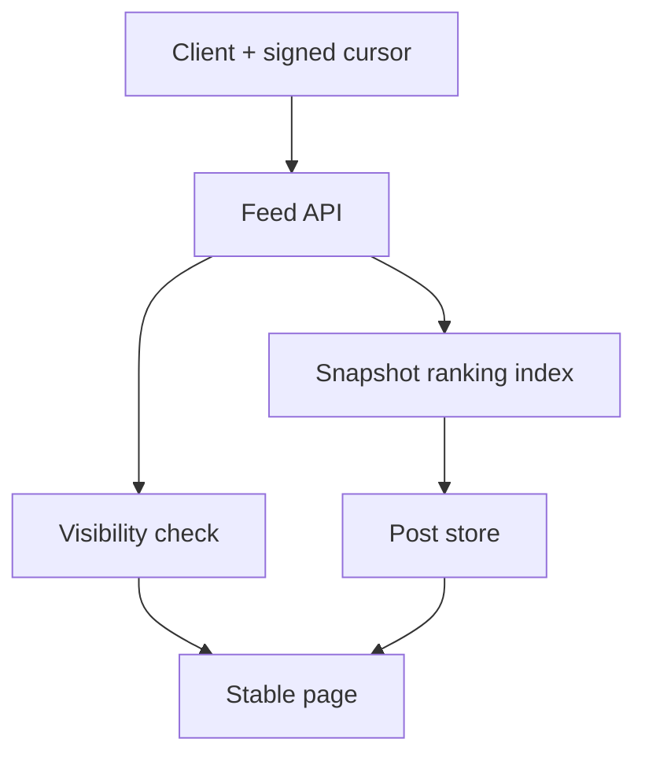
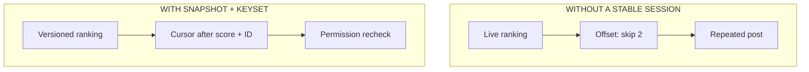
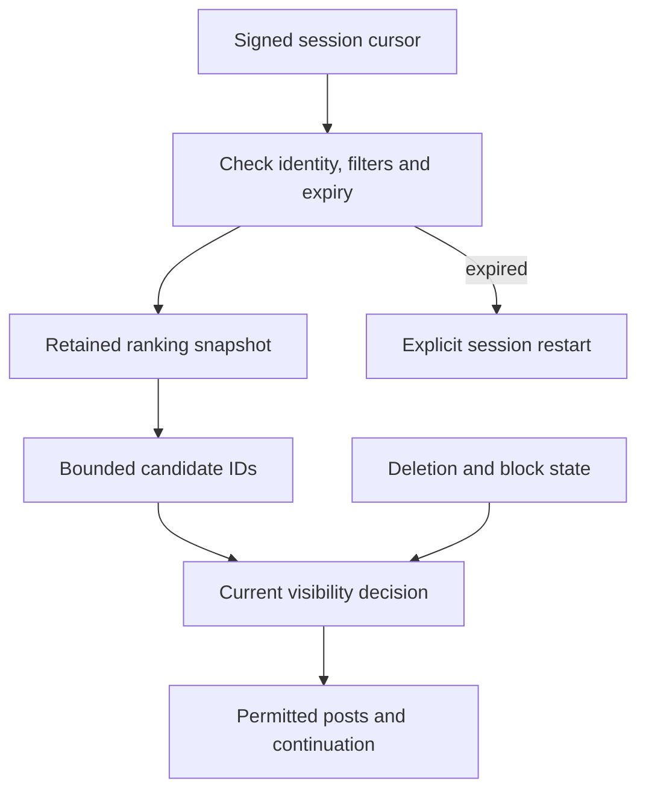

# Reddit · senior product engineering

## Your worked rehearsal: paginate a changing feed without repeating posts

A community feed displays two posts at a time. While a reader scrolls, other people add posts, vote, block authors, and remove content. A page cursor must describe which ordering the reader is continuing, while current visibility rules still decide what they may receive.

Implement a small feed-page contract and draw the stored ordering behind its cursor. Then handle score changes and moderation. You are building the original practice design below, not reconstructing Reddit’s internal architecture.

**Starting point:** these drills are build briefs. Implement in a local file or draw the requested architecture. The worked answer is an explanation, not a supplied end-to-end application. Choose one drill per session, then change one requirement after the baseline works.

Reddit's [public product](https://redditinc.com/) centers communities, posts, comments, votes, and conversation. We could not verify a recent, role-matched senior product SWE candidate account that established a stable interview loop. **Difficulty, exact rounds, and repeat-question frequency are unknown.** All prompts here are original product-inspired simulations, not reported Reddit questions.

## The room · a community is not a single feed

**Practice pressure:** a change to ranking or moderation affects millions of independent communities, live writers, readers, and trust decisions. Ask whether “fresh” means strictly current, eventually refreshed, or stable while a user pages. This is a rehearsal mindset, not a claim about what interviewers actually ask.

**Ask first:** Personalized or community feed? What does a moderator control? What can be hidden or deleted? Which consistency matters to voters versus feed readers? What is the abuse model?

## Choose a coding exercise · eight original drills

| Drill and exact ask | Example to settle before coding | Senior stretch |
| --- | --- | --- |
| 01 · Keyset page of posts sorted by `(score,id)` descending | scores `9:a,9:b,7:c`, cursor `(9,b)` → `9:a,7:c` | Inserts, score changes, snapshot semantics |
| 02 · Flatten threaded comments depth-first with a max visible depth | `a→[b,c], b→[d]` → `a,b,d,c` | Large fan-out and deleted-parent placeholders |
| 03 · Idempotent vote transition per `(user,post)` | up, up, down → post delta `−1` from baseline | Concurrent opposite votes and audit log |
| 04 · Moderation queue by priority then arrival | equal priority timestamps `2,1` → `1,2` | SLA fairness and moderator visibility |
| 05 · Near-duplicate post fingerprint from normalized title | `"Hi!"`, `" hi "` → same candidate | False positives and evasion |
| 06 · Community prefix search with top-k by activity | prefix `py` → matching communities, stable tie break | Trending score lag and prefix cache |
| 07 · Hot-score evaluator with timestamp and vote count | zero votes, same timestamp → stable score | Time decay and adversarial voting |
| 08 · Comment rate limit per user/community | 3 allowed per 60s; fourth at 59s → reject | Burst fairness and spam controls |

## Choose an architecture exercise · five original prompts

| Prompt | Initial product requirement | Change the requirement |
| --- | --- | --- |
| Community feed | Rank recent posts for one community | Stable pagination as votes arrive |
| Comment tree | Read and reply to deeply nested comments | Deleted parents and moderator locks |
| Votes | Update visible counts on a post | Bot abuse and reconciliation |
| Mod queue | Escalate reported content to moderators | Appeal, audit, and urgent safety path |
| Notifications | Alert users when replied to | Fan-out spikes, muting, and consent |

## Worked session · a feed that does not repeat posts

**Interviewer:** “Build a community feed API with `limit` and a cursor. A user scrolls while people submit posts and vote. Do not show the same post twice in that session. Explain what freshness you give up.”

**Clarify aloud:** Ranking is `(rank_score DESC, post_id DESC)`, limit 2, unique immutable IDs, score can change. Is the contract “never duplicate,” or also “never miss a newly eligible post”? They cannot both be guaranteed with a moving ranking and a stateless cursor. Choose session snapshot or an explicitly weaker live-feed contract.

| Feed / action | Expected session page | Edge exposed |
| --- | --- | --- |
| `a:9,b:8,c:7`, first request | `a,b` | Baseline; cursor contains `(8,b)` |
| Insert `x:10` before second request | `c`, not `b,c` | Offset pagination would repeat `b` |
| `c` changes score to 11 mid-session | Snapshot returns `c` once in original order | Live ranking can move across cursor |
| `b` is deleted before page two | Never return `b` again | Visibility must be rechecked |
| User blocks `c` before page two | Skip `c`, potentially short page | Filter after read or over-fetch |
| Empty community | Empty items, null cursor | No fake continuation |

**Think in public:** For the strict session contract, issue a signed cursor with snapshot/version, last sort tuple, filter identity, and expiry. Read from a versioned ranking snapshot; re-evaluate permission and deletion at serving time. Over-fetch when filtering. An unbounded per-user “seen IDs” set is not a scalable fix; an expiring snapshot is a conscious cost/freshness trade-off.

**Before / after:** the animation contrasts an offset sliding beneath live inserts with a cursor anchored to a particular ordering. Draw the initial boxes and label which store owns ranking, content, and permission.

**Follow-up 1 (senior):** “A moderator removes a post after the snapshot.” Visibility beats ordering: skip it without leaking title/snippet from stale cache; return a short page or over-fetch. **Follow-up 2 (staff):** “The ranking index is rebuilt and old cursors point at an expired version.” Return an explicit expiry/restart contract; preserve enough versions for a bounded session, measure expiry rate, cache cost, duplicate reports, and time to moderation hide. Decide where multi-region writes converge.

### Worked extension: preserve ordering while applying current visibility

A snapshot freezes a ranking for a bounded reading session. It must not freeze permission to view a removed post. Read candidate IDs from the snapshot, then evaluate current visibility before exposing content. A cached response that bypasses that check can disclose a title even if the underlying post was deleted. Bound over-fetching and return a short page when the permitted scan budget is exhausted.

When an old snapshot is retired, its cursor cannot continue honestly. Define an expiry response and a UI action to start a fresh feed. That new session may contain posts seen in the old one, so do not claim cross-session deduplication without additional state and a retention policy.

Debrief · what a strong answer contains

Separate the contract from implementation. Offset is an okay baseline only when the list is static; a keyset cursor helps with inserts but alone does not freeze mutable scores. Show a cursor bound to filters and user context, deliberate visibility rechecks, tests for equal scores, and a plan for expiry and privacy.

**Evidence:** [Reddit's product overview](https://redditinc.com/) grounds the domain. The interview format and all drills remain unverified simulations, checked 22 September 2026.
