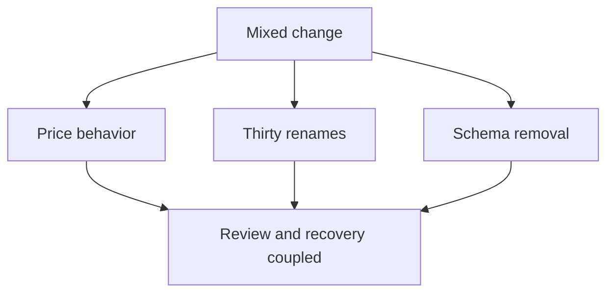
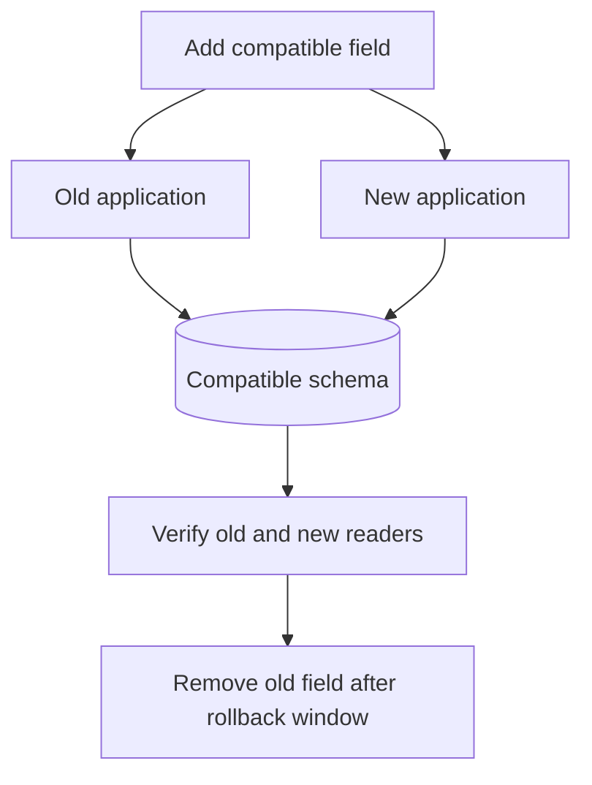
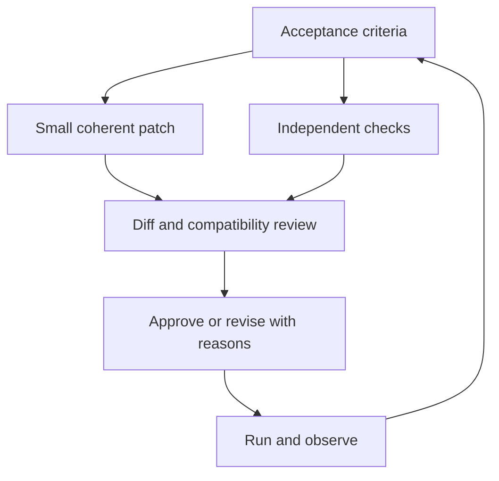

# The change loop

[Curriculum](../../README.md) · [Specify, implement and review changes with AI](README.md)

> Project connection · feeds **P1 (it works)**

## At the whiteboard

> “A checkout fix also renames thirty files and removes a database column.
> Ten percent of checkouts now fail. Make the next change easy to review,
> diagnose, and recover from.”

Start with one observable behavior: `1999 - 200 = 1799` cents.
Keep an unrelated rename separate. Record the reason for each change, not just
what the diff contains.



## The mental model


A **commit** records a coherent change and its reason. A **pull request** explains
its behavior, risks and checks. **Merging** records the decision; running and
observing the result completes the loop.

Small batches make review and diagnosis easier. They do **not** guarantee low
risk or safe rollback: `DROP TABLE orders` is one line. Undoing that line in Git
does not recover the orders.

| Recovery question | Evidence to require |
|---|---|
| Can the code revert cleanly? | Apply the revert on a branch and run checks |
| Can old code read new writes? | Test schema and protocol compatibility |
| Can we recover deleted data? | Restore from a tested backup/recovery path |
| Have effects already escaped? | Reconcile or compensate payments/events |



**Follow-up:** the new version writes a field the old version ignores. A rollback
may work, but only if old readers can still interpret every required value.
Check that contract rather than assuming that a small diff is reversible.

## Refactor or behavior change?

A refactor preserves the **supported observable contract**. Test imports,
fixtures and structure may need to move with the implementation. Changed
expectations deserve special attention; unchanged tests are not proof either.

| Review example | Decision and reason |
|---|---|
| Move `prices.py` into `checkout/`; update test imports; keep `total(1999, 200) == 1799` | Accept as a refactor if the supported API and behavior remain intact |
| Return `1800`; replace the exact assertion with `total(...) > 0` | Reject the refactor claim: the assertion hides changed behavior |
| Correct a calculation **and** add its regression test | One coherent change; the word “and” is not a problem |
| Rename logging classes while changing checkout rounding | Separate unrelated changes, even if the title contains no “and” |

## Ask an assistant for a reviewable change

```text
Implement <one observable behavior>.
State the contract and examples first. Propose coherent, reviewable commits.
Keep unrelated refactoring separate. Include tests with their behavior change.
For stateful changes, explain compatibility and recovery before removing data.
For each commit, state what changed, why, and the checks actually run.
```

Review the diff yourself. Sort each hunk into “needed for this behavior” or
“unrelated.” Look for missing failure paths, tests and migration steps. A useful
review may approve the patch unchanged. Do not manufacture objections to meet
a quota.

```text
Review this diff against the agreed contract.
Identify behavior changes, accidental changes, and tests that would detect them.
Cite the relevant hunks. State unknowns and checks you did not run.
Approve, request changes, or ask a specific question, with evidence.
```

## Your slice of the project

Start [Stage 1: Build the shared reading-list application](../../../projects/reading-list/stages/01-it-works/README.md) with a
repository, `.gitignore`, a lockfile decision and a short scope note. Build a
runnable sign-up/sign-in slice in a few coherent commits. Keep secrets out of
history. Review it through a pull request, even when working alone.

**Acceptance:** another person can reproduce the behavior from your PR; the
commit history explains the decisions; required checks pass; and stateful
changes have an explicit recovery boundary. An unchanged approval is valid
when supported. A one-line destructive migration without recovery is not.

Practice failure detection using a **labeled disposable fixture**, not by
secretly introducing bugs into a real team’s work. A negative control proves
sensitivity to the particular defect you planted, not every possible defect.

## Words you now own

**Diff/hunk:** a change or contiguous part of it. **Revert:** a new commit that
reverses an earlier code change. **Merge queue:** checks proposed combined
changes before landing them. **Lockfile:** the resolved dependency graph used
to reproduce an install. **Review latency:** time to meaningful review, measured
from timestamps rather than inferred from file count.

## Draw it from memory · Make a change reviewable



**Redraw challenge:** show why a clean Git revert cannot undo an already sent
payment or restore a deleted database row.

[Testing](../../02-applications/04-testing/testing-strategy.md) · [Learning sequence](../../README.md) · [Independent practice](../../../practice/interview-guide.md)
