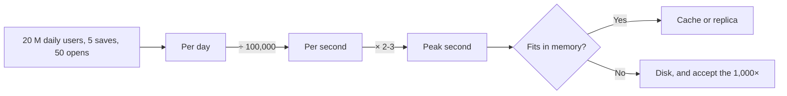

# The constants you estimate with

[Curriculum](../../README.md) · [Specify, implement and review changes with AI](README.md)

> Project connection · feeds **P3 (it holds under load)**

## At the whiteboard

> "Design the bookmark service. Twenty million people use it daily. Each one
> saves about five links and opens their list about fifty times."

You cannot look anything up and you have about ninety seconds before the
conversation moves on. The question is not whether you can architect. It is
whether you can turn that sentence into numbers, because until it is numbers
there is nothing to design against.

Three constants do almost all of the work, and none of them needs a calculator.

## The mental model

**A day is about 100,000 seconds.**

The exact figure is 86,400. Round it up to 105. That is roughly 16%
high, and it is the single most useful rounding in this subject: no design
decision you will ever make turns on 16%, and dividing by 100,000 is arithmetic
you can do out loud while drawing a box.

So **requests per day ÷ 100,000 = requests per second**, and because both sides
are powers of ten it collapses to a ladder worth memorising once:

| Per day | Per second |
|---|---|
| 1 M | 10 |
| 10 M | 100 |
| 100 M | 1,000 |
| 1 B | 10,000 |

Ten times the traffic per day is ten times the traffic per second. Nothing else
to remember.

**One caution the ladder hides, and it is yours to add:** that is an *average*
second. Real traffic has a daily shape. Multiply by two or three for the busy
hour before you size anything, and say out loud that you have done it. An
interviewer who hears "three thousand a second at peak, not one thousand"
learns more about you than the estimate itself does.

**Storage and network latency differ by factors of a thousand.**

| Where the data is | Roughly | Relative to memory |
|---|---|---|
| Memory | 100 ns | 1× |
| Local SSD | 100 µs | ~1,000× slower |
| Round trip across the world | 150 ms | ~1,000,000× slower |

The absolute numbers move with hardware. The **ratios do not**, and the ratios
are the part that decides architectures. Memory, then disk, then the network —
each step is about a thousand times worse than the last. That is why a cache is
not a micro-optimisation, and why one extra cross-region hop can cost more than
every other thing on your diagram put together.

**Each extra nine divides annual downtime by ten.**

| Availability | Downtime per year |
|---|---|
| 99.9% (three nines) | ~8.8 hours |
| 99.99% (four nines) | ~53 minutes |
| 99.999% (five nines) | ~5 minutes |

Start from three nines being most of a working day, and the rest is division.
This is the constant that makes an availability target concrete: five nines
means your total budget for a bad deploy, a failover and a cloud incident is
five minutes for the entire year, which is a sentence that ends a lot of
optimistic conversations.

## The same question, worked

Back to the whiteboard. Twenty million people, five saves and fifty opens each.

- Writes: 20 M × 5 = **100 M per day** → 1,000 per second → call it **3,000 at
  peak**.
- Reads: 20 M × 50 = **1 B per day** → 10,000 per second → **30,000 at peak**.

Now the latency constant does something the traffic numbers alone cannot. Thirty
thousand reads a second, each touching an SSD at 100 µs, is thirty seconds of
disk time per second of wall clock. The disk cannot do it. You need the working
set in memory, or you need to spread it across replicas, and you now know that
before you have drawn a single box.

That is the whole point of carrying these. **The constants do not design the
system. They rule out the designs that were never going to work**, in the first
two minutes, out loud, in front of someone.

## When to reach for this

Any time a problem hands you a population and asks for a structure. In this
curriculum that means:

- [Design services from requirements to failure behavior](../../03-production/01-system-design/README.md) — every
  problem in the chapter opens with a workload you must size before you can
  choose a mechanism.
- [Set reliability objectives and recover from failures](../../03-production/05-reliability/README.md)
  — the nines table is what turns an availability target into an error budget.
- [Measure capacity and control performance costs](../../04-scale-and-evolution/02-performance-cost/README.md)
  — the latency ladder tells you which layer is worth measuring first.
- [Process, search and store data at scale](../../04-scale-and-evolution/01-data-at-scale/README.md) —
  caching, replication and partitioning are all answers to "this does not fit or
  does not keep up", which is an arithmetic finding.

If a question gives you user counts and you start drawing boxes before you have
a per-second number, you are designing against a feeling.

## Where this came from

Bruno sent a short video by [@arjay_mccandless](https://www.tiktok.com/@arjay_mccandless)
laying out the same three groups of constants. The numbers are standard
engineering reference values; the worked example, the peak-traffic caution and
the curriculum links above are this guide's.
