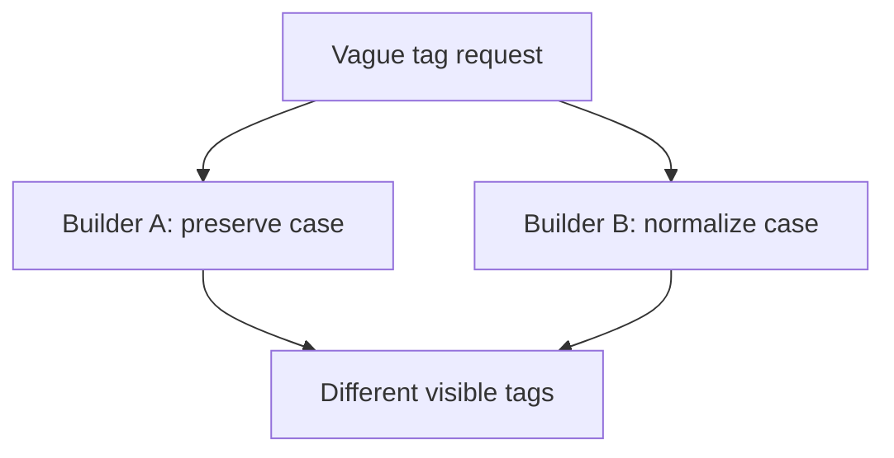
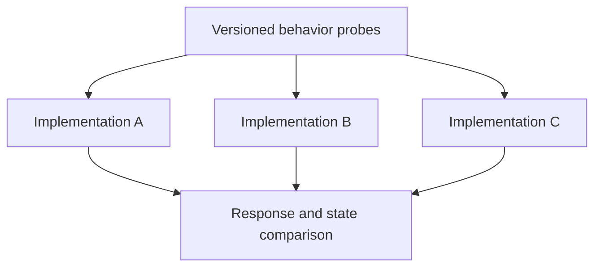
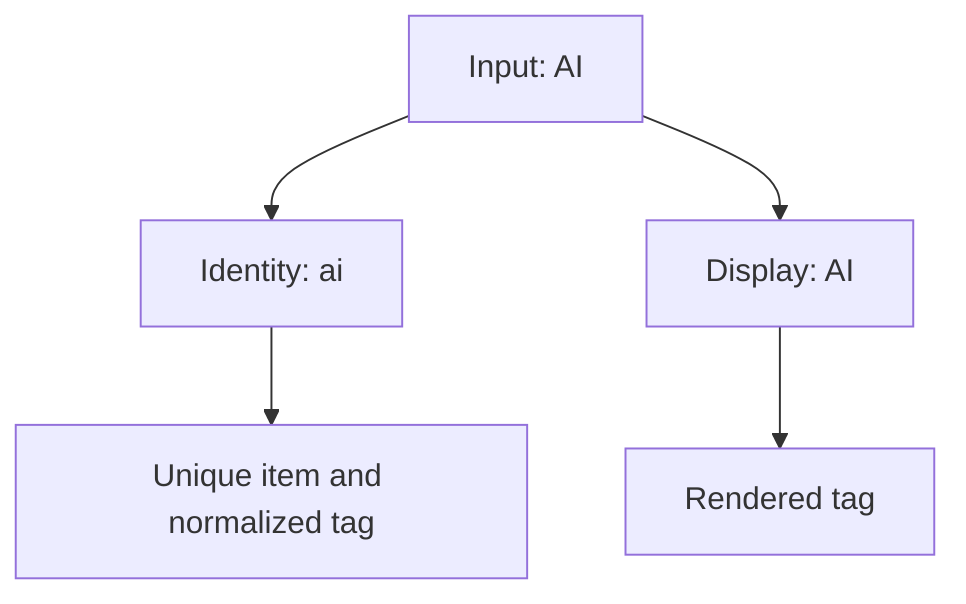

# 1. The spec that survives a stranger

[Curriculum](../../../../README.md) · [Problem solving and AI-assisted engineering](../../README.md) · [Project index](../../../../../indexes/projects.md)

## The reviewer's brief

> Two engineers independently implement tags from your brief. One accepts ` AI ` and `ai` as distinct tags; the other merges them. Give both engineers a contract that settles this without prescribing their source code. What behavior must be pinned?

This is a **constructed practice brief**, not an attributed company question.
Prerequisites: [the section](../../working-with-ai.md). This page is a build brief; it does not ship a runnable application. The original build and prompt sequence below defines the implementation checkpoints.

| Case | Exact input or workload | Expected outcome |
|---|---|---|
| Small example | Add tags ` AI `, `ai`, and an empty string to item 7 owned by user A. | Trim and lowercase; store one `ai`; reject empty input with 400 and leave existing tags unchanged. |
| Boundary / failure | User B sends a tag update to A’s item 7. | 404 with no row changed; matching happy paths cannot establish ownership safety. |
| Scope | Closed normalization rule for this exercise; choose maximum length explicitly. | Explain any additional assumption before implementing it. |

## See the first reviewable result

**First slice:** Write one page specifying tag normalization, duplicate behavior, ownership, and the error response. Give two fresh implementers only that page, not your earlier chat history. For item 7, the inputs `" AI "`, `"ai"`, `""` should yield one stored `ai`, then a 400 without state change. **Show:** both implementations' test output and the exact point their interpretations differed. A stranger's ability to reproduce the behavior is the product.

<!-- project-expectation:start -->

## What you are expected to hand over

**The finished artifact:** One specification for one small, real feature — tagging from P1 is the right size. Hand the identical document to two fresh sessions with no other context, let each build it, and compare what comes back. The spec is the deliverable; the two builds are its test.

Bring a runnable slice or decision artifact, its normal output, and a captured
failure from the examples above. Include one check that turns red when the guarantee
breaks, the state owner, and the first operational limit. For each follow-up,
change the diagram **and** the evidence before claiming the design still works.

### How the review conversation gets harder

| Review gate | The interviewer changes | Expected response |
|---|---|---|
| Baseline | Run the small example from the cases above. | Demonstrate the observable outcome end to end and identify which boundary owns it. |
| Failure | Reproduce the boundary/failure case above. | Show the failure before the fix, then prove the protected behavior without hiding the error. |
| Senior · A third implementation | A third engineer uses a different framework. What do you compare? Predict which boundary must change before opening the design. | Run the same black-box probes against each implementation. Compare status, data, and side effects; ignore file layout and variable names. |
| Lead · The product rule changes | Users now need case-preserving display with case-insensitive uniqueness. Which field changes? State what evidence would make you reject your first design. | Separate normalized identity from display text. Define whether the first or latest spelling wins; retain a migration example for the existing ai value. |
| Evidence | A reviewer asks, “How do you know?” | Build in three stops: reproduce the small case and baseline failure; implement the protected boundary; then replay both changed requirements with captured outputs. |
| Handoff | The author is unavailable and the environment is new. | Another engineer can run, observe, break, and recover the artifact from the repository evidence. |

Before implementation, say the baseline invariant, the owner of each piece of
state, and what the user sees when the named dependency or assumption fails. That
five-minute explanation is part of the project: if it is vague, the build is not
ready to begin.

<!-- project-expectation:end -->

Before looking at the guidance, state the invariant in one sentence and trace the example. In interview practice, implement or sketch independently, then reveal the reasoning. During AI-assisted practice, use the prompts below and verify each checkpoint before the next request.

## Baseline and the failure to explain



Two plausible implementations differ because behavior is underspecified. Agreement alone would also be inconclusive: both could share the same default or defect.

<details>
<summary>Reveal the approach and decisions</summary>

Write probes before implementation, including authorization and atomic validation. The invariant is identical observable behavior for the pinned inputs, not identical code. Keep harmless implementation choices open; revise only ambiguities that affect the contract.

</details>

## Follow-up 1 · A third implementation

**Changed requirement:** A third engineer uses a different framework. What do you compare? Predict which boundary must change before opening the design.

<details>
<summary>Expected reasoning and changed diagram</summary>

Run the same black-box probes against each implementation. Compare status, data, and side effects; ignore file layout and variable names.



</details>

## Follow-up 2 · The product rule changes

**Changed requirement:** Users now need case-preserving display with case-insensitive uniqueness. Which field changes? State what evidence would make you reject your first design.

<details>
<summary>Expected reasoning and changed diagram</summary>

Separate normalized identity from display text. Define whether the first or latest spelling wins; retain a migration example for the existing `ai` value.



</details>

## Evidence to bring to review

Build in three stops: reproduce the small case and baseline failure; implement the protected boundary; then replay both changed requirements with captured outputs. Record commands, fixtures, and observed results in your implementation README. A diagram is a prediction until those checks run.

**Senior expectation:** Supply a behavioral disagreement and the exact sentence that resolves it. **Additional lead scope:** Own spec versions and compatibility between released clients. Completion demonstrates practice evidence; it does not establish interview readiness or multi-team delivery experience.

## Build and prompt sequence


*You end up with a specification two fresh sessions turned into nearly the same
system, and a diff showing exactly where it leaked.*

**Build**

One specification for one small, real feature — tagging from P1 is the right
size. Hand the identical document to two fresh sessions with no other context,
let each build it, and compare what comes back. The spec is the deliverable; the
two builds are its test.

**The thought process**

The first decision is what gets pinned and what stays free. The rule: if two
correct implementations could differ on it and nobody would notice, leave it
out; if the difference would reach a user or a caller, pin it. Pin everything
and the spec is code in worse syntax; pin nothing and it is a wish.

Second: what "the same" means, because you cannot diff source — variable names
are not disagreement, behaviour on the same input is. So you fix the probes
before the first build: the empty tag, the duplicate, the 200-character one,
two users tagging one item. And when the builds diverge anyway, that is not the
model guessing badly — it is a question you left open, answered by coin flip,
twice, differently. Every difference is a missing sentence: add it, run a third
stranger, watch the fan close.

**How to organise the prompts**

**1 — the holes, before you pay for them.**

```
Read this specification. Do not build it.

List every question you would have to answer yourself because the
spec does not. Split them: ones where any answer is fine, and ones
where I would care which answer you picked.
```

The second list is your fan-out, visible before it costs anything; fix the
cheap holes before anyone builds.

**2 — the build, verbatim, to two fresh sessions.**

```
Build exactly what this specification says. Where it is silent,
choose reasonably, and record every choice in ASSUMPTIONS.md: the
question, your answer, the nearest alternative.

Stop when it runs and the spec's examples pass.
```

Fresh means fresh — no shared history, no memory — and each session must end
with something that runs plus a non-empty `ASSUMPTIONS.md`.

**3 — the comparison.**

```
Here are two builds' answers to the same probes, and both
ASSUMPTIONS.md files. List every behavioural difference, and for
each write the one sentence missing from the spec that would have
prevented it. Pin behaviour, not implementation.
```

Accept or reject each sentence yourself; the check is a third stranger, who
must not reproduce the differences you fixed.

**On AWS**

The stranger must actually be a stranger, and a chat app is not one — it
carries memory and custom instructions you have stopped seeing. A pinned model
id behind an API is the clean subject. **Amazon Bedrock** and provider APIs may offer overlapping model families,
with different versions, regions and capabilities; Bedrock earns it when your work already lives in AWS
— IAM credentials you already have, invocation logging, cost next to the rest
of the bill. Otherwise the direct API is simpler. Nothing else here needs AWS:
the artefact is a text file, and git is its home.

**What productionising it means**

The convention outlives the afternoon: silent choices always land in
`ASSUMPTIONS.md`, and a changed spec gets a fresh stranger run, because specs
rot the way tests do. On a team this becomes spec review before code review —
a sentence is cheaper to argue about than the four hundred lines that answered
it wrong.

**The learning**

Some implementation differences reveal questions left open; others are plain
implementation errors. Compare each result against the written contract before
calling the specification incomplete. And precision stops being a feeling — it is measurable, as
the distance between two strangers.

**How you would know it is wrong**

- The builds agree on unspecified behavior. Check for shared defaults or leaked
  context; agreement alone does not establish specification completeness.
- Remove one important sentence and rerun its distinguishing probes. Agreement
  may reflect a shared default; introduce a deliberate contrary behavior to
  verify that the probes can distinguish it.
- The third stranger diverges where you already fixed. Your sentence pinned an
  implementation detail, not the behaviour.
- An empty `ASSUMPTIONS.md`. The recording failed; it does not mean the spec
  was complete.

---

[Back to the ordered project index](../../ai-projects.md)
