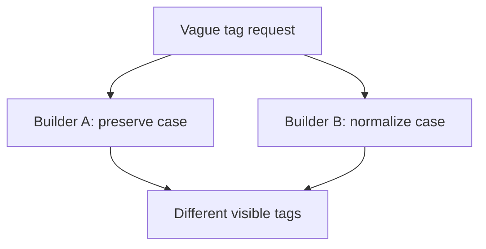
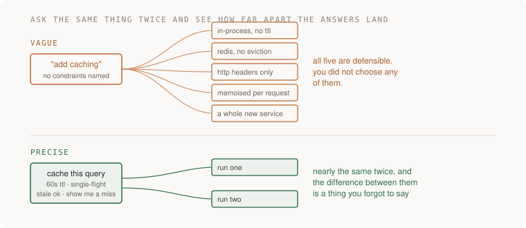

# Specify tag behavior for independent implementers

## Application background

A reading-list app needs tags so users can group their bookmarks. Alice enters ` AI ` with spaces, then adds `ai`. One implementer might store two tags, while another might store a single normalized tag. Both could reasonably believe they followed the instruction “add tags.”

Your job is to write a feature description precise enough that two independent implementers produce the same user-visible behavior. The document should settle meaningful questions without prescribing every internal function or file name.

### Example walkthrough

| Action | Expected behavior |
|---|---|
| Alice adds ` AI ` and `ai` to her bookmark | Trim spaces, lowercase the values and store one `ai` tag. |
| Alice includes an empty tag | Reject the update without partly changing existing tags. |
| Bob tries to change Alice's bookmark tags | Reject the unauthorized update. |

A specification is the written behavior agreement. Normalization means converting equivalent input forms into the same stored identity. The comparison is about behavior, not identical source code.

## Your assignment

**Deliver:** Write a feature specification that fixes normalization, duplicates, ownership and errors, then compare two implementations of that same specification.

This is a constructed development-workflow exercise. Your output is the artifact named above and the observed comparison, rather than a production platform.

## Get the starting application and prepare your workspace

The [repository](https://github.com/Soulful-Iris/junior-to-staff) includes a small reading-list HTTP API with SQLite storage. Follow the [setup and request walkthrough](../../../../../examples/reading-list-starter/README.md) to save a URL and read it back before changing anything. The API has no tag endpoint, browser UI or production authentication yet.

```bash
git clone https://github.com/Soulful-Iris/junior-to-staff.git
cd junior-to-staff
python3 examples/reading-list-starter/app.py --db /tmp/reading-list.sqlite3
```

Leave the server running while sending the documented requests in a second terminal. Use a separate working copy for the exercise. Any helper, specification, review command or Git branches named below are artifacts **you create**, not hidden supplied solutions.

## Complete the exercise

1. Run the supplied reading-list API. It has no tag endpoint yet: define the proposed method, path, request body and response in `SPEC.md` before asking anyone to implement it.

2. Write examples for `" AI "`, `"ai"`, an empty value and an unauthorized member. Pin atomic validation and the maximum tag length. Leave internal file layout open.

3. Give the identical document to two fresh implementers or AI sessions. Run the same requests against both implementations and record each behavioral disagreement in `COMPARISON.md`. Revise the sentence responsible for each disagreement.

## Demonstrate the result

| Case | Exact input or workload | Expected outcome |
|---|---|---|
| Small example | Add tags ` AI `, `ai`, and an empty string to item 7 owned by user A. | Trim and lowercase. Store one `ai`. Reject empty input with 400 and leave existing tags unchanged. |
| Boundary / failure | User B sends a tag update to A’s item 7. | 404 with no row changed. Matching happy paths cannot establish ownership safety. |
| Scope | Closed normalization rule for this exercise. Choose maximum length explicitly. | Explain any additional assumption before implementing it. |

Keep the exact input, observed output and before/after artifact in your exercise README. Label constructed fixtures as fixtures. A fresh reader should be able to repeat the comparison without your conversation history.

## Deployment scope

This assignment concerns local development evidence and workflow. AWS deployment is not required and no cloud resources are supplied or created. CI-policy exercises belong in a disposable repository. They do not change this guide's publish-on-main behavior. For a later application deployment, the [starter's local-to-AWS mapping](../../../../../examples/reading-list-starter/README.md) explains the missing adapters.

## Additional reasoning and harder requirements

<details>
<summary>Study the failure, follow-up requirements and implementation prompts</summary>




Two plausible implementations differ because behavior is underspecified. Agreement alone would also be inconclusive: both could share the same default or defect.

<details>
<summary>Reveal the approach and decisions</summary>

Write probes before implementation, including authorization and atomic validation. The invariant is identical observable behavior for the pinned inputs, not identical code. Keep harmless implementation choices open. Revise only ambiguities that affect the contract.

</details>

## Follow-up 1 · A third implementation

**Changed requirement:** A third engineer uses a different framework. What do you compare?

<details>
<summary>Worked design and implementation</summary>

Run the same black-box probes against each implementation. Compare status, data, and side effects. Ignore file layout and variable names.

**Compare observable behavior.** Give implementation C the same operation sequence used for A and B. Compare response status, normalized tag data, uniqueness and durable side effects. Different function names, routing frameworks or file layouts are irrelevant to that contract.

Hand over a three-column result table with one normal input and one boundary case. If an implementation differs, identify whether the specification left the behavior ambiguous or the implementation violated a stated rule. Do not silently update expected output to match the newest implementation.

</details>

## Follow-up 2 · The product rule changes

**Changed requirement:** Users now need case-preserving display with case-insensitive uniqueness. Which field changes?

<details>
<summary>Worked design and implementation</summary>

Separate normalized identity from display text. Define whether the first or latest spelling wins. Retain a migration example for the existing `ai` value.

**Separate identity from presentation.** Store normalized `ai` as the uniqueness key and `AI` as display text under an explicit spelling policy. For this exercise, keep the first accepted spelling. Existing `ai` records migrate with display text `ai` unless a user deliberately edits it.

Insert AI, then ai, for the same item. One tag identity remains and its display stays AI. Show a separate item preserving its own display policy. Deliver the schema change and migration example so the rule is understandable without guessing what normalization means.

</details>

## Record the evidence and limitations

Build in three stops: reproduce the small case and baseline failure. Implement the protected boundary. Then replay both changed requirements with captured outputs. Record commands, fixtures, and observed results in your implementation README. A diagram is a prediction until those checks run.

**Senior expectation:** Supply a behavioral disagreement and the exact sentence that resolves it. **Additional lead scope:** Own spec versions and compatibility between released clients. Completion demonstrates practice evidence. It does not establish interview readiness or multi-team delivery experience.

## Detailed implementation and AI-assisted prompts



*You end up with a specification two fresh sessions turned into nearly the same
system, and a diff showing exactly where it leaked.*

**Build**

One specification for one small, real feature — tagging from Stage 1 reading-list is the right
size. Hand the identical document to two fresh sessions with no other context,
let each build it, and compare what comes back. The spec is the deliverable. The
two builds are its test.

**The thought process**

The first decision is what gets pinned and what stays free. The rule: if two
correct implementations could differ on it and nobody would notice, leave it
out. If the difference would reach a user or a caller, pin it. Pin everything
and the spec is code in worse syntax. Pin nothing and it is a wish.

Second: what "the same" means, because you cannot diff source — variable names
are not disagreement, behaviour on the same input is. So you fix the probes
before the first build: the empty tag, the duplicate, the 200-character one,
two users tagging one item. And when the builds diverge anyway, that is not the
model guessing badly — it is a question you left open, answered by coin flip,
twice, differently. Every difference is a missing sentence: add it, run a third
stranger, watch the fan close.

**How to organise the prompts**

**1 — the holes, before you pay for them.**

```
Read this specification. Do not build it.

List every question you would have to answer yourself because the
spec does not. Split them: ones where any answer is fine, and ones
where I would care which answer you picked.
```

The second list is your fan-out, visible before it costs anything. Fix the
cheap holes before anyone builds.

**2 — the build, verbatim, to two fresh sessions.**

```
Build exactly what this specification says. Where it is silent,
choose reasonably, and record every choice in ASSUMPTIONS.md: the
question, your answer, the nearest alternative.

Stop when it runs and the spec's examples pass.
```

Fresh means fresh — no shared history, no memory — and each session must end
with something that runs plus a non-empty `ASSUMPTIONS.md`.

**3 — the comparison.**

```
Here are two builds' answers to the same probes, and both
ASSUMPTIONS.md files. List every behavioural difference, and for
each write the one sentence missing from the spec that would have
prevented it. Pin behaviour, not implementation.
```

Accept or reject each sentence yourself. The check is a third stranger, who
must not reproduce the differences you fixed.

**On AWS**

The stranger must actually be a stranger, and a chat app is not one — it
carries memory and custom instructions you have stopped seeing. A pinned model
id behind an API is the clean subject. **Amazon Bedrock** and provider APIs may offer overlapping model families,
with different versions, regions and capabilities. Bedrock earns it when your work already lives in AWS
— IAM credentials you already have, invocation logging, cost next to the rest
of the bill. Otherwise the direct API is simpler. Nothing else here needs AWS:
the artefact is a text file, and git is its home.

**What productionising it means**

The convention outlives the afternoon: silent choices always land in
`ASSUMPTIONS.md`, and a changed spec gets a fresh stranger run, because specs
rot the way tests do. On a team this becomes spec review before code review —
a sentence is cheaper to argue about than the four hundred lines that answered
it wrong.

**The learning**

Some implementation differences reveal questions left open. Others are plain
implementation errors. Compare each result against the written contract before
calling the specification incomplete. And precision stops being a feeling — it is measurable, as
the distance between two strangers.

**How you would know it is wrong**

- The builds agree on unspecified behavior. Check for shared defaults or leaked
  context. Agreement alone does not establish specification completeness.
- Remove one important sentence and rerun its distinguishing probes. Agreement
  may reflect a shared default. Introduce a deliberate contrary behavior to
  verify that the probes can distinguish it.
- The third stranger diverges where you already fixed. Your sentence pinned an
  implementation detail, not the behaviour.
- An empty `ASSUMPTIONS.md`. The recording failed. It does not mean the spec
  was complete.

---

[Back to the ordered project index](../../ai-projects.md)


</details>
