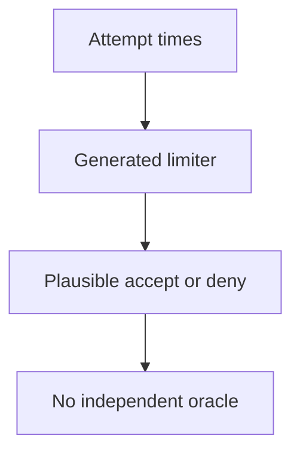
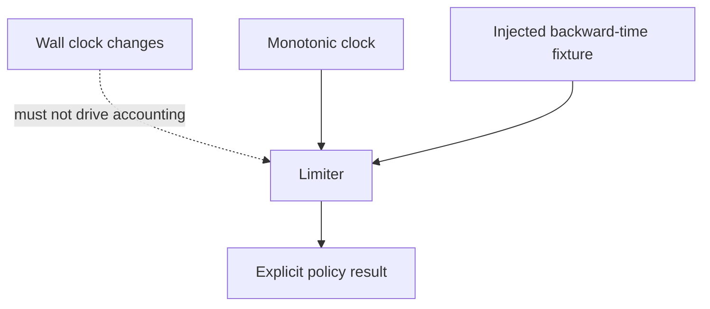
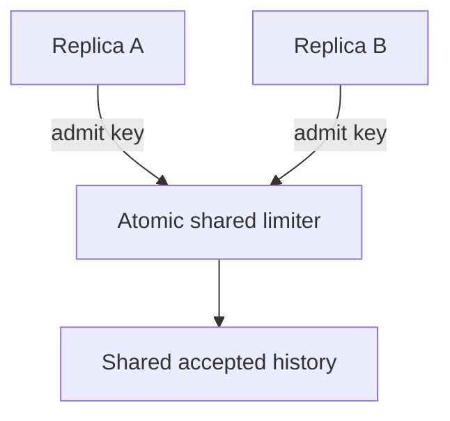

# 2. The verification you could not have written yourself

[Curriculum](../../../../README.md) · [Problem solving and AI-assisted engineering](../../README.md) · [Project index](../../../../../indexes/projects.md)

## The reviewer's brief

> A generated sign-in limiter claims five accepted attempts in any sixty-second window. You cannot yet implement its optimized data structure. How can you decide whether to trust it using only its public interface?

This is a **constructed practice brief**, not an attributed company question.
Prerequisites: [the section](../../working-with-ai.md). This page is a build brief; it does not ship a runnable application. The original build and prompt sequence below defines the implementation checkpoints.

| Case | Exact input or workload | Expected outcome |
|---|---|---|
| Small example | Accepted timestamps 0,1,2,3,4; attempts at 59 and 60 seconds; window is `(now−60, now]`. | 59 is denied; 60 is accepted because timestamp 0 expires. Denials are not added to history. |
| Boundary / failure | An implementation expires timestamps strictly less than the boundary. | The 60-second probe fails; the fixture must distinguish `<` from `<=`. |
| Scope | One key, monotonic clock, no distributed replicas in the baseline. | Explain any additional assumption before implementing it. |

<!-- project-expectation:start -->

## What you are expected to hand over

**The finished artifact:** Ask for something genuinely past your ability to produce — a sliding-window rate limiter for P1's sign-in is the classic; a URL canonicaliser works too. Then build the apparatus that would catch it being wrong: properties, a dumb reference implementation, adversarial inputs, a one-page trust argument.

Treat that sentence as a review contract, not an inspiration. A reviewable
submission contains all of the following:

- the narrow working slice or decision artifact described above, reproducible
  from a clean checkout with assumptions stated;
- captured proof of the normal flow **and** the boundary/failure row above;
- tests, probes, or metrics that can go red when the important guarantee breaks;
- a short decision record naming ownership, excluded scope, and the first
  operational limit; and
- a changed contract, diagram, and new evidence for each follow-up—not only a
  paragraph claiming the original design still works.

### How the review conversation gets harder

| Review gate | The interviewer changes | Expected response |
|---|---|---|
| Baseline | Run the small example from the table above. | Demonstrate the observable outcome end to end and identify which boundary owns it. |
| Failure | Reproduce the boundary/failure row above. | Show the failure before the fix, then prove the protected behavior without hiding the error. |
| Senior · The clock moves backward | The wall clock jumps from 60 to 55. What should happen? Predict which boundary must change before opening the design. | Use a monotonic elapsed clock for local rate accounting or reject non-monotonic test input by contract. Do not silently let expired history reappear. Verify the chosen policy explicitly. |
| Lead · Ten replicas | Ten API processes share one account limit. Does a process-local harness prove fleet safety? State what evidence would make you reject your first design. | No. Put atomic admission at shared authority or divide quotas with a documented weaker guarantee. Test simultaneous arrivals at the shared boundary and count accepted requests across all replicas. |
| Evidence | A reviewer asks, “How do you know?” | Build in three stops: reproduce the small case and baseline failure; implement the protected boundary; then replay both changed requirements with captured outputs. |
| Handoff | The author is unavailable and the environment is new. | Another engineer can run, observe, break, and recover the artifact from the repository evidence. |

Before implementation, say the baseline invariant, the owner of each piece of
state, and what the user sees when the named dependency or assumption fails. That
five-minute explanation is part of the project: if it is vague, the build is not
ready to begin.

<!-- project-expectation:end -->

Before looking at the guidance, state the invariant in one sentence and trace the example. In interview practice, implement or sketch independently, then reveal the reasoning. During AI-assisted practice, use the prompts below and verify each checkpoint before the next request.

## Baseline and the failure to explain



Happy-path examples cannot expose the boundary convention. The reference should count a plainly defined list, even if it is slower.

<details>
<summary>Reveal the approach and decisions</summary>

Fix window endpoints and which events count. Hand-work the edge, write the simple oracle, then compare seeded traces. The invariant is no more than five accepted events in any window. A passing harness is useful when deliberate relevant mutations make it fail.

</details>

## Follow-up 1 · The clock moves backward

**Changed requirement:** The wall clock jumps from 60 to 55. What should happen? Predict which boundary must change before opening the design.

<details>
<summary>Expected reasoning and changed diagram</summary>

Use a monotonic elapsed clock for local rate accounting or reject non-monotonic test input by contract. Do not silently let expired history reappear. Verify the chosen policy explicitly.



</details>

## Follow-up 2 · Ten replicas

**Changed requirement:** Ten API processes share one account limit. Does a process-local harness prove fleet safety? State what evidence would make you reject your first design.

<details>
<summary>Expected reasoning and changed diagram</summary>

No. Put atomic admission at shared authority or divide quotas with a documented weaker guarantee. Test simultaneous arrivals at the shared boundary and count accepted requests across all replicas.



</details>

## Evidence to bring to review

Build in three stops: reproduce the small case and baseline failure; implement the protected boundary; then replay both changed requirements with captured outputs. Record commands, fixtures, and observed results in your implementation README. A diagram is a prediction until those checks run.

**Senior expectation:** Explain the oracle independently and catch the boundary mutant. **Additional lead scope:** Specify fleet guarantees, clock assumptions, and limiter-outage behavior. Completion demonstrates practice evidence; it does not establish interview readiness or multi-team delivery experience.

## Build and prompt sequence

*You end up trusting a piece of code you still could not write, for reasons you
can say out loud.*

**Build**

Ask for something genuinely past your ability to produce — a sliding-window
rate limiter for P1's sign-in is the classic; a URL canonicaliser works too.
Then build the apparatus that would catch it being wrong: properties, a dumb
reference implementation, adversarial inputs, a one-page trust argument.

**The thought process**

Pick the subject by the gap: beyond you to write, not beyond you to *specify*.
You can state what "five attempts in any sixty-second window" means without
being able to implement it efficiently. That gap is where a model puts you
every working day; here you stand in it on purpose.

Then the real question: where does truth come from, if not from reading the
code? Three places: properties that must hold for every input; an oracle — a
slower, dumber version you *can* write and read, which must always agree; and
known answers, worked by hand. For the rate limiter the oracle is insultingly
simple: keep every timestamp, count the ones inside the window. It stays dumb
on purpose — code and tests from the same hand are not two opinions, so the
chain of trust must bottom out in something you can actually read. And the
harness must be shown able to fail before its passing means anything.

**How to organise the prompts**

**1 — properties first, and a readable reference.**

```
Do not write the implementation yet.

State the properties that must hold for every input to this rate
limiter, the inputs most likely to break an implementation, and a
brute-force reference version optimised for being obviously correct,
not for speed.
```

Read the reference until you believe it; if you cannot hold it in your head,
ask for a dumber one.

**2 — the implementation, and the harness.**

```
Now write the real implementation. Then a harness that runs both
versions against the same generated inputs — include empty history,
bursts at the window edge, a clock that goes backwards — and reports
any input where they disagree. The harness may only call the public
interface of each.
```

Check it by reading the input generator, not the implementation — the
generator is where this can quietly test nothing.

**3 — the blind mutation run.**

```
Produce five variants of the implementation, each with one subtle
behavioural bug. Number them. Do not tell me which bug is which.
```

The harness must flag all five before the reveal; a survivor is a map reference
for the exact hole in your harness. Fix, re-run.

**On AWS**

Honestly: none. The point is a harness that runs on your machine in seconds;
infrastructure here would be decoration. The pattern does scale — a differential
harness over a huge input space is what you fan out across **Fargate** tasks —
but that is a later follow-up.

**What productionising it means**

The harness outlives the implementation, which is the payoff of black-box
checks: regenerate the component, upgrade the model that wrote it, or swap in a
library, and the same harness re-proves the replacement. Wire it into CI; keep
the trust argument next to the code, so the next person knows what is defended
and what is assumed.

**The learning**

Trust can be manufactured without comprehension, but only out of parts you can
comprehend — a dumb oracle, a readable generator, a harness seen to catch.
"The tests pass" stops being evidence until you know who wrote the tests.

**How you would know it is wrong**

- A planted bug survives the harness. The harness is wrong, precisely there.
- Break the *oracle* on purpose. If nothing disagrees, the harness compares
  nothing.
- Grep the harness for imports of the implementation's internals. Any hit means
  it is not black-box and dies with the first rewrite.
- Print fifty generated inputs. If timestamps only ever increase, the
  clock-goes-backwards property was never exercised.

---

[Back to the ordered project index](../../ai-projects.md)
