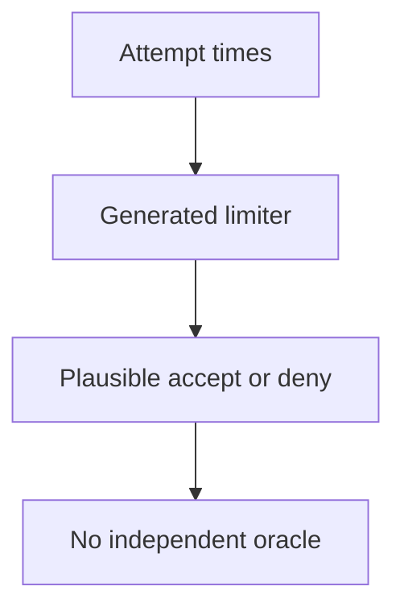
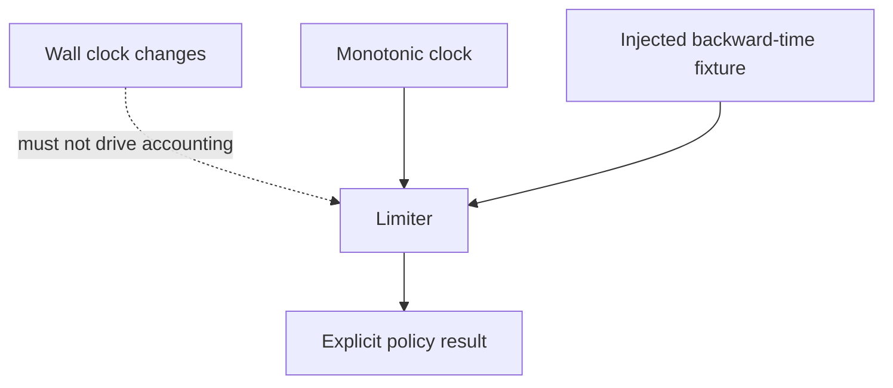
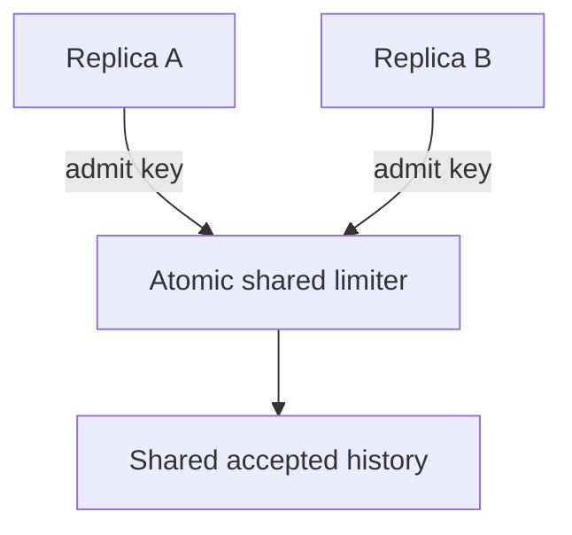

# Evaluate generated rate-limiter code with a simple reference

## Application background

You ask an AI assistant to write a sign-in limiter that allows five attempts in any sixty-second period. The generated implementation uses an optimization you do not yet understand well. You need a way to evaluate its behavior without accepting its explanation as proof.

Begin with a simpler implementation you can understand and supply time as an input. That lets you compare exact moments without waiting in real time. The interesting case is when an old attempt has just left the allowed window.

### Example walkthrough

| Action | Expected behavior |
|---|---|
| The same caller makes attempts at seconds 0, 1, 2, 3 and 4 | Accept all five. |
| The caller tries again at second 59 | Reject the attempt because all five still count. |
| The caller tries at second 60 | Accept because the attempt at second 0 is outside the declared window. |

A reference implementation favors clarity over speed. It serves as an independent comparison for the optimized version under a precisely stated rule.

## Your assignment

**Deliver:** Produce a trust report for a five-attempt sliding-window limiter using a simple independent reference and explicit time inputs.

This is a constructed development-workflow exercise. Your output is the artifact named above and the observed comparison, rather than a production platform.

## Get the starting application and prepare your workspace

The [repository](https://github.com/Soulful-Iris/junior-to-staff) includes a small reading-list HTTP API with SQLite storage. Follow the [setup and request walkthrough](../../../../../examples/reading-list-starter/README.md) to save a URL and read it back before changing anything. The API has no tag endpoint, browser UI or production authentication yet.

```bash
git clone https://github.com/Soulful-Iris/junior-to-staff.git
cd junior-to-staff
python3 examples/reading-list-starter/app.py --db /tmp/reading-list.sqlite3
```

Leave the server running while sending the documented requests in a second terminal. Use a separate working copy for the exercise. Any helper, specification, review command or Git branches named below are artifacts **you create**, not hidden supplied solutions.

## Complete the exercise

1. Create `limiter.py` exposing `allow(subject, now_seconds)` and ask for the optimized implementation. Keep the clock an argument so no real waiting is needed.

2. Write a straightforward list-based reference in a separate module. Retain only timestamps inside `(now - 60, now]` and admit at most five per subject.

3. Compare the implementations for attempts at seconds 0, 1, 2, 3, 4, 59 and 60, plus separate subjects. Record disagreements and the assumptions you have not established, including concurrent/distributed access.

## Demonstrate the result

| Case | Exact input or workload | Expected outcome |
|---|---|---|
| Small example | Accepted timestamps 0,1,2,3,4. Attempts at 59 and 60 seconds. Window is `(now−60, now]`. | 59 is denied. 60 is accepted because timestamp 0 expires. Denials are not added to history. |
| Boundary / failure | An implementation expires timestamps strictly less than the boundary. | The 60-second probe fails. The fixture must distinguish `<` from `<=`. |
| Scope | One key, monotonic clock, no distributed replicas in the baseline. | Explain any additional assumption before implementing it. |

Keep the exact input, observed output and before/after artifact in your exercise README. Label constructed fixtures as fixtures. A fresh reader should be able to repeat the comparison without your conversation history.

## Deployment scope

This assignment concerns local development evidence and workflow. AWS deployment is not required and no cloud resources are supplied or created. CI-policy exercises belong in a disposable repository. They do not change this guide's publish-on-main behavior. For a later application deployment, the [starter's local-to-AWS mapping](../../../../../examples/reading-list-starter/README.md) explains the missing adapters.

## Additional reasoning and harder requirements

<details>
<summary>Study the failure, follow-up requirements and implementation prompts</summary>




Happy-path examples cannot expose the boundary convention. The reference should count a plainly defined list, even if it is slower.

<details>
<summary>Reveal the approach and decisions</summary>

Fix window endpoints and which events count. Hand-work the edge, write the simple oracle, then compare seeded traces. The invariant is no more than five accepted events in any window. A passing harness is useful when deliberate relevant mutations make it fail.

</details>

## Follow-up 1 · The clock moves backward

**Changed requirement:** The wall clock jumps from 60 to 55. What should happen? Predict which boundary must change before opening the design.

<details>
<summary>Expected reasoning and changed diagram</summary>

Use a monotonic elapsed clock for local rate accounting or reject non-monotonic test input by contract. Do not silently let expired history reappear. Verify the chosen policy explicitly.



</details>

## Follow-up 2 · Ten replicas

**Changed requirement:** Ten API processes share one account limit. Does a process-local harness prove fleet safety? State what evidence would make you reject your first design.

<details>
<summary>Expected reasoning and changed diagram</summary>

No. Put atomic admission at shared authority or divide quotas with a documented weaker guarantee. Test simultaneous arrivals at the shared boundary and count accepted requests across all replicas.



</details>

## Record the evidence and limitations

Build in three stops: reproduce the small case and baseline failure. Implement the protected boundary. Then replay both changed requirements with captured outputs. Record commands, fixtures, and observed results in your implementation README. A diagram is a prediction until those checks run.

**Senior expectation:** Explain the oracle independently and catch the boundary mutant. **Additional lead scope:** Specify fleet guarantees, clock assumptions, and limiter-outage behavior. Completion demonstrates practice evidence. It does not establish interview readiness or multi-team delivery experience.

## Detailed implementation and AI-assisted prompts

*You end up trusting a piece of code you still could not write, for reasons you
can say out loud.*

**Build**

Ask for something genuinely past your ability to produce — a sliding-window
rate limiter for the Stage 1 reading list's sign-in is the classic. A URL canonicaliser works too.
Then build the apparatus that would catch it being wrong: properties, a dumb
reference implementation, adversarial inputs, a one-page trust argument.

**The thought process**

Pick the subject by the gap: beyond you to write, not beyond you to *specify*.
You can state what "five attempts in any sixty-second window" means without
being able to implement it efficiently. That gap is where a model puts you
every working day. Here you stand in it on purpose.

Then the real question: where does truth come from, if not from reading the
code? Three places: properties that must hold for every input. An oracle — a
slower, dumber version you *can* write and read, which must always agree. And
known answers, worked by hand. For the rate limiter the oracle is insultingly
simple: keep every timestamp, count the ones inside the window. It stays dumb
on purpose — code and tests from the same hand are not two opinions, so the
chain of trust must bottom out in something you can actually read. And the
harness must be shown able to fail before its passing means anything.

**How to organise the prompts**

**1 — properties first, and a readable reference.**

```
Do not write the implementation yet.

State the properties that must hold for every input to this rate
limiter, the inputs most likely to break an implementation, and a
brute-force reference version optimised for being obviously correct,
not for speed.
```

Read the reference until you believe it. If you cannot hold it in your head,
ask for a dumber one.

**2 — the implementation, and the harness.**

```
Now write the real implementation. Then a harness that runs both
versions against the same generated inputs — include empty history,
bursts at the window edge, a clock that goes backwards — and reports
any input where they disagree. The harness may only call the public
interface of each.
```

Check it by reading the input generator, not the implementation — the
generator is where this can quietly test nothing.

**3 — the blind mutation run.**

```
Produce five variants of the implementation, each with one subtle
behavioural bug. Number them. Do not tell me which bug is which.
```

The harness must flag all five before the reveal. A survivor is a map reference
for the exact hole in your harness. Fix, re-run.

**On AWS**

Honestly: none. The point is a harness that runs on your machine in seconds.
infrastructure here would be decoration. The pattern does scale — a differential
harness over a huge input space is what you fan out across **Fargate** tasks —
but that is a later follow-up.

**What productionising it means**

The harness outlives the implementation, which is the payoff of black-box
checks: regenerate the component, upgrade the model that wrote it, or swap in a
library, and the same harness re-proves the replacement. Wire it into CI. Keep
the trust argument next to the code, so the next person knows what is defended
and what is assumed.

**The learning**

Trust can be manufactured without comprehension, but only out of parts you can
comprehend — a dumb oracle, a readable generator, a harness seen to catch.
"The tests pass" stops being evidence until you know who wrote the tests.

**How you would know it is wrong**

- A planted bug survives the harness. The harness is wrong, precisely there.
- Break the *oracle* on purpose. If nothing disagrees, the harness compares
  nothing.
- Grep the harness for imports of the implementation's internals. Any hit means
  it is not black-box and dies with the first rewrite.
- Print fifty generated inputs. If timestamps only ever increase, the
  clock-goes-backwards property was never exercised.

---

[Back to the ordered project index](../../ai-projects.md)


</details>
