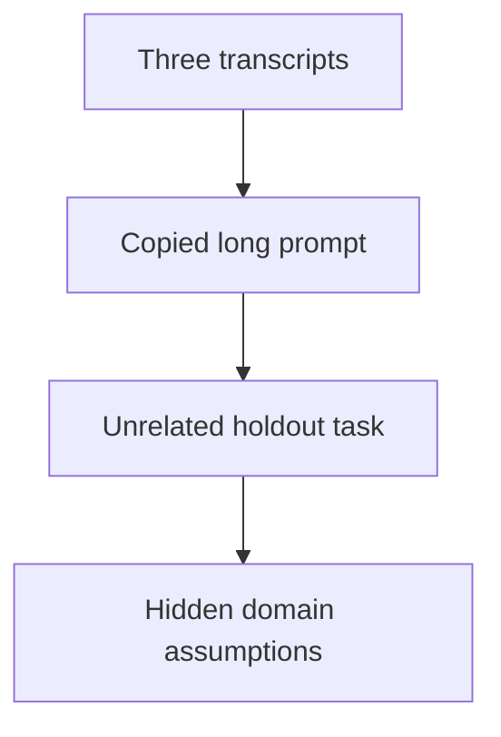

# Build reusable AI instructions and evaluate transfer

## Application background

When asking an assistant to change an application, you often repeat instructions such as “preserve existing callers” or “show what happens for an empty result.” You want a small set of reusable instructions that save effort without carrying unrelated details into every task.

An instruction that helped build a reading-list UI may not help with a data importer. To find out, apply the proposed library to a different task and record which entries still improve the result.

A held-out task is a task you did not use while choosing the instructions. It helps reveal whether the instructions transfer rather than merely fitting the examples that produced them.

## Your assignment

**Deliver:** Create five to ten reusable instruction entries with scope and observable checks, then evaluate them on a different task.

This is a constructed development-workflow exercise. Your output is the artifact named above and the observed comparison, rather than a production platform.

## Get the starting application and prepare your workspace

The [repository](https://github.com/Soulful-Iris/junior-to-staff) includes a small reading-list HTTP API with SQLite storage. Follow the [setup and request walkthrough](../../../../../examples/reading-list-starter/README.md) to save a URL and read it back before changing anything. The API has no tag endpoint, browser UI or production authentication yet.

```bash
git clone https://github.com/Soulful-Iris/junior-to-staff.git
cd junior-to-staff
python3 examples/reading-list-starter/app.py --db /tmp/reading-list.sqlite3
```

Leave the server running while sending the documented requests in a second terminal. Use a separate working copy for the exercise. Any helper, specification, review command or Git branches named below are artifacts **you create**, not hidden supplied solutions.

## Complete the exercise

1. Collect three real development transcripts. If you have none, first use the local reading-list API for a tag change, a conflict response and a title-timeout explanation, saving each conversation.

2. Create `PROMPTS.md` with a name, applicable situation, instruction and observable check for each entry. Distinguish a product requirement from a preference about style.

3. Use a separate paginated-importer task: fetch pages by cursor, preserve each item once and stop at the terminal cursor. Record which entries transfer, require parameters or should be removed. Do not tune the library on this held-out task before the comparison.

## Demonstrate the result

| Case | Exact input or workload | Expected outcome |
|---|---|---|
| Small example | Five entries from three transcripts. Holdout is a paginated importer, while source tasks were UI edits. | Each entry names its constraint, applicability, checkpoint, and keep/parameterize/delete decision after the holdout. |
| Boundary / failure | An entry says “do not mock the database” on a parser with no database. | Reject or narrow applicability. Literal reuse is not successful transfer. |
| Scope | A small local comparison. No causal productivity claim from one run. | Explain any additional assumption before implementing it. |

Keep the exact input, observed output and before/after artifact in your exercise README. Label constructed fixtures as fixtures. A fresh reader should be able to repeat the comparison without your conversation history.

## Deployment scope

This assignment concerns local development evidence and workflow. AWS deployment is not required and no cloud resources are supplied or created. CI-policy exercises belong in a disposable repository. They do not change this guide's publish-on-main behavior. For a later application deployment, the [starter's local-to-AWS mapping](../../../../../examples/reading-list-starter/README.md) explains the missing adapters.

## Additional reasoning and harder requirements

<details>
<summary>Study the failure, follow-up requirements and implementation prompts</summary>




Repeated words can preserve irrelevant assumptions. First extract the constraint and its evidence. Wording is secondary.

<details>
<summary>Reveal the approach and decisions</summary>

Predefine the holdout checkpoint, then parameterize only genuine variables. Compare with and without a constraint over comparable fresh runs. The invariant is that every retained entry has a named failure it is intended to prevent and a check that could reveal that failure.

</details>

## Follow-up 1 · A model upgrade

**Changed requirement:** The same prompts run on a new model version. What evidence expires?

<details>
<summary>Worked design and implementation</summary>

Re-run the saved task probes and track model/configuration versions. Earlier observations remain historical. They do not establish present behavior.

**Retain comparable evidence.** Run the saved task and scoring rule against both model configurations without rewriting the prompt after seeing the new result. Record exact prompt, model configuration, task input and outcome. The old observation remains valid history.

Show one constraint that still prevents its named failure and one that no longer helps, if observed. If all remain useful, report that honestly with the sampled scope. The deliverable is an updated evidence record, not an automatic requirement to replace every prompt on a model upgrade.

</details>

## Follow-up 2 · Several teams adopt it

**Changed requirement:** A payments team needs stronger review than a UI prototype. How does the library avoid unsafe blanket rules?

<details>
<summary>Worked design and implementation</summary>

Give entries applicability conditions and owners. Reuse the verified stopping point while letting domain-specific correctness requirements remain explicit.

**Publish applicability alongside the wording.** A rule to stop after a visual check may suit a prototype but not a payment operation with uncertain external effects. Each shared entry needs the failure it addresses, conditions where it applies and an owning team.

Compare the same entry in a UI prototype and a payments change. Record keep, adapt or reject with the concrete reason. Shared language can reduce repeated work without centralizing every domain's correctness decision. No extra infrastructure is needed for this follow-up.

</details>

## Record the evidence and limitations

Build in three stops: reproduce the small case and baseline failure. Implement the protected boundary. Then replay both changed requirements with captured outputs. Record commands, fixtures, and observed results in your implementation README. A diagram is a prediction until those checks run.

**Senior expectation:** Name one transferred constraint and one failed transfer with evidence. **Additional lead scope:** Version and review shared constraints without turning anecdotes into policy. Completion demonstrates practice evidence. It does not establish interview readiness or multi-team delivery experience.

## Detailed implementation and AI-assisted prompts

*You end up with a page of named asks — constraints, not phrasings — and a
measured answer to whether they hold on work they were not written for.*

**Build**

Mine three or four of your own transcripts for the asks you keep retyping.
Compress them into five to ten named entries — a constraint, when it applies,
what to check after — then run the library on a task from a different area and
count what needed editing.

**The thought process**

What is worth extracting is not sentences. In every ask that worked, one clause
did the work — *show me it failing first*, *do not mock the database*, *stop
when it runs* — and the rest was upholstery. The mining question is which
clause was load-bearing, and the evidence is what the output did differently
because of it. Sometimes the unit is not one ask but a sequence — describe it
back, then slice, then prove — because ordering is what protects your judgment.
a sequence entry names its checkpoints.

Then the part that separates a library from a superstition: the transfer test.
A prompt polished on the task it was written for is fitted to it, the way a
test written after the code asserts whatever the code does. So the measure is a
holdout — a task from somewhere else, success defined before you run. One
afternoon establishes "no worse than ad hoc, cheaper to type, and the checks
fired", which is more than most people ever establish.

**How to organise the prompts**

**1 — mine with evidence, not nostalgia.**

```
Here are three transcripts of me working with a model.

List every constraint I imposed. Rank them by how much work each
did, citing the exact moment in the transcript where the output
changed because of it. No moment, bottom of the list.
```

The check is the citations. Anything with no moment attached gets cut.

**2 — compress into entries.**

```
Rewrite the top five as reusable asks. For each: the ask itself, the
constraint doing the work, when it applies, and what I should check
after using it. Strip everything specific to those three tasks.
```

Grep the entries for your project's nouns — any hit means still fitted, not
reusable.

**3 — transfer, then interrogate the misses.**

```
Here is my library and the edits I had to make to use it on today's
unrelated task. For each edit: a parameter I should turn into a
blank, or an assumption that should kill the entry? Answer per
entry: keep, blank it, or delete.
```

Every entry ends the afternoon blanked, rewritten, or deleted — and for each
survivor you can name the failure it prevents.

**On AWS**

Prompts live in git — versioned, diffed and blamed like anything load-bearing.
**Bedrock Prompt Management** is the managed neighbour. It earns a place when
people who do not ship code must edit prompts, or prompts must change at
runtime without a deploy. A personal library meets neither test. The genuinely
useful piece is measurement: asks run through **Bedrock** with invocation
logging get token counts in **CloudWatch**, so "this ask is efficient" becomes
a number per call instead of a feeling.

**What productionising it means**

Libraries rot when models change under them. Date-stamp every entry with the
model it was measured against, and re-run the transfer test after an upgrade
the way you re-run tests after a dependency bump. Shared with a team, edits get
reviewed like code — a quietly deleted constraint degrades everyone's output,
and nobody's diff shows why.

**The learning**

Most of what you retype does nothing, and the clause that works is shorter than
you thought. Watch one constraint survive transfer and three collapse, and you
stop collecting phrasings for good.

**How you would know it is wrong**

- An entry whose prevented failure you cannot name. Decoration with a title.
- Ablate: same task, with and without the constraint, fresh sessions. Equally
  good outputs mean it does nothing — or the task was too easy to tell.
- Success defined after seeing the output. That is tinkering with a ledger.
- Every entry survived transfer untouched. Your domains were too close. The
  clean result is the suspicious one.

---

[Back to the ordered project index](../../ai-projects.md)


</details>
