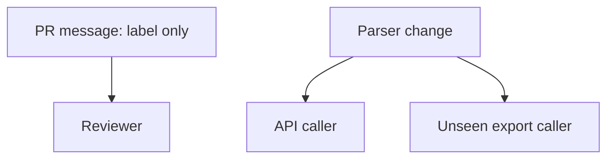
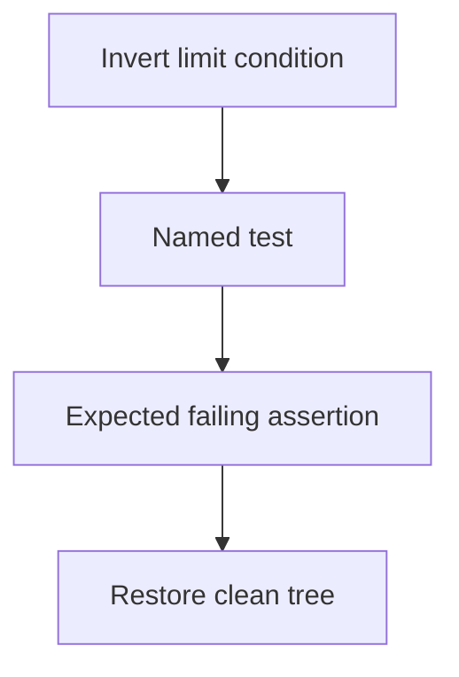
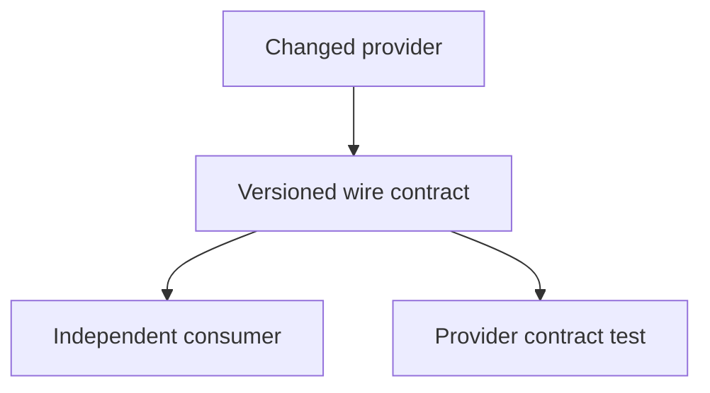

# 4. The review harness

[Curriculum](../../../../README.md) · [Problem solving and AI-assisted engineering](../../README.md) · [Project index](../../../../../indexes/projects.md)

## The reviewer's brief

> A generated PR changes a shared parser while claiming only a UI label update. Reviewers trust the message and miss a caller. Build an evidence collector that helps them locate accidental behavior changes. What can static search establish?

This is a **constructed practice brief**, not an attributed company question.
Prerequisites: [the section](../../working-with-ai.md). This page is a build brief; it does not ship a runnable application. The original build and prompt sequence below defines the implementation checkpoints.

| Case | Exact input or workload | Expected outcome |
|---|---|---|
| Small example | Diff changes `parseLimit`; callers are API list and export; only API list has `test_limit_zero`. | Report both callers; name that test for API list and `NONE` for the uncovered export behavior. |
| Boundary / failure | A caller is registered dynamically and absent from simple text search. | Mark search limits and inspect runtime registration; do not claim complete call-graph coverage. |
| Scope | Ten recorded diffs; collector supplies evidence, never an approval verdict. | Explain any additional assumption before implementing it. |

## See the first reviewable result

**First slice:** Hand the harness a diff that changes `parseLimit`. Its report should name both callers—API list and export—show the existing `test_limit_zero` for the first, and say `NONE` for the second. **Show:** the actual diff, generated report, and a manually checked missing dynamically registered caller. The tool's honest uncertainty is part of the deliverable.

<!-- project-expectation:start -->

## What you are expected to hand over

**The finished artifact:** A written procedure plus a small script that collects evidence and answers three questions of any diff: what behaviour changed, what could have changed accidentally, which existing test would catch the accident. Run it on ten real diffs from your history and tally how often the third answer is "none".

Bring a runnable slice or decision artifact, its normal output, and a captured
failure from the examples above. Include one check that turns red when the guarantee
breaks, the state owner, and the first operational limit. For each follow-up,
change the diagram **and** the evidence before claiming the design still works.

### How the review conversation gets harder

| Review gate | The interviewer changes | Expected response |
|---|---|---|
| Baseline | Run the small example from the cases above. | Demonstrate the observable outcome end to end and identify which boundary owns it. |
| Failure | Reproduce the boundary/failure case above. | Show the failure before the fix, then prove the protected behavior without hiding the error. |
| Senior · Prove a named test | The tool says testlimitzero catches an inverted condition. How do you verify that statement? Predict which boundary must change before opening the design. | Introduce that condition on an isolated branch and run the named test. Capture the failure and restore the tree; a passing mutant disproves the coverage claim. |
| Lead · The change crosses a service | The parser determines an outbound payload used by an independently deployed consumer. What evidence is missing? State what evidence would make you reject your first design. | Add the consumer contract and a provider negative fixture. Local references cannot enumerate deployed clients; identify a contract owner and document unknown consumers. |
| Evidence | A reviewer asks, “How do you know?” | Build in three stops: reproduce the small case and baseline failure; implement the protected boundary; then replay both changed requirements with captured outputs. |
| Handoff | The author is unavailable and the environment is new. | Another engineer can run, observe, break, and recover the artifact from the repository evidence. |

Before implementation, say the baseline invariant, the owner of each piece of
state, and what the user sees when the named dependency or assumption fails. That
five-minute explanation is part of the project: if it is vague, the build is not
ready to begin.

<!-- project-expectation:end -->

Before looking at the guidance, state the invariant in one sentence and trace the example. In interview practice, implement or sketch independently, then reveal the reasoning. During AI-assisted practice, use the prompts below and verify each checkpoint before the next request.

## Baseline and the failure to explain



The message describes intent; risk follows actual dependency edges. A named nearby test is not proof until it detects the proposed accident.

<details>
<summary>Reveal the approach and decisions</summary>

Collect changed symbols, references, and tests, then identify the semantic risk. The invariant is that every claimed protection names a test demonstrated to fail on that accident. Preserve `NONE` and uncertainty rather than manufacturing a reassuring match.

</details>

## Follow-up 1 · Prove a named test

**Changed requirement:** The tool says `test_limit_zero` catches an inverted condition. How do you verify that statement? Predict which boundary must change before opening the design.

<details>
<summary>Expected reasoning and changed diagram</summary>

Introduce that condition on an isolated branch and run the named test. Capture the failure and restore the tree; a passing mutant disproves the coverage claim.



</details>

## Follow-up 2 · The change crosses a service

**Changed requirement:** The parser determines an outbound payload used by an independently deployed consumer. What evidence is missing? State what evidence would make you reject your first design.

<details>
<summary>Expected reasoning and changed diagram</summary>

Add the consumer contract and a provider negative fixture. Local references cannot enumerate deployed clients; identify a contract owner and document unknown consumers.



</details>

## Evidence to bring to review

Build in three stops: reproduce the small case and baseline failure; implement the protected boundary; then replay both changed requirements with captured outputs. Record commands, fixtures, and observed results in your implementation README. A diagram is a prediction until those checks run.

**Senior expectation:** Reproduce one real coverage gap and disprove one mistaken protection claim. **Additional lead scope:** Assign cross-service contract ownership and characterize collector blind spots. Completion demonstrates practice evidence; it does not establish interview readiness or multi-team delivery experience.

## Build and prompt sequence

*You end up with a repeatable interrogation for any diff, and one number from
ten real ones: how often nothing would have caught an accidental change.*

**Build**

A written procedure plus a small script that collects evidence and answers
three questions of any diff: what behaviour changed, what could have changed
accidentally, which existing test would catch the accident. Run it on ten real
diffs from your history and tally how often the third answer is "none".

**The thought process**

A harness is not for replacing your reading; it is for making your tenth review
of the day as good as your first. Attention degrades invisibly, and a procedure
carries quality through fatigue — the reason experienced pilots still run the
checklist. The commit message describes the intended change; the accidental one
lives in the blast radius — every caller of a changed function, every other
user of a touched helper or config key. That is greppable, so the script
fetches evidence and holds no opinions.

The third question must end in a test's name or the word "none" — never
"probably the auth tests". Both answers are checkable: break the behaviour and
the named test must fail; plant the accident and a true "none" leaves the suite
green. If all ten diffs come back covered, ask what the answers would look like
if coverage were bad — the same, and the harness is agreeing with you, not
reviewing.

**How to organise the prompts**

**1 — design the procedure against real diffs.**

```
Here are three recent diffs from this repository. Draft the
procedure for interrogating any diff: for each of the three
questions, the mechanical evidence that answers it — commands, not
judgment. The third answer must be a test name or the word NONE.
```

The procedure must name commands you can run; any step beginning "consider
whether" is judgment smuggled in as evidence, so send it back.

**2 — build the collector.**

```
Write the evidence collector: given a diff, list the changed
functions, their callers, every other file using a helper or config
key this diff touches, and the tests exercising any of those.
Output file:line lists only. No prose, no conclusions.
```

Run it on a diff whose blast radius you already know — it must find the caller
you know about, or it will never surface the ones you do not.

**3 — the ten runs.**

```
Here is diff 4 of 10 and the collector's output. Answer the three
questions; every claim must cite file:line from the evidence. If no
existing test would catch the accidental change, write NONE — not
the nearest test.
```

Spot-verify two NONEs by making the accidental change for real: a green suite
means the NONE was true and the tally is data.

**On AWS**

It can run where the diff lives: **GitHub Actions**, on every pull request.
Estimate runner usage for the current repository plan. AWS enters only if the harness calls a model per diff
— then route it through **Bedrock** with invocation logging on, so each review
has a visible cost in **CloudWatch**; a review bot nobody meters gets quietly
expensive. And whatever runs it gets read-only credentials: it comments, it
never merges.

**What productionising it means**

The tally is the real product: a none-rate over time, saying whether the suite
grows with the code or falls behind it. The failure mode is ritual — people
reading the harness instead of the diff — so it cites evidence and asks
questions, never concludes "looks good". Alarm on the none-rate rising; that is
the trend it exists to catch.

**The learning**

The dangerous part of a change is the part the message never mentions, and
"none" is the most informative answer a review can produce — untooled reviews
almost never do. Ten diffs teach you your real safety margin as no coverage
percentage has.

**How you would know it is wrong**

- Plant an in-passing edit to a shared helper in a test diff. If question two
  does not list it, the blast-radius logic is decorative.
- Verify a named test the way you verify a NONE: break the behaviour; that
  test, specifically, must fail.
- Run the harness twice on one diff. Materially different answers mean a rumour
  generator; pin every claim to collector output.
- Ten out of ten covered. In my own record, answers shaped that much like good
  news have usually been the instrument — check it before you believe it.

---

[Back to the ordered project index](../../ai-projects.md)
