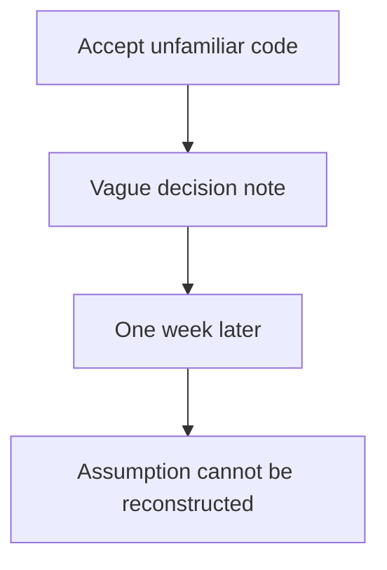
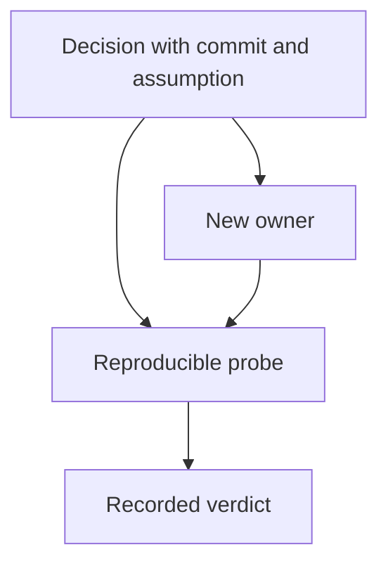
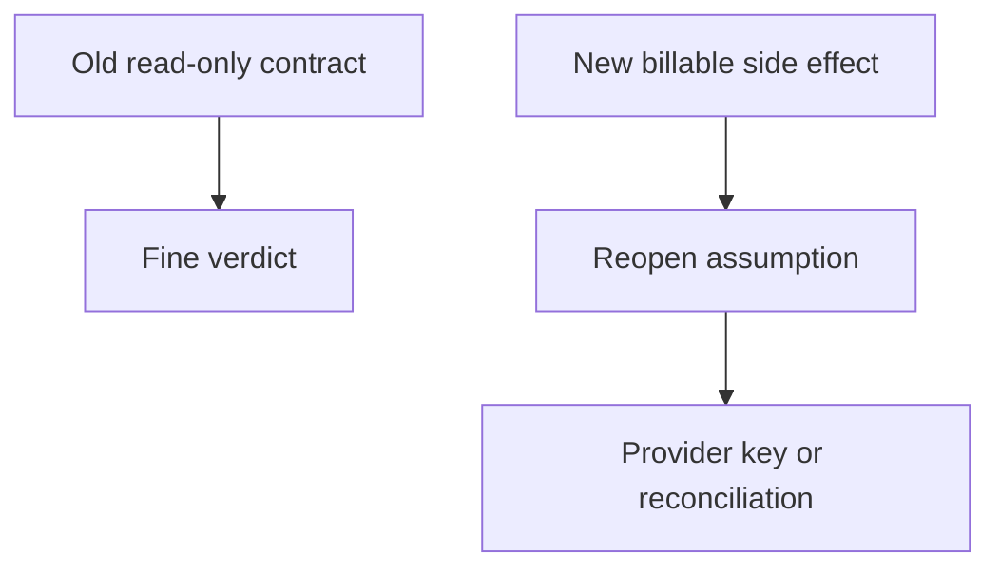

# 5. The honest log

[Curriculum](../../../../README.md) · [Problem solving and AI-assisted engineering](../../README.md) · [Project index](../../../../../indexes/projects.md)

## The reviewer's brief

> You accepted an unfamiliar retry helper because its tests passed. A week later, a duplicate write appears. Keep a record that lets another engineer reconstruct what you assumed and choose a repair. What would make an entry actionable?

This is a **constructed practice brief**, not an attributed company question.
Prerequisites: [the section](../../working-with-ai.md). This page is a build brief; it does not ship a runnable application. The original build and prompt sequence below defines the implementation checkpoints.

| Case | Exact input or workload | Expected outcome |
|---|---|---|
| Small example | Three entries: fixed GET timeout verified; durable idempotency unverified; `quantity || old` accepted. | Classify as fine with evidence, debt with owner/date, and wrong after a zero-quantity regression demonstrates the defect. |
| Boundary / failure | Entry says only “accepted async stuff.” | Mark unusable and replace it with the concrete assumption and falsifying check. |
| Scope | A judgment record; counts are descriptive and not an individual performance score. | Explain any additional assumption before implementing it. |

<!-- project-expectation:start -->

## What you are expected to hand over

**The finished artifact:** The DECISIONS.md the section told you to start, run as a full loop: one line at every moment you accept something you do not fully understand, across a week of real P1 work — then a revisit that ends each entry as fine, debt or wrong, with an action attached. The deliverable is the three counts.

Treat that sentence as a review contract, not an inspiration. A reviewable
submission contains all of the following:

- the narrow working slice or decision artifact described above, reproducible
  from a clean checkout with assumptions stated;
- captured proof of the normal flow **and** the boundary/failure row above;
- tests, probes, or metrics that can go red when the important guarantee breaks;
- a short decision record naming ownership, excluded scope, and the first
  operational limit; and
- a changed contract, diagram, and new evidence for each follow-up—not only a
  paragraph claiming the original design still works.

### How the review conversation gets harder

| Review gate | The interviewer changes | Expected response |
|---|---|---|
| Baseline | Run the small example from the table above. | Demonstrate the observable outcome end to end and identify which boundary owns it. |
| Failure | Reproduce the boundary/failure row above. | Show the failure before the fix, then prove the protected behavior without hiding the error. |
| Senior · The author leaves | A different engineer inherits the debt entry. What needs to survive? Predict which boundary must change before opening the design. | Include affected commit, code location, contract, owner, and a runnable probe. The handoff succeeds when the new owner can execute the check without the original conversation. |
| Lead · The assumption changes | The GET becomes a billable provider operation. Does the old “safe retry” verdict still apply? State what evidence would make you reject your first design. | Reopen the decision because its failure model changed. Require provider idempotency or an explicit uncertain-outcome/reconciliation state; a prior fine verdict is scoped to prior assumptions. |
| Evidence | A reviewer asks, “How do you know?” | Build in three stops: reproduce the small case and baseline failure; implement the protected boundary; then replay both changed requirements with captured outputs. |
| Handoff | The author is unavailable and the environment is new. | Another engineer can run, observe, break, and recover the artifact from the repository evidence. |

Before implementation, say the baseline invariant, the owner of each piece of
state, and what the user sees when the named dependency or assumption fails. That
five-minute explanation is part of the project: if it is vague, the build is not
ready to begin.

<!-- project-expectation:end -->

Before looking at the guidance, state the invariant in one sentence and trace the example. In interview practice, implement or sketch independently, then reveal the reasoning. During AI-assisted practice, use the prompts below and verify each checkpoint before the next request.

## Baseline and the failure to explain



Without the original claim and alternatives, a later reviewer can only repeat the earlier confidence. An empty log or all-fine result warrants sampling, not an automatic claim of dishonesty.

<details>
<summary>Reveal the approach and decisions</summary>

Record the assumption at acceptance, a contrary outcome, and the check that would distinguish them. The invariant is evidence-backed classification: fine cites a check, debt has an owner, wrong records a regression and repair. Keep uncertain conclusions unsettled.

</details>

## Follow-up 1 · The author leaves

**Changed requirement:** A different engineer inherits the debt entry. What needs to survive? Predict which boundary must change before opening the design.

<details>
<summary>Expected reasoning and changed diagram</summary>

Include affected commit, code location, contract, owner, and a runnable probe. The handoff succeeds when the new owner can execute the check without the original conversation.



</details>

## Follow-up 2 · The assumption changes

**Changed requirement:** The GET becomes a billable provider operation. Does the old “safe retry” verdict still apply? State what evidence would make you reject your first design.

<details>
<summary>Expected reasoning and changed diagram</summary>

Reopen the decision because its failure model changed. Require provider idempotency or an explicit uncertain-outcome/reconciliation state; a prior fine verdict is scoped to prior assumptions.



</details>

## Evidence to bring to review

Build in three stops: reproduce the small case and baseline failure; implement the protected boundary; then replay both changed requirements with captured outputs. Record commands, fixtures, and observed results in your implementation README. A diagram is a prediction until those checks run.

**Senior expectation:** Bring one independently replayed decision and its falsifying input. **Additional lead scope:** Define review cadence and protect uncertainty reporting from punitive metrics. Completion demonstrates practice evidence; it does not establish interview readiness or multi-team delivery experience.

## Build and prompt sequence

*You end up with a week of recorded acceptances and three counts you cannot get
any other way: how many were fine, how many were debt, how many were wrong.*

**Build**

The `DECISIONS.md` the section told you to start, run as a full loop: one line
at every moment you accept something you do not fully understand, across a week
of real P1 work — then a revisit that ends each entry as *fine*, *debt* or
*wrong*, with an action attached. The deliverable is the three counts.

**The thought process**

The first decision is the bar for "did not fully understand", and both failure
directions are real: too strict and you are logging every line, which lasts a
day; too loose and the log stays empty, which reads as competence and is
actually blindness. The workable bar — log it if, had this been wrong, you
would not have caught it. And an entry has to survive a week, because its
reader is future-you, who has lost this context. "Accepted the retry logic" is
dead in seven days; "accepted that retrying the fetch is safe because it is
claimed idempotent — did not verify" can be reopened by a stranger. Future-you
is a fresh session with no context, the same reader the spec in project one had.

Third: the revisit must not be re-reading and nodding — you will agree with
yourself, the same instrument measuring twice. So verdicts cost something.
*Fine*: you can now explain why it is right. *Debt*: you still cannot, and a
ticket or test now exists. *Wrong*: it was incorrect, is fixed, and you wrote
down what would have caught it sooner. The loop only works if an entry is
cheaper than pretending to understand — one line, no shame attached. A log kept
to look good measures nothing.

**How to organise the prompts**

**1 — instrument the moment of acceptance, every slice.**

```
List everything in this change I accepted without questioning:
defaults you chose, libraries you picked, behaviour you inferred
from my silence. For each, one line: the choice, the nearest
alternative, and what would reveal the wrong one.
```

An empty list is flattery — ask instead for the three most fragile choices. You
pick which lines enter the log; the model proposes, the log is yours.

**2 — the revisit, one week later, in a fresh session.**

```
Here is an entry from my decisions log, and the current code. State
what the decision assumed, whether this week's changes relied on or
contradicted that assumption, and the one check that would settle
it. End with SETTLED or UNSETTLED. Do not reassure me.
```

Fresh, because it has no stake in defending last week's choices; every item
must end in something runnable, and you run at least three.

**3 — the verdicts are yours; the model gets one job.**

```
Argue the strongest case that this entry was WRONG, citing the code
as it is now. One paragraph. If the case is weak, say it is weak.
```

Use it on anything you are about to mark *fine*; an entry that survives the
strongest opposing case, with the checks run, has earned it. Then count.

**On AWS**

`DECISIONS.md` in git is the right store: the log must live where the diff
lives, commit with it, and get reviewed with it. **DynamoDB** is the neighbour,
and it earns a place only when the log spans many repositories and you want
"all unresolved debt older than thirty days" answered across a team — partition
key the repository, sort key the date, that is the entire schema. The revisit
needs a schedule, and the honest tool is a calendar entry; the AWS version —
**EventBridge Scheduler** invoking a **Lambda** that opens an issue listing
week-old entries — is worth building once the team is bigger than you.

**What productionising it means**

The log becomes provenance: the next person reads it and learns which parts of
the codebase are load-bearing guesses, which no amount of clean code
communicates. The counts become a gauge — a *wrong* count that is not shrinking
means the acceptance bar is too low; an empty week means the bar drifted, not
that you suddenly understand everything.

**The learning**

The section quotes a trial in which developers believed they were faster while
measurably being slower. That gap closes with a record, not with effort. The
ratio of fine to debt to wrong is a measurement of your own judgment, and until
now you were running on the feeling of it.

**How you would know it is wrong**

- A week of real work and an empty log. The bar is wrong; the work was not that
  clean.
- Every verdict came back *fine*. You graded your own homework — run the
  strongest-case argument on three and see if they hold.
- Trace one real bug from the week. If the acceptance that caused it is not in
  the log, the log measures diligence, not risk.
- An entry you cannot act on at revisit — "accepted some async stuff" — failed
  the future-reader test. Tighten the template, not the intention.

---

[Back to the ordered project index](../../ai-projects.md)
