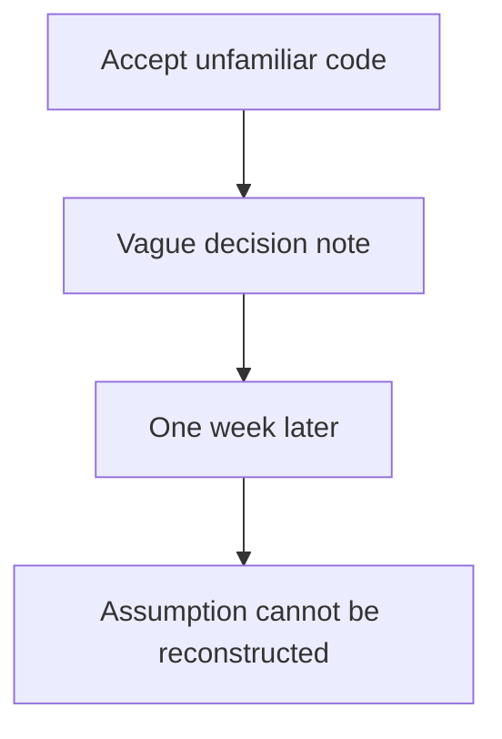

# Record and revisit uncertain engineering decisions

## Application background

While changing a reading-list service, you accept a retry helper you do not fully understand. You assume it cannot save the same operation twice. A week later a duplicate record appears, and another engineer needs to know what you assumed and why.

A useful decision log records the uncertainty when the decision is made, then revisits it using actual observations. Writing “looks fine” after the fact gives the next engineer little to work with.

The deliverable is an actionable history of decisions. Each entry needs enough context for someone else to confirm it, repair it or decide what evidence is still missing.

## Your assignment

**Deliver:** Create a dated decision log and revisit at least three entries with observed evidence and an explicit next action.

This is a constructed development-workflow exercise. Your output is the artifact named above and the observed comparison, rather than a production platform.

## Get the starting application and prepare your workspace

The [repository](https://github.com/Soulful-Iris/junior-to-staff) includes a small reading-list HTTP API with SQLite storage. Follow the [setup and request walkthrough](../../../../../examples/reading-list-starter/README.md) to save a URL and read it back before changing anything. The API has no tag endpoint, browser UI or production authentication yet.

```bash
git clone https://github.com/Soulful-Iris/junior-to-staff.git
cd junior-to-staff
python3 examples/reading-list-starter/app.py --db /tmp/reading-list.sqlite3
```

Leave the server running while sending the documented requests in a second terminal. Use a separate working copy for the exercise. Any helper, specification, review command or Git branches named below are artifacts **you create**, not hidden supplied solutions.

## Complete the exercise

1. Create `DECISIONS.md` with date, decision, assumption, evidence, owner and revisit trigger. Record an actual choice while changing the local API.

2. Add entries covering timeout behavior, an unverified duplicate-write claim and a numeric fallback that treats zero as missing. Run the relevant examples and attach the observed values or responses.

3. Revisit each entry and classify it as supported, unresolved debt or wrong. For a wrong assumption, attach the correction and changed observation. Assign an owner and next step to unresolved debt.

## Demonstrate the result

| Case | Exact input or workload | Expected outcome |
|---|---|---|
| Small example | Three entries: fixed GET timeout verified. Durable idempotency unverified. `quantity || old` accepted. | Classify as fine with evidence, debt with owner/date, and wrong after a zero-quantity regression demonstrates the defect. |
| Boundary / failure | Entry says only “accepted async stuff.” | Mark unusable and replace it with the concrete assumption and falsifying check. |
| Scope | A judgment record. Counts are descriptive and not an individual performance score. | Explain any additional assumption before implementing it. |

Keep the exact input, observed output and before/after artifact in your exercise README. Label constructed fixtures as fixtures. A fresh reader should be able to repeat the comparison without your conversation history.

## Deployment scope

This assignment concerns local development evidence and workflow. AWS deployment is not required and no cloud resources are supplied or created. CI-policy exercises belong in a disposable repository. They do not change this guide's publish-on-main behavior. For a later application deployment, the [starter's local-to-AWS mapping](../../../../../examples/reading-list-starter/README.md) explains the missing adapters.

## Additional reasoning and harder requirements

<details>
<summary>Study the failure, follow-up requirements and implementation prompts</summary>




Without the original claim and alternatives, a later reviewer can only repeat the earlier confidence. An empty log or all-fine result warrants sampling, not an automatic claim of dishonesty.

<details>
<summary>Reveal the approach and decisions</summary>

Record the assumption at acceptance, a contrary outcome, and the check that would distinguish them. The invariant is evidence-backed classification: fine cites a check, debt has an owner, wrong records a regression and repair. Keep uncertain conclusions unsettled.

</details>

## Follow-up 1 · The author leaves

**Changed requirement:** A different engineer inherits the debt entry. What needs to survive?

<details>
<summary>Worked design and implementation</summary>

Include affected commit, code location, contract, owner, and a runnable probe. The handoff succeeds when the new owner can execute the check without the original conversation.

**Give the next engineer a runnable starting point.** A debt entry saying “retry is probably safe” is incomplete without the operation, assumptions and evidence. Include commit, file or interface, observed failure, owner and exact local reproduction command. Preserve any fixture input beside the decision.

Ask a reader with only the checkout to reproduce the outcome and identify the reopening trigger. Record what they could not find. This improves the handoff record without adding a new service or decorating the decision with an architecture diagram.

</details>

## Follow-up 2 · The assumption changes

**Changed requirement:** The GET becomes a billable provider operation. Does the old “safe retry” verdict still apply?

<details>
<summary>Worked design and implementation</summary>

Reopen the decision because its failure model changed. Require provider idempotency or an explicit uncertain-outcome/reconciliation state. A prior fine verdict is scoped to prior assumptions.

**Change the verdict when the effect changes.** The old operation fetched public data. The new provider bills each accepted request, even if the response disappears. Reusing the earlier safe-retry conclusion now risks repeated charges.

Add an attempt identity and an unknown-outcome state to the revised design. Require a provider-supported replay/status protocol or stop automatic retry. Deliver a short before/after assumption table and one lost-response trace. Keep the original verdict as historical evidence with its original scope.

</details>

## Record the evidence and limitations

Build in three stops: reproduce the small case and baseline failure. Implement the protected boundary. Then replay both changed requirements with captured outputs. Record commands, fixtures, and observed results in your implementation README. A diagram is a prediction until those checks run.

**Senior expectation:** Bring one independently replayed decision and its falsifying input. **Additional lead scope:** Define review cadence and protect uncertainty reporting from punitive metrics. Completion demonstrates practice evidence. It does not establish interview readiness or multi-team delivery experience.

## Detailed implementation and AI-assisted prompts

*You end up with a week of recorded acceptances and three counts you cannot get
any other way: how many were fine, how many were debt, how many were wrong.*

**Build**

The `DECISIONS.md` the section told you to start, run as a full loop: one line
at every moment you accept something you do not fully understand, across a week
of real Stage 1 reading-list work — then a revisit that ends each entry as *fine*, *debt* or
*wrong*, with an action attached. The deliverable is the three counts.

**The thought process**

The first decision is the bar for "did not fully understand", and both failure
directions are real: too strict and you are logging every line, which lasts a
day. Too loose and the log stays empty, which reads as competence and is
actually blindness. The workable bar — log it if, had this been wrong, you
would not have caught it. And an entry has to survive a week, because its
reader is future-you, who has lost this context. "Accepted the retry logic" is
dead in seven days. "accepted that retrying the fetch is safe because it is
claimed idempotent — did not verify" can be reopened by a stranger. Future-you
is a fresh session with no context, the same reader the spec in project one had.

Third: the revisit must not be re-reading and nodding — you will agree with
yourself, the same instrument measuring twice. So verdicts cost something.
*Fine*: you can now explain why it is right. *Debt*: you still cannot, and a
ticket or test now exists. *Wrong*: it was incorrect, is fixed, and you wrote
down what would have caught it sooner. The loop only works if an entry is
cheaper than pretending to understand — one line, no shame attached. A log kept
to look good measures nothing.

**How to organise the prompts**

**1 — instrument the moment of acceptance, every slice.**

```
List everything in this change I accepted without questioning:
defaults you chose, libraries you picked, behaviour you inferred
from my silence. For each, one line: the choice, the nearest
alternative, and what would reveal the wrong one.
```

An empty list is flattery — ask instead for the three most fragile choices. You
pick which lines enter the log. The model proposes, the log is yours.

**2 — the revisit, one week later, in a fresh session.**

```
Here is an entry from my decisions log, and the current code. State
what the decision assumed, whether this week's changes relied on or
contradicted that assumption, and the one check that would settle
it. End with SETTLED or UNSETTLED. Do not reassure me.
```

Fresh, because it has no stake in defending last week's choices. Every item
must end in something runnable, and you run at least three.

**3 — the verdicts are yours. The model gets one job.**

```
Argue the strongest case that this entry was WRONG, citing the code
as it is now. One paragraph. If the case is weak, say it is weak.
```

Use it on anything you are about to mark *fine*. An entry that survives the
strongest opposing case, with the checks run, has earned it. Then count.

**On AWS**

`DECISIONS.md` in git is the right store: the log must live where the diff
lives, commit with it, and get reviewed with it. **DynamoDB** is the neighbour,
and it earns a place only when the log spans many repositories and you want
"all unresolved debt older than thirty days" answered across a team — partition
key the repository, sort key the date, that is the entire schema. The revisit
needs a schedule, and the honest tool is a calendar entry. The AWS version —
**EventBridge Scheduler** invoking a **Lambda** that opens an issue listing
week-old entries — is worth building once the team is bigger than you.

**What productionising it means**

The log becomes provenance: the next person reads it and learns which parts of
the codebase are load-bearing guesses, which no amount of clean code
communicates. The counts become a gauge — a *wrong* count that is not shrinking
means the acceptance bar is too low. An empty week means the bar drifted, not
that you suddenly understand everything.

**The learning**

The section quotes a trial in which developers believed they were faster while
measurably being slower. That gap closes with a record, not with effort. The
ratio of fine to debt to wrong is a measurement of your own judgment, and until
now you were running on the feeling of it.

**How you would know it is wrong**

- A week of real work and an empty log. The bar is wrong. The work was not that
  clean.
- Every verdict came back *fine*. You graded your own homework — run the
  strongest-case argument on three and see if they hold.
- Trace one real bug from the week. If the acceptance that caused it is not in
  the log, the log measures diligence, not risk.
- An entry you cannot act on at revisit — "accepted some async stuff" — failed
  the future-reader test. Tighten the template, not the intention.

---

[Back to the ordered project index](../../ai-projects.md)


</details>
