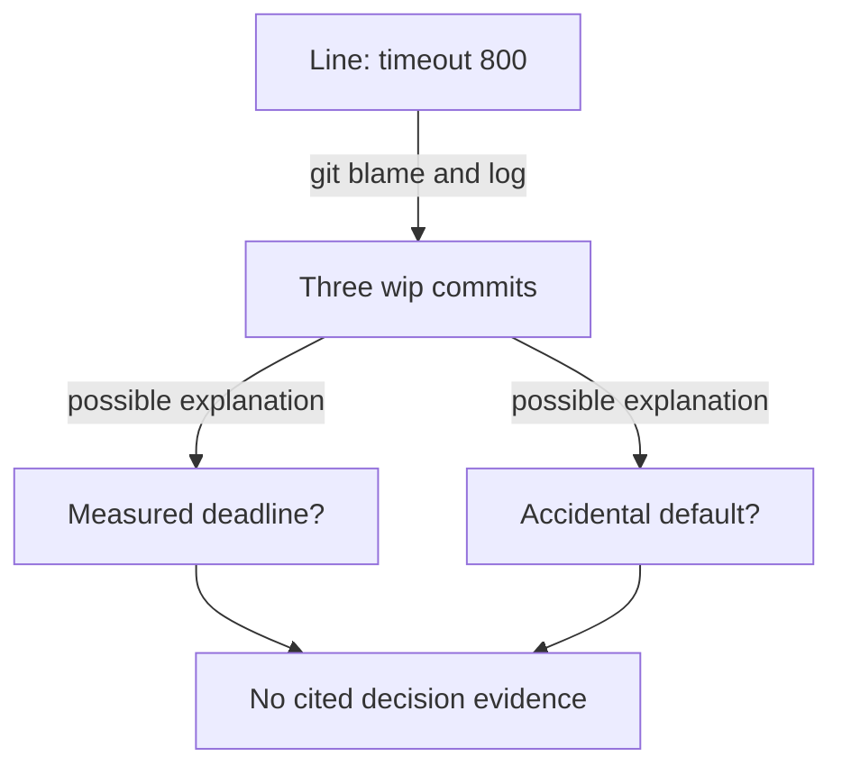
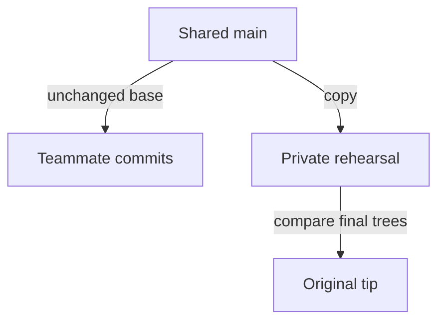
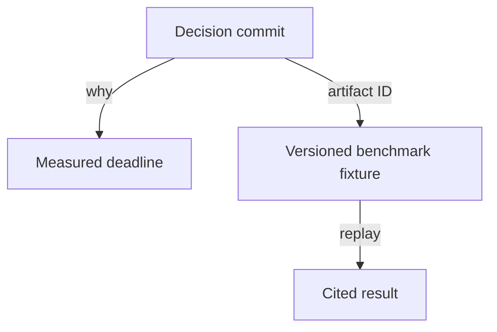

# 1. The history a stranger can debug from

[Curriculum](../../../../README.md) · [Problem solving and AI-assisted engineering](../../README.md) · [Project index](../../../../../indexes/projects.md)

## The reviewer's brief

> An on-call engineer finds `timeout_ms = 800` in your reading-list service. Three commits say only “wip.” Reorganize a private copy so a stranger can explain the value without changing any delivered code. What record would count as evidence?

This is a **constructed practice brief**, not an attributed company question.
Prerequisites: [the section](../../change-loop.md). This page is a build brief; it does not ship a runnable application. The original build and prompt sequence below defines the implementation checkpoints.

| Case | Exact input or workload | Expected outcome |
|---|---|---|
| Small example | Three commits change timeout 300 → 800, rename a helper, then add a timeout test. | The rewritten tip has an empty diff against the original tip; the reader cites the timeout decision and its test. |
| Boundary / failure | A rewrite accidentally restores timeout 300. | The tip comparison fails even if all rewritten commits look tidy. |
| Scope | Private practice branches; no rewriting a branch other people use. | Explain any additional assumption before implementing it. |

<!-- project-expectation:start -->

## What you are expected to hand over

**The finished artifact:** Take a real week of your P1 history — the honest one with wip in it. On a copy, rewrite it into the sequence you would want at 3am: same final code, different story. Then the experiment: a reader with no context gets one line and one question — why is this here — against each version, timed.

Treat that sentence as a review contract, not an inspiration. A reviewable
submission contains all of the following:

- the narrow working slice or decision artifact described above, reproducible
  from a clean checkout with assumptions stated;
- captured proof of the normal flow **and** the boundary/failure row above;
- tests, probes, or metrics that can go red when the important guarantee breaks;
- a short decision record naming ownership, excluded scope, and the first
  operational limit; and
- a changed contract, diagram, and new evidence for each follow-up—not only a
  paragraph claiming the original design still works.

### How the review conversation gets harder

| Review gate | The interviewer changes | Expected response |
|---|---|---|
| Baseline | Run the small example from the table above. | Demonstrate the observable outcome end to end and identify which boundary owns it. |
| Failure | Reproduce the boundary/failure row above. | Show the failure before the fix, then prove the protected behavior without hiding the error. |
| Senior · A shared branch already exists | A teammate has based two commits on the old history. How do you run the drill safely? Predict which boundary must change before opening the design. | Keep the shared reference stable and create a separate rehearsal branch. Compare trees there; use improved messages only on future shared work. The expected outcome is zero forced updates to the teammate’s base. |
| Lead · The explanation lives outside Git | The decision cites a benchmark file that will disappear. What must survive a year? State what evidence would make you reject your first design. | Attach the input, units, observed result, and a stable artifact identifier to the decision record. A narrative with a broken evidence link is not recoverable. Re-run the stranger exercise from an offline clone or exported bundle. |
| Evidence | A reviewer asks, “How do you know?” | Build in three stops: reproduce the small case and baseline failure; implement the protected boundary; then replay both changed requirements with captured outputs. |
| Handoff | The author is unavailable and the environment is new. | Another engineer can run, observe, break, and recover the artifact from the repository evidence. |

Before implementation, say the baseline invariant, the owner of each piece of
state, and what the user sees when the named dependency or assumption fails. That
five-minute explanation is part of the project: if it is vague, the build is not
ready to begin.

<!-- project-expectation:end -->

Before looking at the guidance, state the invariant in one sentence and trace the example. In interview practice, implement or sketch independently, then reveal the reasoning. During AI-assisted practice, use the prompts below and verify each checkpoint before the next request.

## Baseline and the failure to explain



The code records the chosen number, but not whether it came from a measured deadline or an accident. Faster lookup of a wrong explanation is not success.

<details>
<summary>Reveal the approach and decisions</summary>

First inventory decisions, then group commits by behavior and dependency. Preserve intermediate runnable states when possible. The invariant is byte-identical final trees; a test run alone cannot prove it. Measure a cited, correct answer separately from elapsed time.

</details>

## Follow-up 1 · A shared branch already exists

**Changed requirement:** A teammate has based two commits on the old history. How do you run the drill safely? Predict which boundary must change before opening the design.

<details>
<summary>Expected reasoning and changed diagram</summary>

Keep the shared reference stable and create a separate rehearsal branch. Compare trees there; use improved messages only on future shared work. The expected outcome is zero forced updates to the teammate’s base.



</details>

## Follow-up 2 · The explanation lives outside Git

**Changed requirement:** The decision cites a benchmark file that will disappear. What must survive a year? State what evidence would make you reject your first design.

<details>
<summary>Expected reasoning and changed diagram</summary>

Attach the input, units, observed result, and a stable artifact identifier to the decision record. A narrative with a broken evidence link is not recoverable. Re-run the stranger exercise from an offline clone or exported bundle.



</details>

## Evidence to bring to review

Build in three stops: reproduce the small case and baseline failure; implement the protected boundary; then replay both changed requirements with captured outputs. Record commands, fixtures, and observed results in your implementation README. A diagram is a prediction until those checks run.

**Senior expectation:** Show the empty diff and one correct independently cited answer. **Additional lead scope:** Define retention and the owner of decision artifacts. Completion demonstrates practice evidence; it does not establish interview readiness or multi-team delivery experience.

## Build and prompt sequence

*You end up with the same week of work told two ways, and a number: how long a
stranger takes to find out why a line changed in each.*

**Build**

Take a real week of your P1 history — the honest one with `wip` in it. On a
copy, rewrite it into the sequence you would want at 3am: same final code,
different story. Then the experiment: a reader with no context gets one line
and one question — why is this here — against each version, timed.

**The thought process**

The first decision is not a git command, it is a list: what were the actual
decisions made that week? A `fixes` commit usually contains three. Commits are
supposed to map to decisions one for one, so until the list exists you cannot
say what the commits should have been.

Second: where rewriting is allowed. Shared history is a record other people
have built on; rewriting it deletes their context. On a branch never pushed it
is a drill — with one honesty constraint: the final tree stays byte-identical.
You change the story, never the code, and `git diff` between the tips is the
proof.

Last: time-to-answer only counts when the answer is right and cited — the
stranger must name the commit that justifies the line. A fresh model session
with nothing but the clone is the perfect stranger: no memory of the ticket,
no politeness about a useless history.

**How to organise the prompts**

**1. The inventory.**

```
Read `git log -p` for the last week on this branch. List the distinct
decisions buried in it: behaviour changes, refactors, reversals, dead
ends. One line each. Do not touch the repository yet.
```

Check it against your memory of the week. A decision it missed was recorded
nowhere — a finding before anything is built.

**2. The plan.**

```
Plan a rewritten history for a copy of this branch: one commit per
decision, refactors separate from behaviour changes, each message one
line of what plus a body saying why and what we tried that did not
work. The final tree must stay byte-identical. Show me the plan first.
```

Read it as prose. Any commit that needs the word "and" gets split before you
approve.

**3. The execution.**

```
Execute the plan on a new branch, then run
`git diff <old-tip> <new-tip>` and show me the output. It must be
empty. If it is not, stop and tell me what differs.
```

The empty diff is the checkpoint: story changed, code untouched.

**4. The experiment**, in a fresh session with only the clone:

```
Why does line <N> of <file> say what it says? Use only git log, git
blame and the code. Cite the commit that justifies your answer.
```

Time it against both branches. Wrong-but-fast counts as wrong.

**On AWS**

The record belongs beside the code. **GitHub** fits this repository's review
workflow; **CodeCommit** is an AWS-hosted Git option when IAM integration and
AWS account controls are part of the requirement. Compare current collaboration
features and exportability rather than choosing by a historical service rumor.
Keep an independent `git bundle` snapshot in a versioned **S3** bucket if you
need an offsite repository record; verify that it restores the refs you intend
and budget storage/retention. CodeCommit capability checked 2026-09-22 against
[the official overview](https://docs.aws.amazon.com/codecommit/latest/userguide/welcome.html).

**What productionising it means**

The rewrite is a drill, not a workflow. The production version is writing
history well on the way in: a message check in project 3's pipeline, a
protected main so nobody rewrites what others built on, and the inventory
prompt run before a week of work instead of after it.

**The learning**

A history has a reader, and the reader arrives at the worst possible moment.
Watch a stranger answer "why is this line here" in ninety seconds against one
telling and give up against the other, and "backup versus record" stops being
a slogan.

**How you would know it is wrong**

- `git diff` between the tips is not empty: you edited code, not story. Start over.
- The stranger answers as fast against the messy history: the question was answerable from code alone — pick a line whose *why* is not in the file.
- You cannot answer the same question about your own rewritten history a week later.
- Messages that narrate the diff — first word "update", "change", "fix" — survived the rewrite. Grep for them.

---

[Back to the ordered project index](../../change-projects.md)
