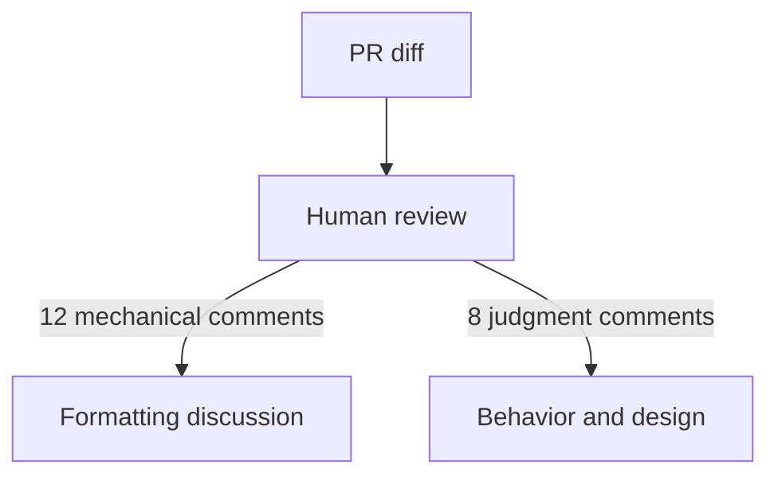
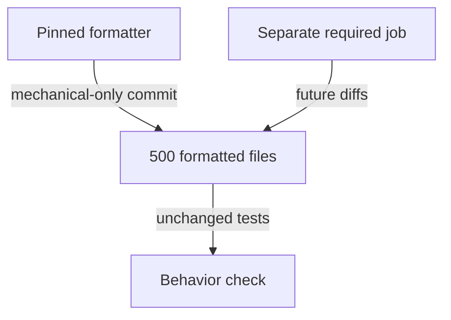
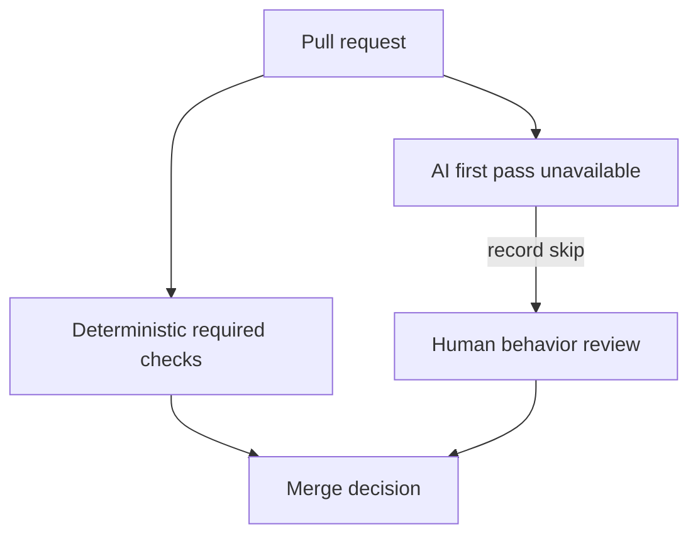

# Automate deterministic review rules and retain human judgment

## Application background

A team reviews reading-list changes and repeatedly comments on formatting and import order. Those comments consume attention while a more important change, such as removing an ownership check, can go unnoticed. Some review work is mechanical, while other work needs product context.

Collect a small set of review comments and decide which ones have an objective rule a tool can enforce. Then observe whether removing that mechanical work leaves the behavior decisions visible to the human reviewer.

An automated review result is useful evidence about the rules it actually checks. It is not a substitute for every other kind of review.

## Your assignment

**Deliver:** Classify review comments, automate repeatable mechanical rules and show which behavior decisions still require a reviewer.

This is a constructed development-workflow exercise. Your output is the artifact named above and the observed comparison, rather than a production platform.

## Get the starting application and prepare your workspace

The [repository](https://github.com/Soulful-Iris/junior-to-staff) includes a small reading-list HTTP API with SQLite storage. Follow the [setup and request walkthrough](../../../../../examples/reading-list-starter/README.md) to save a URL and read it back before changing anything. The API has no tag endpoint, browser UI or production authentication yet.

```bash
git clone https://github.com/Soulful-Iris/junior-to-staff.git
cd junior-to-staff
python3 examples/reading-list-starter/app.py --db /tmp/reading-list.sqlite3
```

Leave the server running while sending the documented requests in a second terminal. Use a separate working copy for the exercise. Any helper, specification, review command or Git branches named below are artifacts **you create**, not hidden supplied solutions.

## Complete the exercise

1. Collect twenty comments from your own changes, or produce a clearly labeled exercise set while reviewing the starter. Categorize each as a mechanical rule or a contextual behavior/design decision.

2. Configure a formatter or linter in the disposable exercise workspace for rules with an objective result. Record the comments those rules remove and any false positives.

3. Review a change that removes the owner condition from the note-update operation. Show why style feedback alone cannot approve the change and identify the behavior evidence the human reviewer needs.

## Demonstrate the result

| Case | Exact input or workload | Expected outcome |
|---|---|---|
| Small example | 20 comments: 8 formatting, 4 imports, 3 naming, 5 behavioral concerns. | 12 deterministic comments map to formatter/linter checks. The 8 judgment comments retain a human owner. |
| Boundary / failure | The AI review gives a style verdict and silently approves a missing owner check. | Its contract is violated. Human behavioral review remains required. |
| Scope | Five subsequent PRs form a small local experiment, not a universal productivity study. | Explain any additional assumption before implementing it. |

Keep the exact input, observed output and before/after artifact in your exercise README. Label constructed fixtures as fixtures. A fresh reader should be able to repeat the comparison without your conversation history.

## Deployment scope

This assignment concerns local development evidence and workflow. AWS deployment is not required and no cloud resources are supplied or created. CI-policy exercises belong in a disposable repository. They do not change this guide's publish-on-main behavior. For a later application deployment, the [starter's local-to-AWS mapping](../../../../../examples/reading-list-starter/README.md) explains the missing adapters.

## Additional reasoning and harder requirements

<details>
<summary>Study the failure, follow-up requirements and implementation prompts</summary>




The baseline consumes the same attention on deterministic and contextual decisions. Automating a subjective rule without measuring false positives can increase the review burden.

<details>
<summary>Reveal the approach and decisions</summary>

Classify comments with examples, enforce a small deterministic set, and keep the AI pass advisory with a bounded job. The invariant is that mechanical enforcement does not grant behavioral approval. Count overrides and correctly found seeded defects alongside comment volume.

</details>

## Follow-up 1 · The repository is already large

**Changed requirement:** Turning on a formatter touches 500 files. How do reviewers retain a useful history? Predict which boundary must change before opening the design.

<details>
<summary>Expected reasoning and changed diagram</summary>

Land one behavior-preserving mechanical change and a separate enforcement change. Existing tests should remain unmodified. Record formatter version and exclude unrelated fixes so blame and rollback remain interpretable.



</details>

## Follow-up 2 · The AI endpoint is unavailable

**Changed requirement:** The model is down during an urgent security patch. Should the patch wait? State what evidence would make you reject your first design.

<details>
<summary>Expected reasoning and changed diagram</summary>

Choose and document an advisory fail-open policy with a human reviewer for this exercise. Deterministic gates still run. Record the skipped AI pass, then compare later findings. Its absence must not silently become a behavioral approval.



</details>

## Record the evidence and limitations

Build in three stops: reproduce the small case and baseline failure. Implement the protected boundary. Then replay both changed requirements with captured outputs. Record commands, fixtures, and observed results in your implementation README. A diagram is a prediction until those checks run.

**Senior expectation:** Catch the seeded behavioral bug after removing style noise. **Additional lead scope:** Assign rule ownership and a measurable exception-removal process. Completion demonstrates practice evidence. It does not establish interview readiness or multi-team delivery experience.

## Detailed implementation and AI-assisted prompts

*You end up with your review comments sorted into machine work and judgment,
and the machine pile at zero on your next five pull requests.*

**Build**

A corpus of real review comments — project 2 supplies plenty — sorted into
what a machine could have said and what needed a person. Then the machine
layer: a formatter that rewrites, a linter and import order that enforce, an
AI first pass constrained by contract. Then the count, re-run on your next
five PRs.

**The thought process**

The first decision is the line itself. Mechanical means one right answer every
time it applies: formatting, import order, unused symbols, an obvious footgun.
Judgment means naming, design, "is this the right change at all". The
dangerous territory is the middle — rules right often but not always — because
every false positive spends the gate's credibility, and credibility does not
refill. Start strict and small.

Second: enforce beats advise. A formatter that rewrites ends the argument. A
linter that complains starts one. The state you are buying is that style stops
being reviewable because it stops being variable.

Third: adopting a formatter on an existing repo means one huge mechanical
diff. That is project 1's discipline arriving as policy — its own commit,
behaviour identical, tests untouched, mixed with nothing.

Fourth: the AI pass gets a job description, and it is the section's first-pass
read: map where human attention should go, name what is absent, no verdicts —
and no style, because machines now own style twice over.

**How to organise the prompts**

**1. The sort.**

```
Here are the review comments from my last N pull requests. For each:
could a machine have made this comment every time it applies, yes or
no? For each yes, name the tool or rule. For each no, name the
judgment it needed.
```

Sample ten yeses and argue where you disagree — a wrong yes is a future false
positive, cheap to catch now.

**2. The tools, one at a time.**

```
Add the formatter as two commits: one that only reformats, tests
untouched and green, and one that enforces it as a pipeline job. Then
the linter and import order, same shape. Show each enforcement going
red on a planted violation before we keep it.
```

The reformat commit's tests must pass unmodified, and every tool must have
been seen red once.

**3. The AI pass, with a contract.**

```
Wire a first-pass review on every PR with this contract: comment only
on behaviour, risk, and what is absent — tests, migration, rollback.
Never comment on style or formatting. End with the three hunks most
deserving of human attention, and no verdict.
```

Test the contract on a PR that is stylistically ugly and behaviourally fine.
One style comment is a breach — tighten and rerun.

**4. The count.**

```
For my next five PRs, sort every review comment into the two piles and
report the machine pile per PR. For each machine comment that still
occurred, name the missing or misconfigured rule.
```

The target is zero, and every non-zero names its own fix.

**On AWS**

The zero-setup machine pass is GitHub-side and covered in
[the section](../../change-loop.md). The AWS version exists for one reason: when the diff
must not leave your boundary, run the model through **Bedrock** from a small
**Lambda** on the PR webhook, the pipeline assuming an **OIDC** role. Bedrock
rides IAM, so no vendor API key sits in repository secrets for project 3's
scanner to find. Lambda beats **CodeBuild** for the bot because a diff fits in
memory and the work lasts seconds. A build container is the wrong shape. The
mechanical tools can stay in Actions. Estimate model invocations separately
from CI usage. Neither a small diff nor IAM integration proves a zero bill.

**What productionising it means**

Keep a false-positive ledger: a rule overridden more than about weekly gets
fixed or deleted, because an ignorable gate teaches ignoring gates. Pin
formatter and linter versions — an unpinned formatter upgrade reformats the
world mid-PR. And decide in writing whether the AI pass fails open or closed
when its API is down. Not deciding means finding out during an outage.

**The learning**

Reviewer attention is the loop's scarcest input, and every comment category
you automate is attention returned to questions only a person can answer. The
corollary: enforced checks disappear from consciousness, advisory ones become
noise, and almost nothing worth keeping lives in between.

**How you would know it is wrong**

- Plant one style violation and one real bug in the same PR. The machine must catch the style. The human pass must still catch the bug. A bug that sailed through on a green glow means you automated complacency.
- The comment mix is unchanged after a month: the tools are advisory, or not required, or not running.
- Overrides rise week on week: the rules spend credibility faster than they earn it.
- Turn the formatter off locally and push. The pipeline must catch it — advice dies, law holds.

---

[Back to the ordered project index](../../change-projects.md)


</details>
