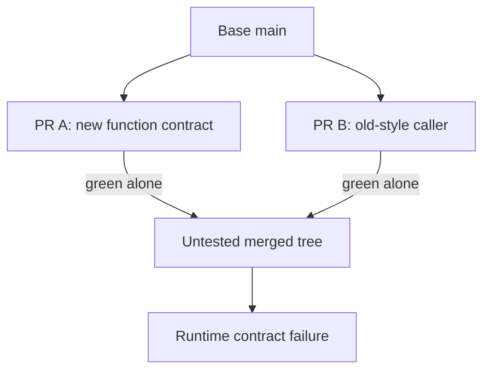
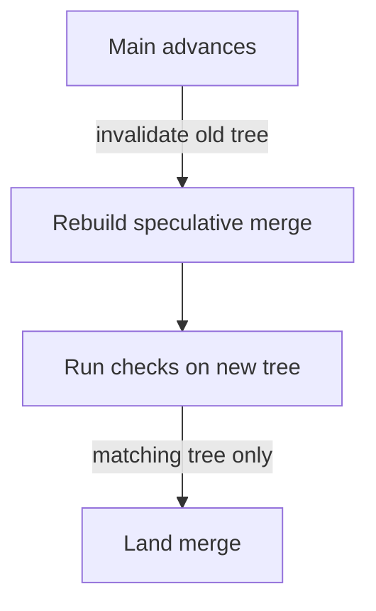
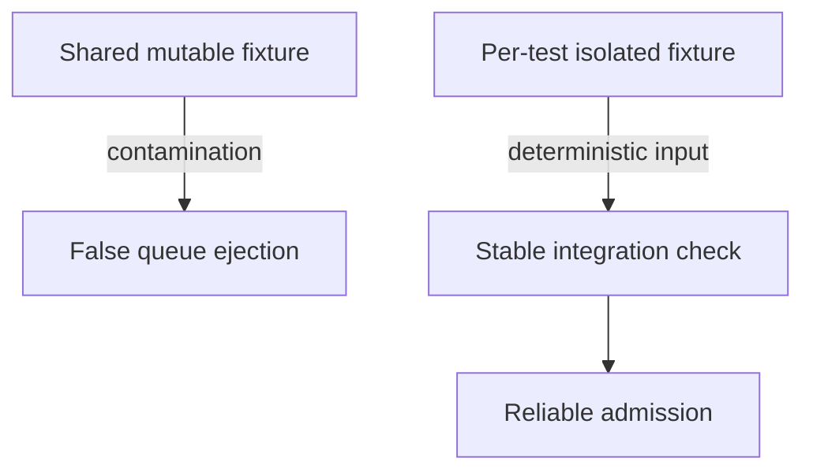

# 5. Two greens that make a red

[Curriculum](../../../../README.md) · [Problem solving and AI-assisted engineering](../../README.md) · [Project index](../../../../../indexes/projects.md)

## The reviewer's brief

> PR A changes a function to require an options object; PR B adds a caller using the previous positional argument. Both are green and Git merges them cleanly. Prevent their combination from breaking main. Which tree did each check test?

This is a **constructed practice brief**, not an attributed company question.
Prerequisites: [the section](../../change-loop.md). This page is a build brief; it does not ship a runnable application. The original build and prompt sequence below defines the implementation checkpoints.

| Case | Exact input or workload | Expected outcome |
|---|---|---|
| Small example | A changes `fetchTitle(url, ms)` to `fetchTitle(url, {timeoutMs})`; B adds a caller in another file. | A and B pass alone; their temporary merge fails a behavioral contract check; a merge gate refuses B after A. |
| Boundary / failure | CI reruns only the unchanged PR head after main moves. | The stale green result is not accepted as proof of the combined tree. |
| Scope | A controlled semantic conflict with no textual conflict; a test must exercise the new caller. | Explain any additional assumption before implementing it. |

<!-- project-expectation:start -->

## What you are expected to hand over

**The finished artifact:** PR A changes a function's contract. PR B, branched before A landed, adds a new call site written against the old contract, in a different file. No textual conflict; both green on their own base; together they break main. Then a merge queue — real or hand-rolled — catches the second one before main ever sees it.

Treat that sentence as a review contract, not an inspiration. A reviewable
submission contains all of the following:

- the narrow working slice or decision artifact described above, reproducible
  from a clean checkout with assumptions stated;
- captured proof of the normal flow **and** the boundary/failure row above;
- tests, probes, or metrics that can go red when the important guarantee breaks;
- a short decision record naming ownership, excluded scope, and the first
  operational limit; and
- a changed contract, diagram, and new evidence for each follow-up—not only a
  paragraph claiming the original design still works.

### How the review conversation gets harder

| Review gate | The interviewer changes | Expected response |
|---|---|---|
| Baseline | Run the small example from the table above. | Demonstrate the observable outcome end to end and identify which boundary owns it. |
| Failure | Reproduce the boundary/failure row above. | Show the failure before the fix, then prove the protected behavior without hiding the error. |
| Senior · Main changes during CI | A third commit lands while the speculative check is running. May the old result be reused? Predict which boundary must change before opening the design. | Recompute the speculative tree and rerun checks affected by the new base. Compare tree or input hashes explicitly; a commit’s unchanged PR head says nothing about dependency changes on main. |
| Lead · The suite is flaky | The correct integration test fails 10% of the time due to leaked fixture state. Does a retry establish correctness? State what evidence would make you reject your first design. | Reproduce fixture contamination and isolate state before trusting the queue. Track ejection reasons. A retry may gather diagnostic evidence but does not repair the oracle; the merge queue amplifies flaky gates into team-wide delay. |
| Evidence | A reviewer asks, “How do you know?” | Build in three stops: reproduce the small case and baseline failure; implement the protected boundary; then replay both changed requirements with captured outputs. |
| Handoff | The author is unavailable and the environment is new. | Another engineer can run, observe, break, and recover the artifact from the repository evidence. |

Before implementation, say the baseline invariant, the owner of each piece of
state, and what the user sees when the named dependency or assumption fails. That
five-minute explanation is part of the project: if it is vague, the build is not
ready to begin.

<!-- project-expectation:end -->

Before looking at the guidance, state the invariant in one sentence and trace the example. In interview practice, implement or sketch independently, then reveal the reasoning. During AI-assisted practice, use the prompts below and verify each checkpoint before the next request.

## Baseline and the failure to explain



The green checks are true about two different trees. The integration failure is caused by their combination, which neither check observed.

<details>
<summary>Reveal the approach and decisions</summary>

Construct the failing combination first. Test a speculative merge against current main plus preceding queued changes and bind the result to that exact tree. The invariant is that the admitted tree is the checked tree; queue serialization cannot compensate for an absent contract test.

</details>

## Follow-up 1 · Main changes during CI

**Changed requirement:** A third commit lands while the speculative check is running. May the old result be reused? Predict which boundary must change before opening the design.

<details>
<summary>Expected reasoning and changed diagram</summary>

Recompute the speculative tree and rerun checks affected by the new base. Compare tree or input hashes explicitly; a commit’s unchanged PR head says nothing about dependency changes on main.



</details>

## Follow-up 2 · The suite is flaky

**Changed requirement:** The correct integration test fails 10% of the time due to leaked fixture state. Does a retry establish correctness? State what evidence would make you reject your first design.

<details>
<summary>Expected reasoning and changed diagram</summary>

Reproduce fixture contamination and isolate state before trusting the queue. Track ejection reasons. A retry may gather diagnostic evidence but does not repair the oracle; the merge queue amplifies flaky gates into team-wide delay.



</details>

## Evidence to bring to review

Build in three stops: reproduce the small case and baseline failure; implement the protected boundary; then replay both changed requirements with captured outputs. Record commands, fixtures, and observed results in your implementation README. A diagram is a prediction until those checks run.

**Senior expectation:** Show four original outcomes and rejection of the exact combined tree. **Additional lead scope:** Balance throughput, check duration, bypass policy, and flake ownership. Completion demonstrates practice evidence; it does not establish interview readiness or multi-team delivery experience.

## Build and prompt sequence

*You end up having built the failure merge queues exist for — two PRs, each
green alone, red together — and the machinery that stops it reaching main.*

**Build**

PR A changes a function's contract. PR B, branched before A landed, adds a new
call site written against the old contract, in a different file. No textual
conflict; both green on their own base; together they break main. Then a merge
queue — real or hand-rolled — catches the second one before main ever sees it.

**The thought process**

Start by naming why CI lied: "this PR is green" actually means "this PR was
green against the main that existed when its checks ran". It is a statement
about a moment. Main moved, and nobody tested the combination — no tool was
wrong; the claim was smaller than everyone assumed.

Second, the construction discipline: the pair must merge cleanly. If git
reports a textual conflict you built the wrong failure — that one is caught
for free. You want a semantic dependency with no textual overlap, which is why
the new call site lives in a different file.

Third, the prevention menu: require-branches-up-to-date serialises humans, who
then babysit rebases; test-after-merge-and-revert is optimistic and lets main
go red sometimes, which tiny teams tolerate; a merge queue serialises machines,
testing each PR against main plus everything ahead of it and ejecting what
fails. Team size times CI duration picks the answer; the queue won because it
converts human waiting into machine time.

**How to organise the prompts**

**1. The construction brief.**

```
Describe two changes to this repository that each pass the full suite
on their own branch, merge into main with no textual conflict, and
make the suite fail once both are merged. Name the mechanism. Do not
write code yet.
```

The mechanism must be a semantic dependency, and the no-conflict claim
specific about which files each change touches.

**2. The trap, proven.**

```
Build both branches from the same base. Show me four results: the
suite green on A, green on B, both merging cleanly into a scratch
branch, and the suite red there.
```

The four results are the artefact. A green scratch branch demonstrates
nothing — construct again.

**3. The prevention.**

```
Enable the merge queue — or write a landing script that refuses to
merge any PR until the suite passes on a temporary merge of that PR
onto current main plus everything ahead of it in line. Replay both
PRs through it and show me where the second one is stopped.
```

The failure must happen inside the queue, with main's history green
throughout the replay.

**4. The limits.**

```
List what this queue still cannot catch, with one concrete example
from this repository for each.
```

At minimum: combinations that only fail at runtime under real data, and a
flaky suite, which the queue amplifies into everyone's problem. An answer
claiming the queue catches everything is selling, not thinking.

**On AWS**

A merge queue spends CI capacity on speculative combined trees. Estimate
required runs and duration before selecting hosted **Actions** or **CodeBuild**
for a needed VPC/machine shape. Cache reusable build inputs without reusing a
green result for a different source tree. Store immutable images by digest in
**ECR**, and reports/bundles by source SHA in **S3**; a generic S3 tarball is not
an image-registry endpoint. Include storage, transfer and cleanup in the current
account estimate instead of assuming a fixed free allowance.

**What productionising it means**

The queue gets metrics — depth, time-in-queue, ejection rate — because a queue
nobody watches is a delay nobody can explain. Flakiness is now existential:
one flaky test ejects innocent PRs and stalls every merge behind them, so the
quarantine rule from [testing](../../../../02-applications/04-testing/testing-strategy.md) stops being optional. And the
bypass log from project 3 applies doubly at 6pm on a Friday.

**The learning**

Green is a statement about a moment, not a property of a change. Integration
is a race; the queue removes the race without a person holding a lock — and
you know exactly which failure it removes, because you built that failure
with your own hands.

**How you would know it is wrong**

- Git reports a textual conflict between the pair: wrong construction — that case was already caught for free.
- The scratch branch is green: no semantic dependency, nothing demonstrated.
- The queue passes both PRs: check which ref CI ran on. If it re-ran the stale PR head instead of the speculative merge, the queue is ceremony.
- After the ejection, rebase PR B and land it properly. If it still cannot pass, the original failure was something else and you proved less than you think.

---

[Back to the ordered project index](../../change-projects.md)
