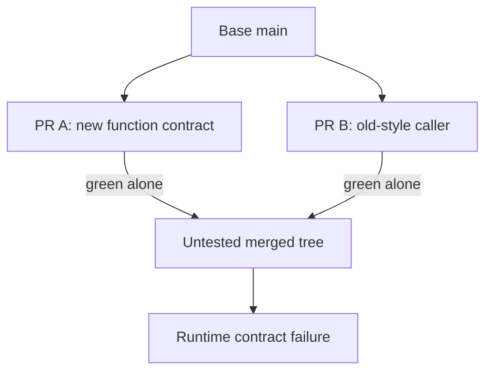

# Check the combined behavior of independently valid changes

## Application background

Two engineers branch from the same version of a reading-list app. One changes the title helper to take an options object. The other adds a new caller using the old arguments. Each engineer's branch works with the code it started from.

Git may combine their files without reporting a text conflict, yet the combined application can fail. The problem is the relationship between the helper and its new caller, not whether Git could join the text.

### Example walkthrough

| Action | Expected behavior |
|---|---|
| Branch A changes `fetchTitle(url, ms)` to `fetchTitle(url, {timeoutMs})` | Update A's existing callers. |
| Branch B adds another caller with the old signature | B still works against its original helper. |
| Combine A and B | Observe the incompatible call and update it before accepting the combined result. |

An integration check evaluates the combined revision that would run after merging. Success on two separate branch revisions does not establish success on their combination.

## Your assignment

**Deliver:** Create two independently working branches whose combination fails, then demonstrate a process that evaluates the combined revision.

This is a constructed development-workflow exercise. Your output is the artifact named above and the observed comparison, rather than a production platform.

## Get the starting application and prepare your workspace

The [repository](https://github.com/Soulful-Iris/junior-to-staff) includes a small reading-list HTTP API with SQLite storage. Follow the [setup and request walkthrough](../../../../../examples/reading-list-starter/README.md) to save a URL and read it back before changing anything. The API has no tag endpoint, browser UI or production authentication yet.

```bash
git clone https://github.com/Soulful-Iris/junior-to-staff.git
cd junior-to-staff
python3 examples/reading-list-starter/app.py --db /tmp/reading-list.sqlite3
```

Leave the server running while sending the documented requests in a second terminal. Use a separate working copy for the exercise. Any helper, specification, review command or Git branches named below are artifacts **you create**, not hidden supplied solutions.

## Complete the exercise

1. Use a disposable repository with a title helper and two callers. Record the original behavior and create branches A and B from the same revision.

2. On A, change the helper to require an options object and update its current caller. On B, add another caller using the old signature. Run each branch and then a temporary combined revision. Record the actual combined failure.

3. Update the incompatible caller and rerun the combined application. If practicing merge-queue configuration, do so only in this disposable repository and record the exact candidate tree checked.

## Demonstrate the result

| Case | Exact input or workload | Expected outcome |
|---|---|---|
| Small example | A changes `fetchTitle(url, ms)` to `fetchTitle(url, {timeoutMs})`. B adds a caller in another file. | A and B pass alone. Their temporary merge fails a behavioral contract check. A merge gate refuses B after A. |
| Boundary / failure | CI reruns only the unchanged PR head after main moves. | The stale green result is not accepted as proof of the combined tree. |
| Scope | A controlled semantic conflict with no textual conflict. A test must exercise the new caller. | Explain any additional assumption before implementing it. |

Keep the exact input, observed output and before/after artifact in your exercise README. Label constructed fixtures as fixtures. A fresh reader should be able to repeat the comparison without your conversation history.

## Deployment scope

This assignment concerns local development evidence and workflow. AWS deployment is not required and no cloud resources are supplied or created. CI-policy exercises belong in a disposable repository. They do not change this guide's publish-on-main behavior. For a later application deployment, the [starter's local-to-AWS mapping](../../../../../examples/reading-list-starter/README.md) explains the missing adapters.

## Additional reasoning and harder requirements

<details>
<summary>Study the failure, follow-up requirements and implementation prompts</summary>




The green checks are true about two different trees. The integration failure is caused by their combination, which neither check observed.

<details>
<summary>Reveal the approach and decisions</summary>

Construct the failing combination first. Test a speculative merge against current main plus preceding queued changes and bind the result to that exact tree. The invariant is that the admitted tree is the checked tree. Queue serialization cannot compensate for an absent contract test.

</details>

## Follow-up 1 · Main changes during CI

**Changed requirement:** A third commit lands while the speculative check is running. May the old result be reused?

<details>
<summary>Worked design and implementation</summary>

Recompute the speculative tree and rerun checks affected by the new base. Compare tree or input hashes explicitly. A commit’s unchanged PR head says nothing about dependency changes on main.

**Bind evidence to the combined tree.** PR B's head may be unchanged while main acquires a conflicting semantic change. Recompute the speculative merge and record its tree identity. Reuse a prior result only if all relevant source and execution inputs truly match.

Deliver the old base, new base and both combined-tree IDs. Show the original result marked stale and the new result attached to the new tree. The exercise demonstrates why “this PR was green earlier” does not describe its current integration behavior.

</details>

## Follow-up 2 · The suite is flaky

**Changed requirement:** The correct integration test fails 10% of the time due to leaked fixture state. Does a retry establish correctness?

<details>
<summary>Worked design and implementation</summary>

Reproduce fixture contamination and isolate state before trusting the queue. Track ejection reasons. A retry may gather diagnostic evidence but does not repair the oracle. The merge queue amplifies flaky gates into team-wide delay.

**Repair the source of nondeterminism.** Preserve the input order and shared fixture state that produced the false failure. Isolate mutable files, database rows or clocks as appropriate, then replay that specific contamination sequence. Record retry outcomes as observations rather than turning any later pass into approval.

At a 10% independent false-failure probability, repeated checks can create substantial queue churn even when every change is correct. Independence itself may not hold with shared state. Deliver the cause, deterministic reproduction and ownership of any temporary quarantine.

</details>

## Record the evidence and limitations

Build in three stops: reproduce the small case and baseline failure. Implement the protected boundary. Then replay both changed requirements with captured outputs. Record commands, fixtures, and observed results in your implementation README. A diagram is a prediction until those checks run.

**Senior expectation:** Show four original outcomes and rejection of the exact combined tree. **Additional lead scope:** Balance throughput, check duration, bypass policy, and flake ownership. Completion demonstrates practice evidence. It does not establish interview readiness or multi-team delivery experience.

## Detailed implementation and AI-assisted prompts

*You end up having built the failure merge queues exist for — two PRs, each
green alone, red together — and the machinery that stops it reaching main.*

**Build**

PR A changes a function's contract. PR B, branched before A landed, adds a new
call site written against the old contract, in a different file. No textual
conflict. Both green on their own base. Together they break main. Then a merge
queue — real or hand-rolled — catches the second one before main ever sees it.

**The thought process**

Start by naming why CI lied: "this PR is green" actually means "this PR was
green against the main that existed when its checks ran". It is a statement
about a moment. Main moved, and nobody tested the combination — no tool was
wrong. The claim was smaller than everyone assumed.

Second, the construction discipline: the pair must merge cleanly. If git
reports a textual conflict you built the wrong failure — that one is caught
for free. You want a semantic dependency with no textual overlap, which is why
the new call site lives in a different file.

Third, the prevention menu: require-branches-up-to-date serialises humans, who
then babysit rebases. Test-after-merge-and-revert is optimistic and lets main
go red sometimes, which tiny teams tolerate. A merge queue serialises machines,
testing each PR against main plus everything ahead of it and ejecting what
fails. Team size times CI duration picks the answer. The queue won because it
converts human waiting into machine time.

**How to organise the prompts**

**1. The construction brief.**

```
Describe two changes to this repository that each pass the full suite
on their own branch, merge into main with no textual conflict, and
make the suite fail once both are merged. Name the mechanism. Do not
write code yet.
```

The mechanism must be a semantic dependency, and the no-conflict claim
specific about which files each change touches.

**2. The trap, proven.**

```
Build both branches from the same base. Show me four results: the
suite green on A, green on B, both merging cleanly into a scratch
branch, and the suite red there.
```

The four results are the artefact. A green scratch branch demonstrates
nothing — construct again.

**3. The prevention.**

```
Enable the merge queue — or write a landing script that refuses to
merge any PR until the suite passes on a temporary merge of that PR
onto current main plus everything ahead of it in line. Replay both
PRs through it and show me where the second one is stopped.
```

The failure must happen inside the queue, with main's history green
throughout the replay.

**4. The limits.**

```
List what this queue still cannot catch, with one concrete example
from this repository for each.
```

At minimum: combinations that only fail at runtime under real data, and a
flaky suite, which the queue amplifies into everyone's problem. An answer
claiming the queue catches everything is selling, not thinking.

**On AWS**

A merge queue spends CI capacity on speculative combined trees. Estimate
required runs and duration before selecting hosted **Actions** or **CodeBuild**
for a needed VPC/machine shape. Cache reusable build inputs without reusing a
green result for a different source tree. Store immutable images by digest in
**ECR**, and reports/bundles by source SHA in **S3**. A generic S3 tarball is not
an image-registry endpoint. Include storage, transfer and cleanup in the current
account estimate instead of assuming a fixed free allowance.

**What productionising it means**

The queue gets metrics — depth, time-in-queue, ejection rate — because a queue
nobody watches is a delay nobody can explain. Flakiness is now existential:
one flaky test ejects innocent PRs and stalls every merge behind them, so the
quarantine rule from [testing](../../../../02-applications/04-testing/testing-strategy.md) stops being optional. And the
bypass log from project 3 applies doubly at 6pm on a Friday.

**The learning**

Green is a statement about a moment, not a property of a change. Integration
is a race. The queue removes the race without a person holding a lock — and
you know exactly which failure it removes, because you built that failure
with your own hands.

**How you would know it is wrong**

- Git reports a textual conflict between the pair: wrong construction — that case was already caught for free.
- The scratch branch is green: no semantic dependency, nothing demonstrated.
- The queue passes both PRs: check which ref CI ran on. If it re-ran the stale PR head instead of the speculative merge, the queue is ceremony.
- After the ejection, rebase PR B and land it properly. If it still cannot pass, the original failure was something else and you proved less than you think.

---

[Back to the ordered project index](../../change-projects.md)


</details>
