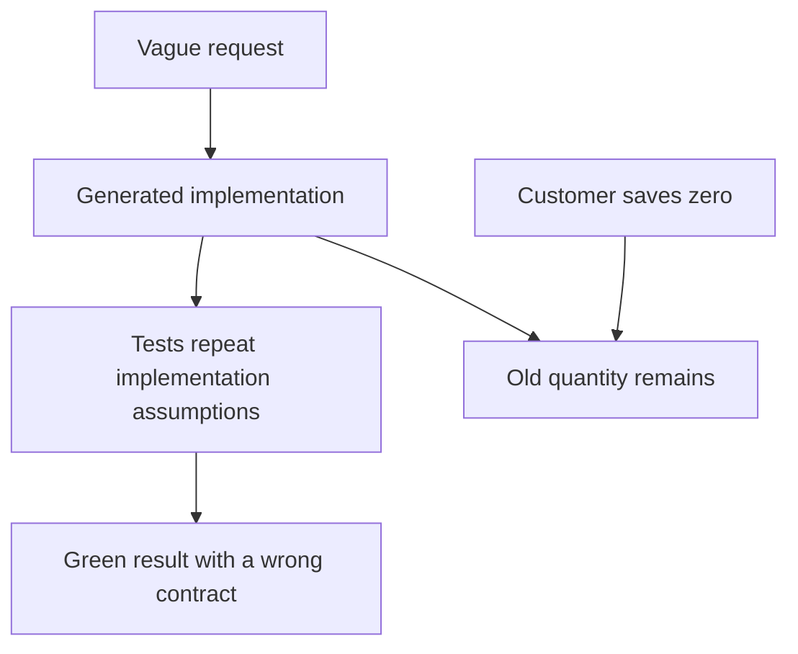
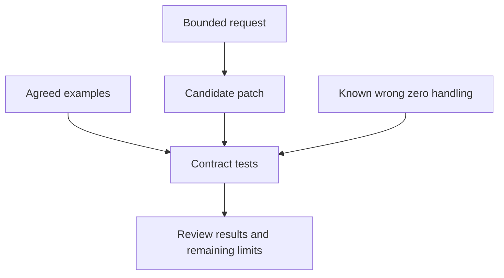
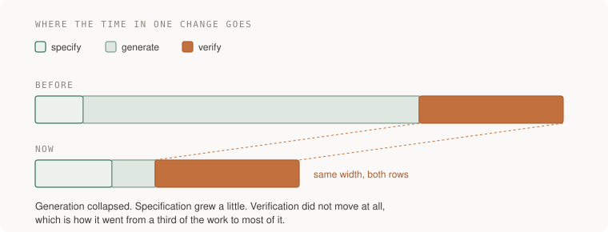
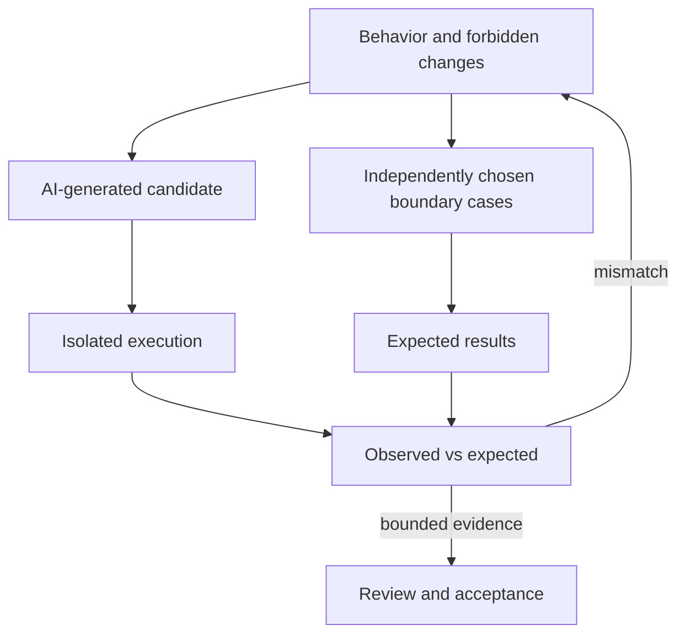

# Specify and verify an AI-generated change

A stock-management screen lets a user change the quantity of an item. The item currently has seven units. Setting it to zero means it is out of stock, while omitting the quantity from a partial update means leave it unchanged. An assistant generated code that accidentally treats both situations as the same.

Your job is to define those meanings, inspect the proposed implementation, and gather evidence from the actual boundary being changed. The lesson is about deciding whether a patch implements the product rule, regardless of who wrote it.

[Curriculum](../../README.md) · [AI-assisted code changes](README.md)

> Project connection · feeds **every project in this guide**

## See why a plausible one-line implementation loses zero

```javascript
const current = 7;
const supplied = 0;
console.log(supplied || current); // 7: zero selects the fallback
```

`||` chooses its right side when the left side is falsy. Zero is falsy in JavaScript, but zero is valid product data here. Replacing `||` with `??` preserves zero, yet still treats null as absent. This exercise rejects null, so the repair needs an explicit presence/type decision as well.

| Wire input | Meaning | Expected stored quantity |
|---|---|---:|
| `{"quantity":0}` | Explicitly set stock to zero | 0 |
| `{}` | No quantity change requested | 7 |
| `{"quantity":null}` | Invalid under this contract | 7, with rejection |
| `{"quantity":"0"}` | String, not an allowed integer | 7, with rejection |

Write this table before inspecting the assistant's expected results. An **oracle** is the expectation used to judge an observed result. If the expectation merely copies the generated expression, both can repeat the same mistake. The [quantity investigation](../../02-applications/04-testing/labs/quantity-debug/README.md) isolates this defect.

## Reason through the changed situation

> “An assistant implemented quantity updates and supplied passing tests.
> A customer cannot save zero. What should you check before accepting a repair?”

| Request with current quantity `7` | Expected result for this exercise |
|---|---|
| `{ "quantity": 0 }` | Save `0` |
| `{}` | Keep `7` |
| `{ "quantity": -1 }` | Reject; keep `7` |
| `{ "quantity": null }` | Reject; keep `7` |

Missing, null and zero are different product cases. Agree on the contract before
accepting the implementation; do not let a convenient language expression pick
it silently.



## Reason through the review

1. Use the four cases above as an independent oracle.
2. Inspect the smallest patch. `value || current` loses zero; `??` still needs
   the chosen null validation.
3. Exercise the real request boundary. JSON input is not validated by a
   TypeScript annotation.
4. Restore the known zero-handling defect in a disposable copy. The zero test
   should fail. This checks sensitivity to that defect, not all defects.



## Follow the mechanism and its limits



Specify the behavior, generate a candidate, then verify it. Faster generation
does not tell you how much review a particular patch needs. Measure your own
specification, implementation, review and rework time separately.

The important distinction is **where the expectation comes from**, not whether
the test was written before or after the code, or by a person or an assistant.

| Check | What it tells you |
|---|---|
| A post-implementation test expects saving `0` to store `0`, from the product contract | Useful evidence for that case, even on its first green run |
| `assert result == result` | Nothing about whether the result is correct |
| Restore `value || current`; the zero test fails | The test detects this known zero-handling defect |
| Replace `x + 0` with `x` for ordinary integers; tests stay green | This equivalent change does not alter the supported behavior |
| A mocked database returns the expected row | Checks caller logic, not actual SQL or database isolation |

Test-first development is a useful workflow. A deliberately failing run is a
useful negative control. Neither chronology nor one killed mutant proves the
whole implementation correct.

## Ask an assistant for useful evidence

```text
State the contract and concrete normal, empty and invalid-input examples.
List important assumptions and unresolved questions; do not invent concerns.
Implement one reviewable slice and name the boundaries its tests exercise.
Report the exact commands and results, including failures and skipped checks.
```

For a regression, ask for a test that fails on the known buggy version and passes
on the repair. For already-correct behavior, a green first run is acceptable:
explain the independent expectation and add a meaningful negative control when
it would strengthen the evidence.

```text
Review the diff, not its description.
What behavior changes? What could change accidentally?
Which checks cover those risks, and what remains untested?
Support approval or requested changes with evidence; approval unchanged is valid.
```

## What to inspect before accepting

Read the diff and the assertions. Check swallowed exceptions, default values
standing in for failed calls, authorization boundaries and added dependencies.
Use real integrations where their behavior is the claim; use fakes where you
need controlled caller-state tests. Neither substitutes for the other.

A short homemade replacement is not automatically safer than a maintained
library. Compare the required behavior, security surface, maintenance cost,
license and dependency graph—not just line count.

## Apply this lesson to the reading-list application

Before P1, keep a short `DECISIONS.md`: the chosen contract, meaningful
alternatives, unresolved assumptions and how they were checked. Record actual
unknowns; do not accept confusing code merely to fill a required list.

**Acceptance:** demonstrate the four quantity cases, explain the patch, show
what the tests do and do not establish, and justify the review decision. A clean
patch may be accepted without a forced objection. For interview practice,
attempt a fresh variant unaided and record any prior exposure or tool use.

## Words you now own

**Specification:** the requested behavior. **Oracle:** the independent expected
result. **Negative control:** a known-bad case used to check detection.
**Equivalent mutant:** a changed implementation with the same supported
behavior. **Swallowed error:** a failure hidden instead of handled explicitly.

## Draw it from memory · Keep the author separate from the oracle



**Redraw challenge:** show how a plausible explanation and a passing tautology
can coexist with the zero-handling defect.

[Research notes and limits](../../../docs/research/junior-foundation-research-2026.md) · [Learning sequence](../../README.md) · [Independent practice](../../../practice/interview-guide.md)
