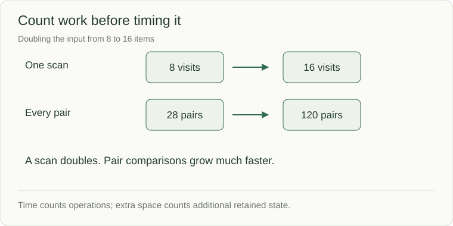

# Cost: count the work and the memory

Before choosing a structure, ask what grows when the input doubles. Let `n` be the number of items. **Time complexity** describes how the work grows; **extra space** describes memory allocated in addition to the input. Neither is a stopwatch reading.



## Start with something you can count

```python
values = [4, 8, 12, 16]
total = 0
for value in values:
    total += value
print(total)  # 40
```

There are four additions for four values: O(n) time. `total` is one accumulator, so auxiliary space is O(1) under a fixed-size arithmetic model. Creating `doubled = [2 * value for value in values]` also takes O(n) time, but allocates n output values. Say whether your space bound includes the output.

## Recognize the common growth patterns

| Bound | What the algorithm does | How the work grows |
|---|---|---|
| O(1) | One direct array access | Same number of accesses |
| O(log n) | Repeatedly halves a candidate range | Doubling n adds roughly one halving |
| O(n) | Visits each item once | Doubling n doubles the visits |
| O(n log n) | Typical comparison sorting | Doubling n takes a little more than twice the work |
| O(n²) | Compares every pair | Doubling n gives roughly four times the pairs |
| O(2ⁿ) | Enumerates all subsets | One extra item doubles the subsets |

O(n²) is an upper-bound growth statement. Nested loops are not automatically quadratic: if a left pointer advances at most n times across the entire outer loop, total pointer movement is O(n).

## Three qualifiers matter

**Worst case:** the largest work for a given input size. **Expected:** an average under stated assumptions, such as well-distributed hash values. **Amortized:** total work spread across a sequence, such as occasional resizing during list appends. A Python dictionary lookup is normally described as expected O(1), and list append as amortized O(1).

Strings, slices, sorting, and recursive calls hide work too. Copying a length-k slice costs O(k); recursion retains a call stack; returning p answers costs at least O(p). Python integers grow, so arithmetic on enormous integers is not literally fixed cost.

## Check your understanding

If a scan stores every distinct value, its time can be O(n) and its extra space O(n). If a recursive search reaches depth n, its stack can consume O(n) even when it allocates no explicit collection. Explain both bounds before calling a solution efficient.

Sources: [Python data structures](https://docs.python.org/3/tutorial/datastructures.html) · [Algorithm analysis and fundamental structures](https://algs4.cs.princeton.edu/10fundamentals/)
