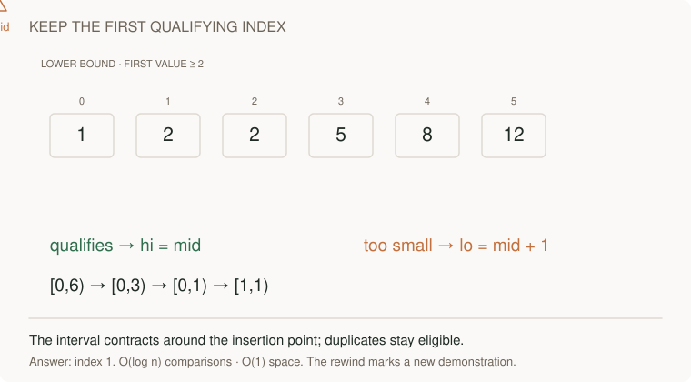
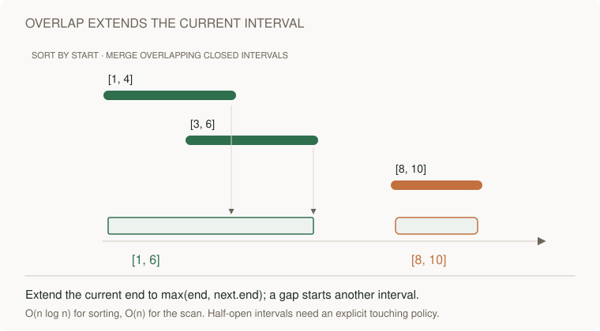

# Sorted data: binary search and intervals

[Curriculum](../../../README.md) · [Data structures and algorithms](../README.md)

> “Where would target 3 first fit in sorted [1,3,3,8]? Now decide whether bookings ending and starting at time 3 overlap.”

The search returns index 1. Booking policy determines endpoint overlap; write that contract before using either binary search or interval merging.

This is a short prerequisite lesson. Attempt the complete [binary search boundary problem](../problems/11-binary-search-boundary/README.md), then [meeting room capacity](../problems/10-meeting-room-capacity/README.md), with their contracts, tests and changed requirements.

**Build:** Find the first index ≥ target; then merge overlapping closed intervals.



[Static diagram](../../../../assets/learning/binary-halving-still.svg)

**The idea:** Search keeps `[lo, hi)` shrinking. Merging sorts by start, so only the last emitted interval can overlap the next.

Closed: `[1,3] + [3,4] → [1,4]`. Half-open meetings: `[1,3)` and `[3,4)` do not conflict.

## First, what does sorted input buy us?

If numbers are already sorted, **binary search** can discard half the remaining candidates after each comparison. `lower_bound` asks for the first position whose value is at least the target. For `[1, 3, 3, 8]`, target 3, the answer is index 1, not just *any* position holding 3. Returning `len(nums)` means every value is smaller.

```python
nums, target = [1, 3, 3, 8], 3
lo, hi = 0, len(nums)  # possible answer lives in [lo, hi)
while lo < hi:
    mid = (lo + hi) // 2
    if nums[mid] < target:
        lo = mid + 1    # mid is too small to be the answer
    else:
        hi = mid        # mid might be the FIRST valid position
print(lo)               # 1
```

Python's slice notation `[lo, hi)` includes `lo` but excludes `hi`. The same *endpoint convention* matters for bookings. A meeting `[09:00, 10:00)` frees its room at 10:00, so `[10:00, 11:00)` can use that room. Closed intervals `[1, 3]` and `[3, 4]` both contain 3 and therefore overlap.

**Read both visuals:** in the first, watch the candidate search range shrink; in the second, watch a merged interval extend only when the next interval touches under the chosen closed-endpoint policy. Do not carry that policy unchanged into room scheduling.



[Static view](../../../../assets/learning/merge-intervals-still.svg)

## Your 45-minute session

1. **5 min:** draw one example and a simple solution.
2. **25 min:** implement `lower_bound, merge_intervals` without the reference.
3. **10 min:** check the exact examples below; say which endpoint convention each interval uses.
4. **5 min:** explain the cost and answer the changed requirement.

**Cost:** Search: O(log n) time, O(1) space on sorted data. Merge: O(n log n) time, O(n) space including the sorted copy.

| Operation / input | Expected | Why |
| --- | --- | --- |
| `lower_bound([1, 2, 2, 5], 2)` | `1` | First 2, not the later 2. |
| `lower_bound([], 2)` | `0` | Empty list: insertion goes at index 0. |
| `lower_bound([1, 5], 9)` | `2` | Insert after the last item. |
| Merge **closed** `[[1, 5], [2, 3]]` | `[[1, 5]]` | The inner interval changes nothing. |
| Merge **closed** `[[1, 3], [3, 4]]` | `[[1, 4]]` | Shared endpoint counts as overlap. |
| Rooms **half-open** `[9, 10)`, `[10, 11)` | One room suffices | End at 10 is no longer occupied. |

For search, halving `n` candidates about `log₂ n` times gives O(log n) comparisons and two index variables give O(1) extra space. For merging, sorting dominates at O(n log n); the sorted copy and output can each store up to `n` intervals, so O(n) extra space. Define whether sorting may mutate the input before choosing an implementation.

**Pass before moving on:** Explain both midpoint updates and draw the difference between closed and half-open intervals.

**Changed requirement:** Calendar meetings are half-open intervals. Should 09:00–10:00 merge with 10:00–11:00?

<details>
<summary>After attempting: reference and explanation</summary>

Compare `lower_bound, merge_intervals` in [algorithms.py](../algorithms.py). Use [pattern notes](../pattern-notes.md) for the invariant and [contracts](../reference.md) for complexity edge cases. Reimplement tomorrow without copying.

</details>

[Previous](03-prefix.md) · [Next: Graphs: visit once, then track prerequisites](05-graphs.md)
