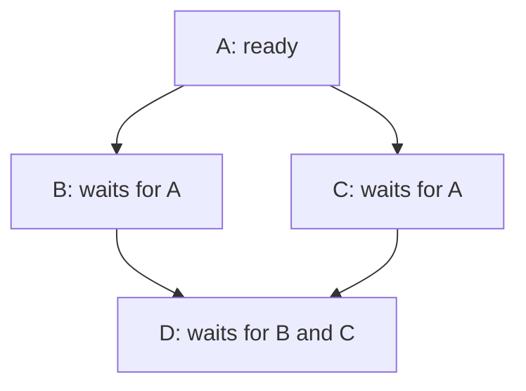

# Graphs: visit once, then track prerequisites

[Curriculum](../../../README.md) · [Data structures and algorithms](../README.md)

> “A deployment must fetch before parsing and parse before saving. Return a legal order, or explain why a newly added dependency makes one impossible.”

An isolated task also belongs in the output. Draw prerequisites before code; distinguish visiting a node from proving all its dependencies have finished.

This is a short prerequisite lesson. Attempt the complete [dependency order problem](../problems/21-dependency-order/README.md), then [grid shortest path](../problems/24-grid-shortest-path/README.md), with their contracts, tests and changed requirements.

**Build:** Count four-connected islands; then return one valid prerequisite order.


[Static diagram](../../../../assets/learning/bfs-frontier-still.svg)

**The idea:** BFS marks on enqueue. Dependency scheduling admits only vertices with zero remaining prerequisites.

## First, what is a graph and a queue?

A **graph** has nodes (tasks or cells) and edges (relationships). For `fetch → parse → save`, each arrow means the left task must finish before the right one can run. Breadth-first search (BFS) visits neighbors a layer at a time using a **queue**: new items join at the back and old items leave from the front.

```python
from collections import deque
queue = deque(["fetch"])
queue.append("parse")      # ["fetch", "parse"]
print(queue.popleft())     # "fetch"; "parse" is next
```

For an island grid, enqueue a land cell only if it has not already been seen; mark it **at enqueue time**, because two neighboring cells may discover it before either is processed. For dependency ordering, count how many prerequisites remain for each node. Only a zero count makes it ready:

```python
remaining = {"fetch": 0, "parse": 1, "save": 1}
ready = deque([task for task, n in remaining.items() if n == 0])
# After fetch finishes, decrement parse to 0; then enqueue parse.
```

The diagram below is a different graph: D cannot start after B alone because it also waits for C. Try crossing off completed tasks and updating each remaining count. A cycle `A → B → A` has no first ready task; return an explicit cycle result instead of waiting forever.



## Your 45-minute session

1. **5 min:** draw one example and a simple solution.
2. **25 min:** implement `islands, course_order` without the reference.
3. **10 min:** run the input/output table below; include the duplicate-edge case.
4. **5 min:** explain the cost and answer the changed requirement.

**Cost:** BFS/topological order: O(V+E) time and O(V+E) space. A grid has O(rows × cols) vertices and edges.

| Scenario | Expected | Reason |
| --- | --- | --- |
| Grid `[["1", "0"], ["0", "1"]]` | 2 islands | Diagonals are not four-connected. |
| Empty grid `[]` | 0 islands | No land nodes exist. |
| Tasks `A→C`, `B→C` | `C` after **both** A and B | Remaining count starts at 2. |
| Tasks `A→B`, `B→A` | Cycle / no valid order | Neither can start. |
| Duplicate dependency `A→B` twice | B has one unique prerequisite | Dedupe edges before counting. |
| Tasks A with no edges, B→C | Order includes A, B, C | Isolated tasks are still nodes. |

`V` counts nodes and `E` counts edges. Visiting each node and edge a bounded number of times costs O(V+E). A grid of `r × c` cells has at most `r × c` nodes and four neighbor checks per cell, giving O(r×c) time and up to O(r×c) queue/visited space. State whether your input graph is directed; an undirected friendship link does not mean “must finish first.”

**Pass before moving on:** Show the queue after each step. Detect a cycle by unfinished vertices, not by a guessed timeout.

**Changed requirement:** Add different edge weights. Why can FIFO traversal now return an expensive route first?

<details>
<summary>After attempting: reference and explanation</summary>

Compare `islands, course_order` in [algorithms.py](../algorithms.py). Use [pattern notes](../pattern-notes.md) for the invariant and [contracts](../reference.md) for complexity edge cases. Reimplement tomorrow without copying.

</details>

[Previous](04-order.md) · [Next: Heaps: keep the next best candidate](06-heaps.md)
