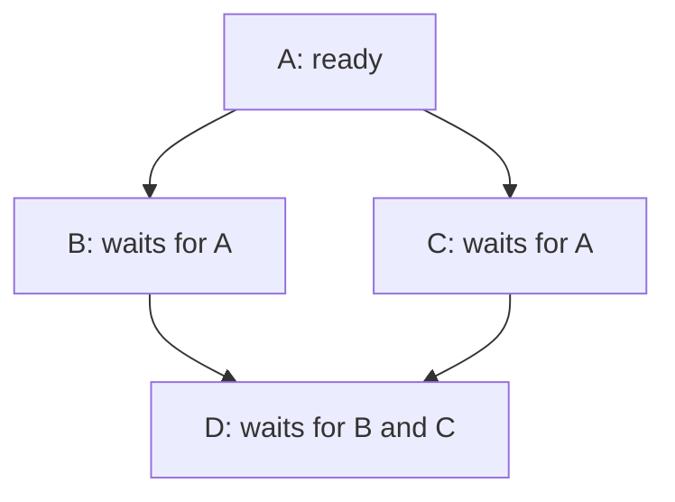

# Graphs: visit once, then track prerequisites

[Curriculum](../../../README.md) · [Choose data structures and reason about algorithms](../README.md)

> “A deployment must fetch before parsing and parse before saving. Return a legal order, or explain why a newly added dependency makes one impossible.”

An isolated task also belongs in the output. Draw prerequisites before code; distinguish visiting a node from proving all its dependencies have finished.

The coding-practice chapter will apply this tool to complete problems. Here, focus on the mechanism and trace how its state changes.

**Working example:** Count four-connected islands; then return one valid prerequisite order.


[Static diagram](../../../../assets/learning/bfs-frontier-still.svg)

**The idea:** BFS marks on enqueue. Dependency scheduling admits only vertices with zero remaining prerequisites.

## Represent connections, then choose a traversal

A **graph** has nodes (tasks or cells) and edges (relationships). For `fetch → parse → save`, each arrow means the left task must finish before the right one can run. Breadth-first search (BFS) visits neighbors a layer at a time using the FIFO queue from the earlier lesson.

```python
from collections import deque
queue = deque(["fetch"])
queue.append("parse")      # ["fetch", "parse"]
print(queue.popleft())     # "fetch"; "parse" is next
```

For an island grid, enqueue a land cell only if it has not already been seen; mark it **at enqueue time**, because two neighboring cells may discover it before either is processed. For dependency ordering, count how many prerequisites remain for each node. Only a zero count makes it ready:

```python
remaining = {"fetch": 0, "parse": 1, "save": 1}
ready = deque([task for task, n in remaining.items() if n == 0])
# After fetch finishes, decrement parse to 0; then enqueue parse.
```

The diagram below is a different graph: D cannot start after B alone because it also waits for C. Try crossing off completed tasks and updating each remaining count. A cycle `A → B → A` has no first ready task; return an explicit cycle result instead of waiting forever.



## BFS and DFS: change the frontier order

An adjacency map stores each node's neighbors. This example is directed: A can reach B and C, and both can reach D.

```python
from collections import deque

graph = {"A": ["B", "C"], "B": ["D"], "C": ["D"], "D": []}
frontier = deque(["A"])
visited = {"A"}
order = []
while frontier:
    node = frontier.popleft()
    order.append(node)
    for neighbor in graph[node]:
        if neighbor not in visited:
            visited.add(neighbor)
            frontier.append(neighbor)
print(order)  # ["A", "B", "C", "D"]
```

After A, the queue is `[B, C]`. Processing B adds D: `[C, D]`. Processing C does not add D again because D was marked when discovered. Storing each node's distance when first discovered gives shortest hop counts in an unweighted graph.

**Depth-first search (DFS)** follows one branch before returning to alternatives. A stack supplies that order:

```python
frontier = ["A"]
visited = set()
order = []
while frontier:
    node = frontier.pop()
    if node in visited:
        continue
    visited.add(node)
    order.append(node)
    frontier.extend(reversed(graph[node]))
print(order)  # ["A", "B", "D", "C"]
```

Reversing neighbors makes the leftmost neighbor run first in this stack example. Multiple pending entries can exist, but each node is expanded only once; the stack can hold O(E) entries. A recursive DFS instead retains the active call path, up to O(V) frames. Neither traversal's `visited` set alone detects a directed cycle: cycle detection needs active-versus-finished state, or the dependency-count method above. A DFS order is not generally a shortest path or a valid prerequisite order.

Both traversals take O(V+E) time over reachable nodes and edges with an adjacency list. To traverse a disconnected graph completely, start again from every unvisited node. The weighted-path lesson later changes the frontier from arrival order to cost order.

## Check the mechanism

Predict each expected result, then trace the state that produces it. Explain the boundary case before opening the reference.

**Cost:** BFS/topological order: O(V+E) time and O(V+E) space. A grid has O(rows × cols) vertices and edges.

| Scenario | Expected | Reason |
| --- | --- | --- |
| Grid `[["1", "0"], ["0", "1"]]` | 2 islands | Diagonals are not four-connected. |
| Empty grid `[]` | 0 islands | No land nodes exist. |
| Tasks `A→C`, `B→C` | `C` after **both** A and B | Remaining count starts at 2. |
| Tasks `A→B`, `B→A` | Cycle / no valid order | Neither can start. |
| Duplicate dependency `A→B` twice | B has one unique prerequisite | Dedupe edges before counting. |
| Tasks A with no edges, B→C | Order includes A, B, C | Isolated tasks are still nodes. |

`V` counts nodes and `E` counts edges. Visiting each node and edge a bounded number of times costs O(V+E). A grid of `r × c` cells has at most `r × c` nodes and four neighbor checks per cell, giving O(r×c) time and up to O(r×c) queue/visited space. State whether your input graph is directed; an undirected friendship link does not mean “must finish first.”

**Pass before moving on:** Show the queue after each step. Detect a cycle by unfinished vertices, not by a guessed timeout.

**Changed requirement:** Add different edge weights. Why can FIFO traversal now return an expensive route first?

<details>
<summary>After attempting: reference and explanation</summary>

Compare `islands, course_order` in [algorithms.py](../algorithms.py). Use [pattern notes](../pattern-notes.md) for the invariant and [contracts](../reference.md) for complexity edge cases. Reimplement tomorrow without copying.

</details>
