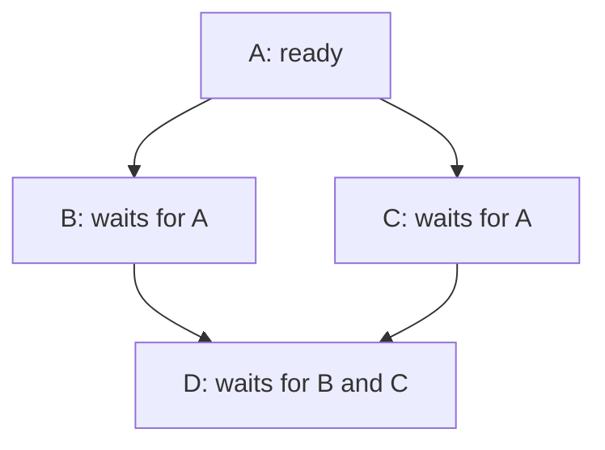

# Graphs: visit once, then track prerequisites

[Curriculum](../../../README.md) · [Data structures and algorithms](../README.md)

> “A deployment must fetch before parsing and parse before saving. Return a legal order, or explain why a newly added dependency makes one impossible.”

An isolated task also belongs in the output. Draw prerequisites before code; distinguish visiting a node from proving all its dependencies have finished.

This is a short prerequisite lesson. Attempt the complete [dependency order problem](../problems/21-dependency-order/README.md), then [grid shortest path](../problems/24-grid-shortest-path/README.md), with their contracts, tests and changed requirements.

**Build:** Count four-connected islands; then return one valid prerequisite order.

[Static diagram](../../../../assets/learning/bfs-frontier-still.svg)

**The idea:** BFS marks on enqueue. Dependency scheduling admits only vertices with zero remaining prerequisites.

## Your 45-minute session

1. **5 min:** draw one example and a simple solution.
2. **25 min:** implement `islands, course_order` without the reference.
3. **10 min:** test Empty grid; two parents reaching one node; a cycle; repeated prerequisite pairs.
4. **5 min:** explain the cost and answer the changed requirement.

**Cost:** BFS/topological order: O(V+E) time and O(V+E) space. A grid has O(rows × cols) vertices and edges.

**Pass before moving on:** Show the queue after each step. Detect a cycle by unfinished vertices, not by a guessed timeout.

**Changed requirement:** Add different edge weights. Why can FIFO traversal now return an expensive route first?

After attempting: reference and explanation

Compare `islands, course_order` in [algorithms.py](../algorithms.py). Use [pattern notes](../pattern-notes.md) for the invariant and [contracts](../reference.md) for complexity edge cases. Reimplement tomorrow without copying.

[Previous](04-order.md) · [Next: Heaps: keep the next best candidate](06-heaps.md)
