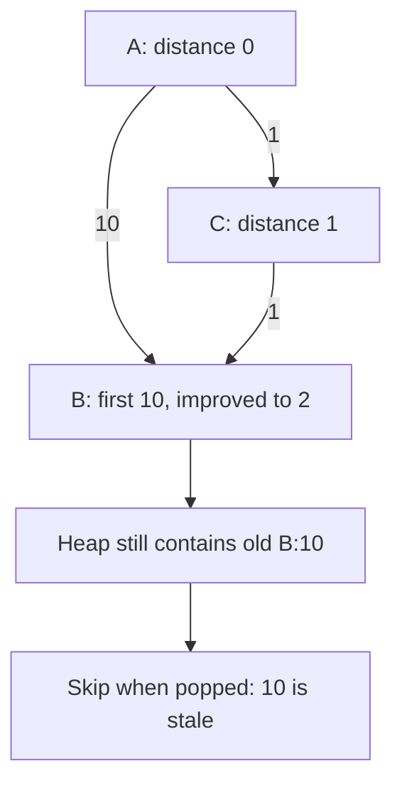

# Heaps: keep the next best candidate

[Curriculum](../../../README.md) · [Data structures and algorithms](../README.md)

> “A stream is too large to sort after every update. Keep its three largest observations. What does the smallest retained value tell you about a new arrival?”

With retained [4,7,7], discard 2 but admit 9 and remove 4. Then ask why a cheapest tentative route can still have an obsolete heap entry.

This is a short prerequisite lesson. Attempt the complete [top k stream problem](../problems/26-top-k-stream/README.md), then [weighted shortest path](../problems/25-weighted-shortest-path/README.md), with their contracts, tests and changed requirements.

**Build:** Return the K **largest observations** (duplicates count), then compute shortest distances with nonnegative edge weights. “Largest” is different from “most frequent”: a value seen once can be largest.



**The idea:** A heap orders the next candidate, not every element. Dijkstra skips stale entries whose distance is no longer current.

## First, what does a heap actually guarantee?

A Python `heapq` is a **min-heap**: its smallest value is always at position 0. The *rest of its internal list is not sorted*. `heappush` and `heappop` each take O(log k) work for k retained entries. To retain the three largest arrivals, keep the **smallest winner at the root**, ready to evict when a larger number arrives.

```python
from heapq import heappush, heapreplace
winners = []
for value in [4, 7, 7, 2, 9]:
    if len(winners) < 3:
        heappush(winners, value)
    elif value > winners[0]:
        heapreplace(winners, value)
print(sorted(winners, reverse=True))  # [9, 7, 7]
```

Before the 9 arrives, the retained values are `[4, 7, 7]`; arrival 2 loses to the smallest winner, 4. When 9 arrives it replaces 4. The diagram below shows *heap repair*, not a sorted array. Another use of a heap is Dijkstra's shortest paths: it selects the **cheapest tentative route**, and an older, more expensive entry can stay in the heap after an improved route appears.


[Static view](../../../../assets/learning/heap-sift-still.svg)

## Your 45-minute session

1. **5 min:** draw one example and a simple solution.
2. **25 min:** implement `top_k_frequent, shortest_paths` without the reference.
3. **10 min:** use the concrete cases below, keeping stream and graph outputs separate.
4. **5 min:** explain the cost and answer the changed requirement.

**Cost:** Top k largest stream: O(n log(k+1)) updates, O(k) retained space. Lazy-heap Dijkstra: O(V + E log(E+1)) time, O(V+E) space.

| Task / input | Expected | Boundary |
| --- | --- | --- |
| Top 2, arrivals `[4, 1, 7, 3]` | `[7, 4]` | Discard smaller arrivals. |
| Top 2, arrivals `[5, 5, 4]` | `[5, 5]` | Repeated observations count separately. |
| Top 0, arrivals `[4, 7]` | `[]` | Store nothing. |
| Top 5, arrivals `[4, 7]` | `[7, 4]` | Return only what arrived. |
| Routes `A→B:10, A→C:1, C→B:1` | Best A→B is 2 | The old cost-10 heap entry is stale. |
| Source A, isolated D | Distance to D is infinity | Do not invent a route. |
| Edge cost −1 | Reject for Dijkstra | Its nonnegative-weight assumption fails. |

For the *largest-observations stream*, each of `n` arrivals costs at most O(log(k+1)); retained state is O(k), and presenting a descending snapshot costs O(k log(k+1)). The quoted `O(n + u log(k+1))` above belongs to a **different task**—counting `n` samples and retaining the k most frequent of `u` distinct values. Keep those bounds separate. For Dijkstra, `V` is vertices and `E` edges; a heap may contain stale tentative routes, so storage can reach O(V+E), and heap operations cost up to O(log(E+1)).

**Pass before moving on:** Explain what the root guarantees and why FIFO BFS cannot replace Dijkstra for weighted edges.

**Changed requirement:** Your K is almost the number of unique values. Compare sorting with a heap.

<details>
<summary>After attempting: reference and explanation</summary>

Compare `top_k_frequent, shortest_paths` in [algorithms.py](../algorithms.py). Use [pattern notes](../pattern-notes.md) for the invariant and [contracts](../reference.md) for complexity edge cases. Reimplement tomorrow without copying.

</details>

[Previous](05-graphs.md) · [Next: Stacks: keep unresolved work](07-stack.md)
