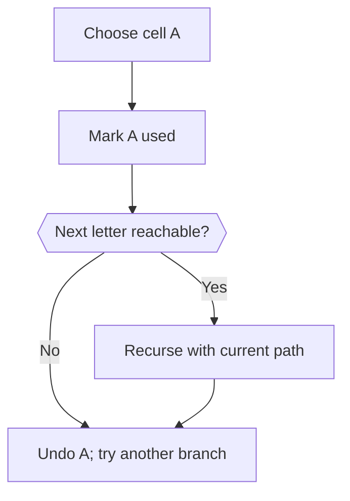
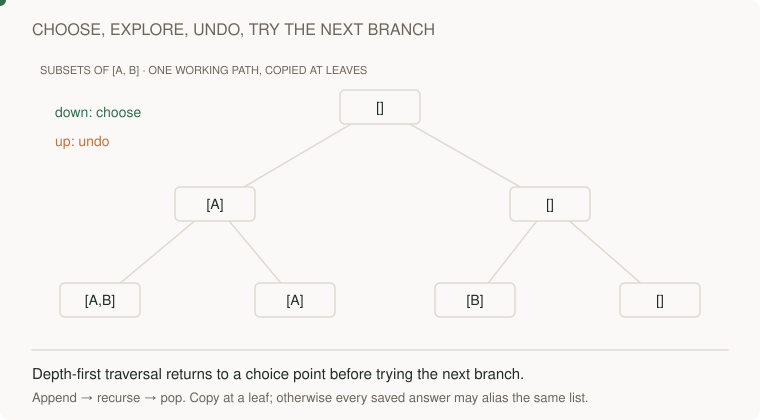
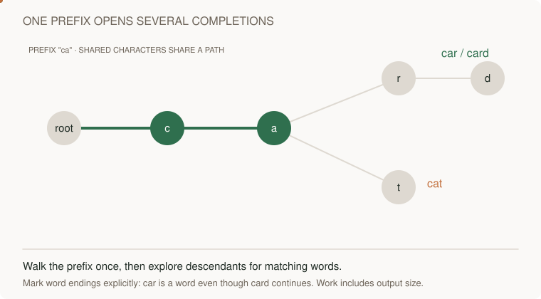

# Search: choose, recurse, undo

[Curriculum](../../../README.md) · [Choose data structures and reason about algorithms](../README.md)

> “Find AB on a row [A,B]. Can ABA use the same A again? How would you store many dictionary words that share a prefix?”

AB succeeds; ABA fails under the no-cell-reuse rule. Track choices local to one path, restore them after return, and keep that state separate from a dictionary trie.

The coding-practice chapter will apply this tool to complete problems. Here, focus on the mechanism and trace how its state changes.

**Working example:** Find a word along neighboring cells without reuse; then implement exact word insertion and lookup.



Trie example: `a → p → p* → l → e*`. Stars mark complete words; `ap` has a path but is not a stored word.

**The idea:** Backtracking tracks the current path, then undoes it. A trie shares prefixes but marks complete words explicitly.

## First, what is a choice you must undo?

Searching a grid for a word means choosing a cell for each next letter. Under the **no reuse** rule, a cell used in the *current path* cannot be used again until that candidate path ends. A `set` of `(row, column)` pairs records used cells. Undo the choice when returning so a different starting cell gets a fair chance.

```python
used = set()
cell = (0, 0)
used.add(cell)                  # choose the A cell for this path
# Explore a neighboring B cell here; only this path sees A as used.
used.remove(cell)               # undo before trying another path
```

For the one-row board `[["A", "B"]]`, `"AB"` succeeds by moving right. `"ABA"` fails: the only A is already used by that path. Marking cells globally without undoing them would make a later independent start incorrectly fail. If you modify the board itself instead of using a set, restore the original letter even when a branch fails.

A **trie** solves a different problem: sharing prefixes across many stored words. Each edge is a character; a separate terminal flag says “a complete word ends here.” The path `a → p` exists for both `"app"` and `"apple"`, but `"ap"` is not a word until its node is marked terminal.

```python
root = {"children": {}, "end": False}
root["children"]["a"] = {"children": {}, "end": False}
# A path can exist even when end is False.
```

**Read both animations:** in the backtracking visual, watch the mark get removed on exit; in the trie visual, watch several words reuse the same prefix edges while only marked nodes are returned as words. Do not confuse “path currently used” with “dictionary word stored.”



[Static view](../../../../assets/learning/backtracking-still.svg)



[Static view](../../../../assets/learning/trie-prefix-still.svg)

## Check the mechanism

Predict each expected result, then trace the state that produces it. Explain the boundary case before opening the reference.

**Cost:** Word search: O(rows × cols × 4^L) conservative time, O(L) working space. Trie lookup: O(L).

| Operation / input | Expected | Why |
| --- | --- | --- |
| Grid `[["A", "B"]]`, word `"AB"` | `True` | The cells are adjacent. |
| Same grid, word `"ABA"` | `False` | The one A cell cannot be reused. |
| Grid `[["A", "B"], ["B", "A"]]`, word `"BA"` | `True` | A failed start must not poison a later one. |
| Search an existing grid | Grid unchanged afterward | Every branch restores its choice. |
| Trie stores `"app"`, `"apple"`; search `"ap"` | Prefix exists, exact word absent | A path alone is not terminal. |
| Trie stores `"app"`, `"apple"`; search `"app"` | Exact word present | The `app` node is terminal and still has children. |

For `r×c` grid cells and word length `L`, a conservative search bound is O(r×c×4^L) branches; path storage is O(L), excluding the input board. A trie lookup follows `L` character edges in O(L) time. Storage for all inserted trie words depends on their total character count, not just the query length.

**Pass before moving on:** Draw the state restored after a failed branch, and distinguish an end marker from a child edge.

**Changed requirement:** Search many words together. Which prefix checks can be shared?

<details>
<summary>After attempting: reference and explanation</summary>

Compare `word_exists, Trie` in [algorithms.py](../algorithms.py). Use [pattern notes](../pattern-notes.md) for the invariant and [contracts](../reference.md) for complexity edge cases. Reimplement tomorrow without copying.

</details>
