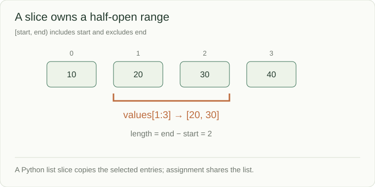

# Arrays and strings: keep order and boundaries

A sequence keeps values in order. Python's `list` is a resizable array: an index locates an item directly. A string is an immutable sequence of Unicode code points. These are the inputs many interview algorithms traverse.



## Read, copy, and mutate deliberately

```python
values = [10, 20, 30, 40]
window = values[1:3]
window[0] = 99
print(window)  # [99, 30]
print(values)  # [10, 20, 30, 40]
```

`[1:3]` includes index 1 and excludes index 3. Its length is `3 - 1`. The slice creates a new list; assigning `window = values` would instead make both names refer to the same list. A shallow copy still shares nested mutable objects.

## The operations shape the algorithm

| Operation on a Python list | Typical bound | What is happening |
|---|---|---|
| Read/write `values[i]` | O(1) | Locate one slot |
| Append or pop at the end | Amortized O(1) | Change the tail; occasional resize |
| Insert/delete at the front | O(n) | Shift remaining entries |
| Membership `x in values` | O(n) | Scan until found or exhausted |
| Slice k entries | O(k) | Copy those entries |

Build many string fragments in a list and join once when appropriate; repeated concatenation can repeatedly copy the accumulated text. If a prompt means *visible characters*, clarify Unicode handling: one visible symbol may span several code points. TypeScript string indices use UTF-16 code units, so do not silently transfer Python character assumptions.

## Three different questions

For `[1, 3, 2, 4]`, `[3, 2]` is a **contiguous subarray**. `[1, 2, 4]` is a **subsequence** that preserves order while skipping positions. `{1, 2, 3, 4}` is a set that forgets positions. Choosing the wrong one can make a fast solution answer the wrong question.

**Boundary check:** `[]` has no valid index; `[8]` has index 0; `values[len(values)]` is outside the list. Use half-open ranges consistently when returning start/end positions.

Source: [Python data structures](https://docs.python.org/3/tutorial/datastructures.html)
