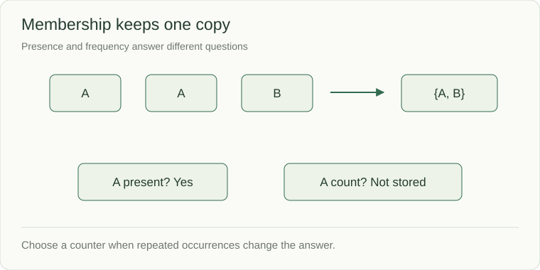

# Sets: remember membership

An importer receives record IDs A, B, A and C. It should process each ID once during this run. You need to remember membership, not how often an ID arrived. Follow the set through these arrivals, then change the requirement to counting duplicates and explain why a different representation is needed.

A set answers “have we seen this value?” It keeps unique, hashable values and deliberately loses duplicates. Use it for membership, deduplication, and visited-state tracking when counts and order are not required.



```python
visited = set()
visited.add("A")
visited.add("A")
print(len(visited))       # 1
print("A" in visited)     # True
print("B" in visited)     # False
```

`set()` creates an empty set; `{}` creates a dictionary. A tuple such as `(row, column)` can identify a grid cell. A mutable list cannot be a set member because it is unhashable.

## Choose what must be remembered

| Need | State to retain | Example |
|---|---|---|
| Presence only | Set | Has node A been queued? |
| Number of occurrences | Counter/map | How many copies of A remain? |
| Original position | Map to index | Which earlier entry can complete a match? |
| Input order and duplicates | List | Which observations arrived, in order? |

`set("aab") == set("abb")` is true, but those strings have different counts. A set cannot prove they are anagrams. Likewise, deduplicating event IDs is only correct if the product contract says repeated IDs represent the same event.

## Cost and lifecycle

Membership, add, and discard are expected O(1) under normal hashing; n distinct members take O(n) space. A visited set must have the right lifetime. BFS usually keeps it for the whole traversal, while backtracking keeps a *path-local* set and removes entries when undoing a choice.

**Predict:** after adding `A`, adding `A`, and discarding `A`, membership is false. The set remembers presence, not how many times add was called.

## Walk the duplicate decision

| Incoming ID | Already present? | Action | Members afterward |
|---|---|---|---|
| A | No | Process A, remember A | A |
| B | No | Process B, remember B | A, B |
| A | Yes | Skip duplicate | A, B |
| C | No | Process C, remember C | A, B, C |

The displayed member order is for explanation, not a set iteration guarantee. This in-memory example also forgets everything on restart. Durable import deduplication later requires stored identity and an atomic relationship to the imported effect. The set lesson establishes only the membership decision inside one run.

Source: [Python sets](https://docs.python.org/3/tutorial/datastructures.html#sets)
