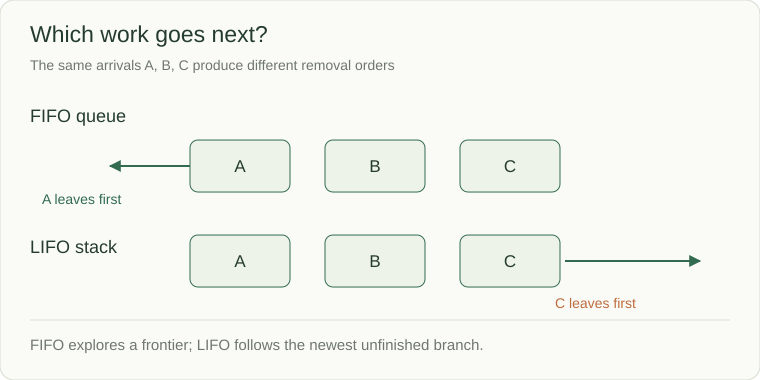

# Queues and deques: control who goes next

A traversal discovers tasks A and B, then discovers C while processing A. Should C jump ahead of B? A first-in, first-out queue says no. You will use the same ordering rule to explain why breadth-first search visits nearby nodes before more distant ones.

A **queue** serves the oldest waiting item first (FIFO). A **stack** serves the newest first (LIFO). A **deque** supports efficient operations at both ends, so it can implement either policy. The order determines whether a traversal explores nearby states or follows one branch deeply.



```python
from collections import deque

ready = deque(["A", "B"])
ready.append("C")
print(ready.popleft())  # A
print(list(ready))      # ['B', 'C']
```

Appending and removing at either deque end are O(1). Removing `list[0]` with `pop(0)` shifts the remaining entries, making it a poor queue for large traversals. A deque is not intended for fast arbitrary middle indexing.

## Use the order as part of the proof

In BFS, newly discovered neighbors join the back while the oldest discovered node leaves the front. Every distance-d node is processed before distance d+1, which gives shortest paths when every edge has equal cost. Mark a node visited when enqueueing it so two parents cannot schedule it twice.

For a tree level, capture the initial queue length, then remove exactly that many nodes; appended children belong to the next level. In a dependency scheduler, the queue holds only work whose prerequisites are complete.

## A queue is not a complete work system

An in-memory deque alone does not define capacity, waiting, cancellation, persistence, or concurrent ownership. Those contracts appear later in the bounded queue and durable-job exercises. Here, predict the state after append-left, append-right, pop-left, and pop-right before adding those concerns.

## Keep this level separate from the next one

Suppose the current tree frontier is `[B, C]`. B has children D and E. C has child F.

| Step | Queue after the step | Nodes emitted for this level |
|---|---|---|
| Capture level size = 2 | B, C | none |
| Remove B, append D and E | C, D, E | B |
| Remove C, append F | D, E, F | B, C |

Stop after the two captured removals. D, E and F belong to the next level even though they are already in the same queue. If the loop keeps processing until the queue is empty, it loses the level boundary.

Source: [Python queue operations](https://docs.python.org/3/tutorial/datastructures.html#using-lists-as-queues)
