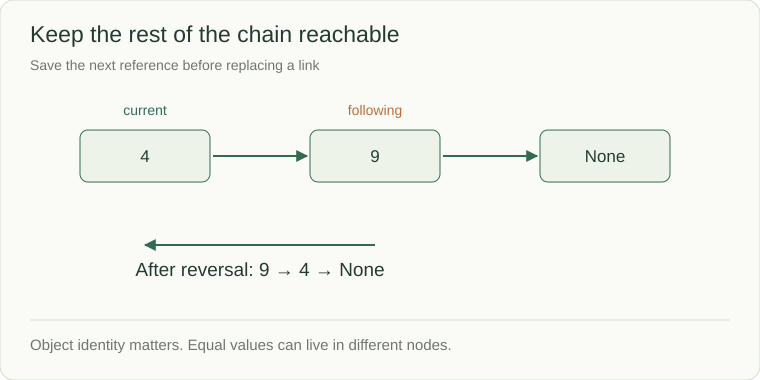

# Linked lists: preserve the reachable chain

A linked-list node stores a value and a reference to another node. An array index locates a slot; a link points to an object. To reach the third node from the head, follow two links. The useful skill is changing connections without losing the remaining chain.



```python
from dataclasses import dataclass

@dataclass(eq=False)
class Node:
    value: int
    next: "Node | None" = None

head = Node(4, Node(9))
print(head.next.value)  # 9
```

`eq=False` keeps node identity meaningful: two separate nodes containing 4 are not the same node. The end is `None`. An empty list has `head = None`.

## Change one link safely

To reverse a chain, save the unreversed suffix before replacing a link:

```python
previous = None
current = head
while current is not None:
    following = current.next
    current.next = previous
    previous = current
    current = following
head = previous
```

After each iteration, `previous` owns the reversed prefix and `current` owns the remaining suffix. Reversing `4 → 9 → None` yields `9 → 4 → None`; forgetting `following` can disconnect the 9.

## Cost depends on the handle you have

Finding an arbitrary value is O(n). Inserting after an already-known node is O(1). In a singly linked list, deleting a known node may still require its predecessor. A doubly linked list stores both `previous` and `next`, enabling O(1) removal with a node handle at the cost of more links to maintain.

This is why an LRU cache combines a dictionary with a doubly linked list: the map finds the node, and the list moves it in recency order. State explicitly whether an operation reuses caller-owned nodes or returns a new chain.

**Check:** empty and one-node chains survive reversal; repeated values remain separate nodes; a cycle needs detection or a documented exclusion before a traversal can terminate.
