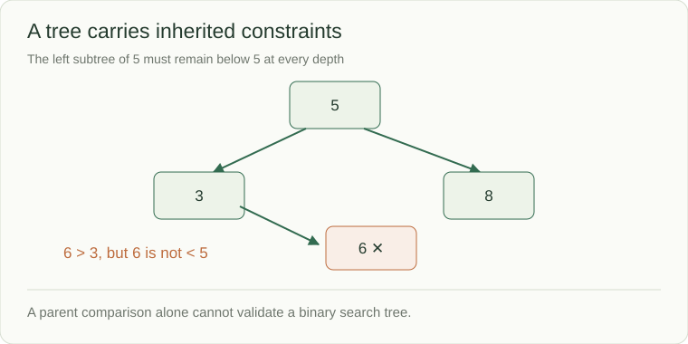

# Trees: carry context down, combine answers up

A folder can contain subfolders, which contain more subfolders. To calculate its depth, each folder needs the completed depths of its children. To validate an ordered search tree, however, each child needs constraints inherited from its ancestors. This lesson separates information passed downward from answers combined upward.

A tree connects nodes through parent–child relationships without cycles or shared child nodes. A binary tree has at most two children per node. A binary **search** tree adds an ordering rule over whole subtrees. These are separate properties.



## Four useful traversal orders

For root 4 with children 2 and 7:

| Traversal | When the node is handled | Output |
|---|---|---|
| Preorder | Before its children | `[4, 2, 7]` |
| Inorder | Between left and right | `[2, 4, 7]` |
| Postorder | After its children | `[2, 7, 4]` |
| Level order | By increasing depth | `[[4], [2, 7]]` |

Preorder carries constraints downward. Postorder combines completed child answers. Inorder of a valid strict BST yields sorted unique values. Level order uses a queue.

```python
def height(node):
    if node is None:
        return 0
    return 1 + max(height(node.left), height(node.right))
```

This height counts **nodes**: an empty tree is 0 and one node is 1. A diameter problem may count edges instead; write the unit before combining child results.

## The entire path matters

A node in the left subtree of root 5 must remain below 5, even several levels down. Checking only its immediate parent misses that constraint. Carry lower/upper bounds into each subtree. For ancestry questions, compare node identity and track whether both requested nodes actually exist.

Traversing n nodes is O(n). A recursive traversal retains O(h) stack frames for height h; a degenerate chain has h = n, not log n. A balanced search tree bounds its height; a plain binary tree does not. For deep untrusted trees, use an explicit stack and validate repeated nodes.

**Check:** explain why a node 6 beneath parent 3 in the left subtree of 5 is invalid, even though `6 > 3`.

## Work out the returned height

For root 4 with leaf children 2 and 7, `height(None)` returns 0. Each leaf returns `1 + max(0, 0) = 1`. The root returns `1 + max(1, 1) = 2`.

The code's return value counts nodes along the longest root-to-leaf path. The corresponding number of edges is one. Before reusing the result in a diameter or distance problem, write the requested unit beside the function. A correct recurrence with the wrong unit still returns the wrong answer.
