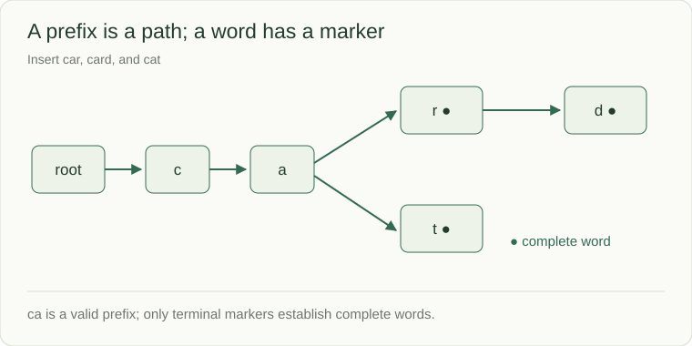

# Tries: share prefixes without losing whole words

A trie stores a character on each edge. Words with a common prefix share the same path. Reaching the prefix path answers whether that prefix exists; a separate terminal marker answers whether it is a complete word.



```python
class TrieNode:
    def __init__(self):
        self.children = {}
        self.is_terminal = False

root = TrieNode()
for word in ["car", "card", "cat"]:
    node = root
    for character in word:
        if character not in node.children:
            node.children[character] = TrieNode()
        node = node.children[character]
    node.is_terminal = True
```

`car` ends at a terminal node that also has child `d`; whole words can be prefixes of longer words. `ca` has a path but is not terminal. Existing prefix nodes are reused; a new node is created only for a missing edge.

## What the structure buys

Insertion and exact/prefix lookup take O(L) character steps for a word of length L, assuming expected constant dictionary access. Producing completions additionally costs the visited branches and returned text. Lexical order requires ordered child traversal; stop after the requested number of completions.

| Query after the insertions above | Expected |
|---|---|
| Whole word `car` | Present |
| Whole word `ca` | Absent |
| Prefix `ca` | Present |
| Completions for `car`, limit 5 | `car`, `card` |
| Completions with limit 0 | No results |

A trie spends memory on nodes and maps. For only exact membership, a set is usually a simpler representation. Add normalization, deletion, popularity ranking, or compressed edges only when the contract needs them.
