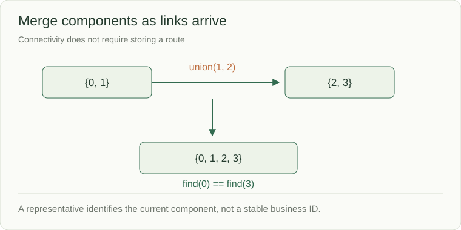

# Union-find: track components as links arrive

Union-find, also called a disjoint-set structure, answers whether two vertices belong to the same connected component. Each vertex points through `parent` links to a representative. `union` merges components; `find` returns the current representative.



```python
parent = list(range(4))
size = [1] * 4

def find(vertex):
    while parent[vertex] != vertex:
        parent[vertex] = parent[parent[vertex]]
        vertex = parent[vertex]
    return vertex

def union(first, second):
    first, second = find(first), find(second)
    if first == second:
        return False
    if size[first] < size[second]:
        first, second = second, first
    parent[second] = first
    size[first] += size[second]
    return True
```

This learning snippet assumes valid vertex IDs `0..3`. The complete connectivity problem validates IDs at its public boundary. Path compression shortens future searches; attaching the smaller component to the larger prevents avoidable long chains.

## Follow the state change

1. `union(0, 1)` merges `{0}` and `{1}`.
2. `union(2, 3)` creates another component `{2,3}`.
3. `find(0) == find(3)` is false.
4. `union(1, 2)` joins both components, so the same comparison becomes true.
5. Repeating `union(0, 3)` returns false: they are already connected.

With weighting and path compression, a sequence of operations is almost constant time per operation amortized, formally O(α(n)), with O(n) storage. The representative is an implementation choice, not a stable business identifier.

Union-find does not return the actual path between two vertices and does not support arbitrary edge deletion in this simple form. Use graph traversal for paths; reconsider the structure when removals enter the contract.

Source: [Union-find API and bounds](https://algs4.cs.princeton.edu/code/javadoc/edu/princeton/cs/algs4/UF.html)
