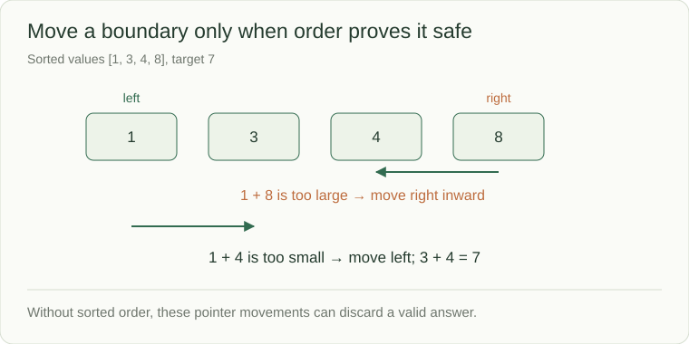

# Two pointers: discard work with a reason

Two pointers track boundaries or positions while traversing a sequence. The important part is the proof that moving one pointer cannot skip an answer. Sorting often supplies that proof; without order, the same movement may be invalid.



## Opposite ends of sorted data

```python
def contains_pair(values, target):
    left, right = 0, len(values) - 1
    while left < right:
        total = values[left] + values[right]
        if total == target:
            return True
        if total < target:
            left += 1
        else:
            right -= 1
    return False
```

This snippet assumes **ascending** values. On `[1, 3, 4, 8]`, target 7, `1+8` is too large, so moving right inward is safe: pairing 8 with any larger left value would only increase the sum. Then `1+4` is too small, so move left inward; `3+4` succeeds.

It visits at most n pointer positions: O(n) time and O(1) extra space. Sorting an arbitrary input first adds O(n log n) work and can lose original indices unless they are retained. A two-sum contract requiring original positions therefore needs that extra design decision.

## Related movement patterns

| Pattern | What the positions mean | Safety condition |
|---|---|---|
| Opposite ends | Remaining candidate range | Order proves which side can be discarded |
| Read/write | Scanned prefix and compacted result | Writing never destroys unread data |
| Fast/slow | Different speeds through links | Identity and termination are handled |
| Sliding window | Current contiguous range | Its validity can be updated as boundaries move |

For `[3]`, `left < right` is false, so one position cannot count twice. For unsorted `[3,1,4]`, do not assume the same sum comparisons justify pointer movement. State the precondition before using the technique.
