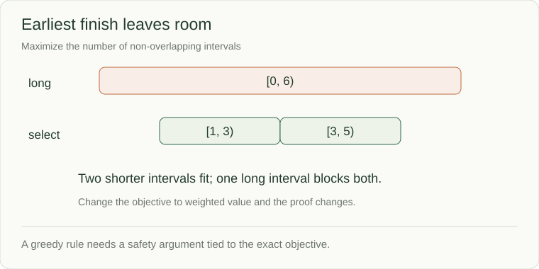

# Greedy choices: prove the local step is safe

A meeting room receives several requests and you want to accept as many non-overlapping meetings as possible. Choosing the earliest finishing meeting seems useful because it leaves time afterward. You will explain why that choice is safe for this objective, then see it fail when meetings have different values.

A greedy algorithm makes one local choice and never revisits it. It works only when that choice can be part of an optimal answer. A familiar rule without a proof is a guess.



## An exchange argument you can explain

Suppose you want the largest number of non-overlapping, half-open intervals. Among all possible first intervals, the one that finishes earliest leaves at least as much room for everything after it. Replace an optimal solution's first interval with that earliest-finishing interval; the remaining intervals still fit. Repeat on the remaining problem.

```python
def select_intervals(intervals):
    selected = []
    available_at = float("-inf")
    for start, end in sorted(intervals, key=lambda span: span[1]):
        if start >= available_at:
            selected.append((start, end))
            available_at = end
    return selected

print(select_intervals([(0, 6), (1, 3), (3, 5)]))
# [(1, 3), (3, 5)]
```

The snippet assumes valid intervals with `start < end`. Sorting takes O(n log n); scanning takes O(n); the selected output can contain n intervals.

## One changed requirement can break the proof

If `(0,6)` is worth 100 and each shorter interval is worth 1, maximizing **value** prefers the long interval. Earliest finish still maximizes the *count*, but no longer answers the new objective. Weighted scheduling needs additional reasoning, commonly dynamic programming.

Similarly, choosing the largest coin first fails for coins `[1,3,4]` and amount 6: `4+1+1` uses three coins while `3+3` uses two. Before applying a greedy rule, name the objective, explain an exchange or other safety argument, and try a small counterexample.
