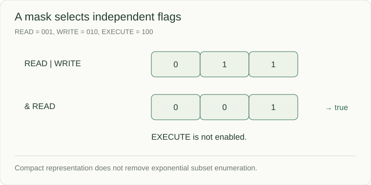

# Bit operations: represent independent flags

An integer's binary digits can represent independent on/off states. A **mask** selects the bits an operation cares about. This is useful for flags, compact subsets, and some counting techniques; clarity still matters more than a clever-looking expression.



```python
READ = 1 << 0
WRITE = 1 << 1
EXECUTE = 1 << 2

permissions = READ | WRITE
print(bool(permissions & READ))     # True
print(bool(permissions & EXECUTE))  # False
permissions &= ~WRITE
print(permissions == READ)         # True
```

`|` enables bits, `&` selects common bits, `^` toggles differing bits, `~` inverts, and shifts move bit positions. These operators differ from the Boolean `and`/`or` operators. The small integers above are a representation example, not a complete authorization system.

## Recognize the assumptions

`x ^ x == 0` and `x ^ 0 == x`, so XOR can cancel paired integer values. It only isolates one unpaired value when the input guarantees the required multiplicities. It does not recover arbitrary missing or repeated values from any dataset.

For n flags, `0 .. (1 << n) - 1` enumerates 2ⁿ subsets. The representation is compact, but enumeration is still exponential. Python integers have arbitrary precision; fixed-width reasoning such as overflow and unsigned shifts does not transfer unchanged from other languages.

**Check:** READ|WRITE is binary `011`; removing WRITE leaves `001`; testing EXECUTE yields zero. If zero is a valid stored value, avoid treating it as “missing” through a truthiness check.
