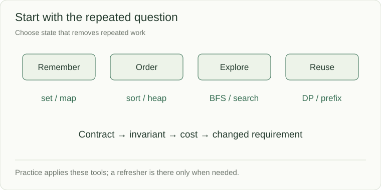

# Choose the structure from the repeated question

You have now met the shared tools. Start practice by identifying the question the simple solution asks repeatedly. The state should answer that question cheaply and retain exactly the information the contract needs.

## Match the need to the mechanism

| Repeated question or constraint | Starting point | What to verify |
|---|---|---|
| Have I seen this? | Set | Whether duplicates or order matter |
| What answer is stored for this key? | Map / counter | Key identity and state lifetime |
| Which work goes next? | Stack / queue / heap | LIFO, FIFO, or priority |
| Can order rule out half the candidates? | Binary search | Monotone predicate and boundary policy |
| Can a contiguous range be updated incrementally? | Window / prefix summaries | Negative values and removal effects |
| Do links connect these vertices? | BFS/DFS or union-find | Path required? Edges removed? |
| Does a word share this prefix? | Trie | Exact word versus prefix; output size |
| Does a local choice preserve an optimum? | Greedy | A safety proof, not just an intuition |
| Are smaller states recomputed? | Dynamic programming | State meaning, base case, recurrence |
| Must all feasible choices be explored? | Backtracking | Undo, duplicate pruning, exponential output |

## The coverage before practice

This chapter covers the foundation of the 42-problem bank: arrays/strings, sets/maps, stacks/deques, linked lists, trees/BSTs, heaps, tries, graphs, union-find, sorting/binary search, two pointers/windows, prefix summaries, greedy choices, backtracking, DP, and bit operations. Graph lessons introduce BFS, DFS, topological ordering, and the distinction between unweighted and weighted paths. Later system chapters combine these into LRU caches, expiry indexes, event-time aggregation, and blocking queues.

Specialized structures such as segment trees, Fenwick trees, suffix arrays, and balanced-tree implementation are useful extensions when a prompt needs range updates, ordered queries, or specialized text indexing. They are not prerequisites of this bank; do not pretend every interview requires the same catalog.

## One reusable working sequence

1. Define input, output, invalid input, mutation, and tie behavior.
2. Trace a normal case and a boundary case.
3. Write a direct solution and identify repeated work.
4. Choose state that removes that work; state its invariant.
5. Bound time, extra storage, and output size.
6. Change one requirement and explain what must change.

The next chapter begins the coding problems. Refreshers there are optional; the problem brief and examples lead the page.

Sources: [Python collections overview](https://docs.python.org/3/tutorial/datastructures.html) · [Algorithms topic catalog](https://algs4.cs.princeton.edu/lectures/)
