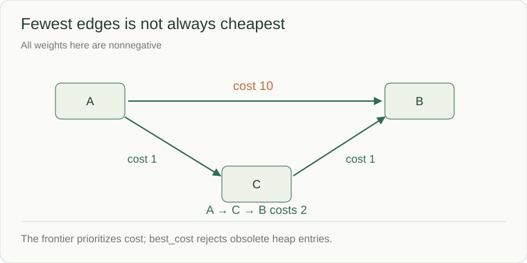

# Weighted paths: expand the cheapest candidate

A delivery route goes directly from A to B at cost 10, or from A to C to B at costs 1 and 1. The two-hop route is cheaper. You will follow the candidate costs in a heap and see why visiting the fewest edges would answer the wrong question.

BFS minimizes the number of equal-cost edges. When edges have different costs, the route with fewer edges may cost more. For **nonnegative** weights, Dijkstra's algorithm expands the cheapest known candidate using a min-heap.



```python
from heapq import heappop, heappush

graph = {"A": [("B", 10), ("C", 1)], "C": [("B", 1)], "B": []}
best_cost = {"A": 0}
frontier = [(0, "A")]
while frontier:
    cost, node = heappop(frontier)
    if cost != best_cost[node]:
        continue
    for neighbor, weight in graph[node]:
        candidate = cost + weight
        if candidate < best_cost.get(neighbor, float("inf")):
            best_cost[neighbor] = candidate
            heappush(frontier, (candidate, neighbor))
print(best_cost["B"])  # 2
```

The snippet assumes a complete adjacency mapping, nonnegative weights, and comparable string node IDs. For arbitrary objects, add a sequence number to heap entries so equal costs do not trigger object comparisons. The full problem validates its boundary.

## Why stale entries are harmless

The direct route places `(10, B)` in the frontier. Going through C later discovers `(2, B)`. The heap may hold both, but `best_cost[B]` is authoritative, so the old cost 10 is skipped when popped. A predecessor map can reconstruct the route; costs alone cannot.

With this lazy duplicate-entry heap, there can be O(E) queued candidates: O((V+E) log(1+E)) time is a safe bound and O(V+E) space. For a simple graph this is commonly written O((V+E) log V). State the representation used when quoting the bound.

## Know which problem you have

| Edge costs | Starting algorithm | Limitation |
|---|---|---|
| Equal | BFS | Minimizes edge count |
| Nonnegative | Dijkstra | Negative edges invalidate the greedy proof |
| Negative allowed | Bellman–Ford or another suitable method | Detect reachable negative cycles; O(VE) for Bellman–Ford |
| Directed acyclic graph | Process a topological order | Requires acyclicity; O(V+E) relaxation |

An unreachable node has no finite distance. A negative cycle reachable from the source can make some shortest distances undefined. Those are contract outcomes, not a large made-up number.

## Watch the cheaper route replace the estimate

| Removed candidate | New information | Pending candidates afterward |
|---|---|---|
| A at cost 0 | B can cost 10, C can cost 1 | C:1, B:10 |
| C at cost 1 | B improves to cost 2 | B:2, B:10 |
| B at cost 2 | Its best route is now processed | B:10 |
| B at cost 10 | Stored best is 2, so this entry is stale | none |

The table presents pending candidates in cost order for readability. A heap's internal array is not fully sorted. The authoritative best-cost map is what makes retaining an obsolete heap entry safe.
