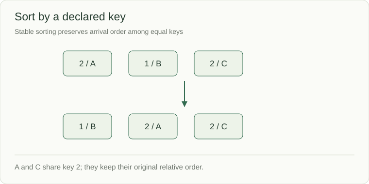

# Sorting: pay once to expose order

A list of incident records must be displayed by severity while retaining arrival order among equal severities. Sorting can expose the order you need, but it can also change positions and tie behavior. Run the example and distinguish a sorted copy from a mutation of the caller's list.

Sorting arranges values by an explicit key. It can make duplicates adjacent, expose interval order, enable binary search, or let two pointers discard candidates. Account for its cost and decide whether the caller's input may change.



```python
records = [(2, "A"), (1, "B"), (2, "C")]
ordered = sorted(records, key=lambda record: record[0])
print(ordered)  # [(1, 'B'), (2, 'A'), (2, 'C')]
print(records)  # [(2, 'A'), (1, 'B'), (2, 'C')]
```

`sorted` returns a new list. `list.sort` mutates the list and returns `None`. Python's sort is stable: records A and C retain their relative order because their keys are equal. If you need a different tie rule, make it part of the key.

## Algorithms behind the interface

| Approach | Mechanism | Typical guarantee |
|---|---|---|
| Insertion sort | Insert into an ordered prefix | O(n²) worst case; simple for small/nearly sorted input |
| Merge sort | Sort halves, merge ordered fronts | O(n log n); array merging usually needs O(n) workspace |
| Quicksort | Partition around a pivot | Expected O(n log n), O(n²) worst case without safeguards |
| Heap sort | Repeatedly extract an extreme | O(n log n), O(1) array workspace, generally not stable |
| Counting sort | Count keys in a bounded integer range | O(n+k) with range size k; only useful when k is manageable |

Comparison sorting has an Ω(n log n) worst-case lower bound for arbitrary distinct keys; a counting/radix method uses extra assumptions about the key representation. Do not claim a linear-time comparison sort by hiding a large key range.

## Preserve the contract while preprocessing

Sorting `[3,1,2]` into `[1,2,3]` changes positions. If the answer must refer to original positions, retain `(value, original_index)` or use another technique. For intervals, the comparison at equal endpoints must match the product policy. For huge data, memory and external sorting may matter more than the in-memory comparison count.

**Check:** sorting by the first field returns B, A, C above; sorting by both fields changes the tie contract. A stable sort preserves input order among equals without inventing a business priority.
