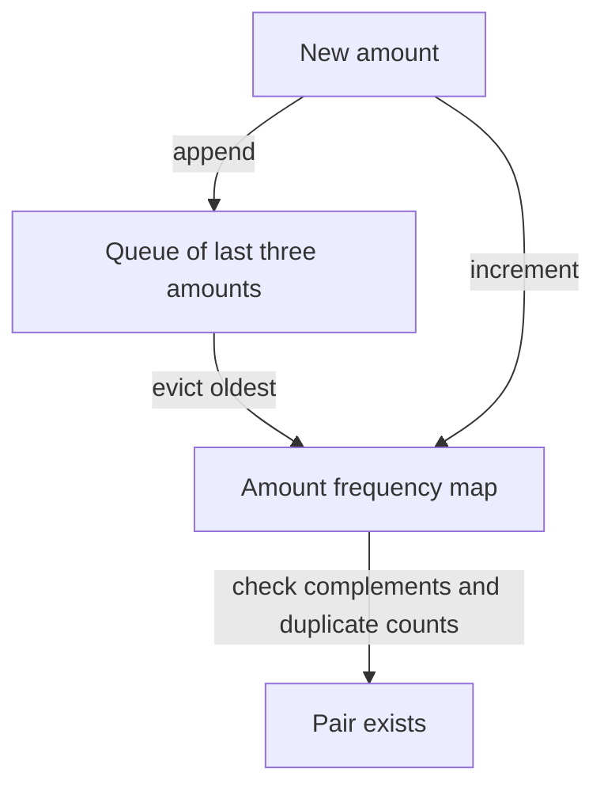

# Two sum: remember the useful past

[Curriculum](../../../../README.md) · [Data structures and algorithms](../../README.md) · [All coding problems](../../../../../indexes/coding.md)

Constructed practice problem; no company attribution. Prerequisites: [map lookup](../../lessons/01-maps.md).

## Candidate brief

> A reconciliation tool receives signed transaction amounts. Find two different positions whose amounts total a requested adjustment. Return the first pair found while scanning rightward. What should happen when amounts repeat or no pair exists?

| Contract | Decision |
|---|---|
| Input | Integer list/tuple `nums`, integer `target`; booleans excluded |
| Output | `(i, j)` with `i < j`; choose smallest `j`, then smallest `i`; otherwise `None` |
| Boundaries | Empty/singleton inputs cannot form a pair; inputs are not mutated |
| Invalid input | `ValueError` for invalid container, element, or target type |
| Excluded | Approximate floating-point money and distributed reconciliation |

## The tool before the challenge

A Python map is a `dict`. Here it tracks unfinished matches: a `3` at index 0 with target `6` is waiting for another `3`. The second 3 completes the pair; a one-item `[3]` cannot reuse itself.
```python
pending_matches = {3: 0}     # need 3; return index 0 if it arrives
print(3 in pending_matches)  # True
print(pending_matches[3])    # 0
```
Trace the dictionary *before* processing each position. A key is the **future value needed**; its value is the earliest index waiting for it. If the contract asks for **all** pairs, each needed value must retain a list of waiting indices instead. The [maps primer](../../lessons/01-maps.md) teaches the full search and complexity; the contract below adds tie order and invalid inputs.

<!-- interview-rehearsal:start -->

## What the interviewer expects

The interviewer gives you the scenario and the contract above. Explain what a
successful call returns, walk one row from the table below, and name what your
state means *before* choosing a data structure.

**Done means:** `(i, j)` with `i < j`; choose smallest `j`, then smallest `i`; otherwise `None`.

Now predict each output before looking at the reference; invalid input should
leave any existing state unchanged unless the contract says otherwise.

### Test-case scenarios to settle before coding

| Case | Exact input or state | Expected result | What it is testing |
|---|---|---|---|
| Representative | `[2, 7, 11, 15]`, target `9` | `(0, 1)` | A prior complement should be found. |
| Repeated value | `[3, 3]`, target `6` | `(0, 1)` | Two positions may hold the same value. |
| No answer | `[1, 2, 3]`, target `20` | `None` | Absence is part of the return contract. |
| Too little input | `[]` and `[9]` | `None` for both | One position cannot be reused. |
| Tie rule | `[1, 4, 2, 3]`, target `5` | `(0, 1)` | Smallest right index wins before later pairs. |
| Invalid/atomic | `[True, 2]`, target `3` | `ValueError`; input unchanged | Python booleans must not silently count as integers. |

For each row, show which branch or state change produces that result.

<!-- interview-rehearsal:end -->

`two_sum([3, 3, 2], 6) == (0, 1)`: equal values at distinct positions are allowed.
`two_sum([3], 6) is None`: one position cannot be reused.
`two_sum([True, 2], 3)` raises `ValueError`.

Before opening the explanation, restate the contract, trace the smallest useful
example, implement a baseline, and identify the repeated work. Then implement
your improvement independently and derive tests from the contract. Say what
your state means before saying which data structure stores it.

<details>
<summary>Worked lesson, changed requirements, and reference</summary>

### Derive the representation

Start with each possible right endpoint `j`, then try all earlier `i` in order.
That baseline directly implements the tie rule but performs O(n²) comparisons.
A candidate should identify the precise repeated question: “Is someone waiting
for `nums[j]`, and which earlier index was first?” `pending_matches` answers
that question without rescanning the prefix. A needed future value maps to
the earliest earlier index waiting for it.

| j / value | Check pending key | Map before lookup | Result / next map |
|---|---:|---|---|
| 0 / 3 | 3 | `{}` | no pair; save `6 - 3 = 3 → 0` |
| 1 / 3 | 3 | `{3: 0}` | return `(0, 1)` |

The invariant is that, before processing `j`, the map contains the value needed
to complete each earlier item, with the earliest waiting index for each needed
value. Lookup **before** insertion prevents using `j` twice. Keeping the first
waiting index preserves the second tie rule; returning on the first successful
right endpoint preserves the first. If lookup fails, record this item's needed
future value unless an earlier index is already waiting for it.
If every lookup fails, every eligible pair was ruled out when its right endpoint
was visited. Hash lookup has expected constant cost, so validation plus search
cost expected O(n) time and O(n) auxiliary space; adversarial hash behavior is
not a promised worst-case O(n) bound. No result-size term is needed for one pair.

### Follow-up 1: return every index pair

Predict the state change before reading the table. Storing one index now loses
answers. Map each needed future value to **all** waiting indices and emit a pair for each match.
For `[3, 3, 3]`, target 6:

| Right index | Stored matching indices | Newly emitted pairs |
|---:|---|---|
| 0 | none | none |
| 1 | `[0]` | `(0, 1)` |
| 2 | `[0, 1]` | `(0, 2)`, `(1, 2)` |

The expected bound becomes O(n + p), where `p` is the number of returned pairs;
`p` can be quadratic. A generator reduces retained output, not required work.
Distinct value pairs would require a different deduplication contract.

### Follow-up 2: amounts arrive forever

Now accept `add(amount)` and ask whether a pair exists among the most recent
three arrivals. Redraw ownership of history: the old permanent map is incorrect
because expired values can produce false matches.



Counts, rather than a set, preserve duplicates during eviction. If an amount is
its own complement, require count at least two. A senior candidate separates
index-pair, value-pair, and existence semantics and explains output cost. A lead
candidate additionally defines ordering, retention, and backpressure for the
streaming API; the in-memory solution supplies no cross-process ordering.

### Run and check

From the repository root:

```bash
cd curriculum/01-code/02-data-structures-algorithms/problems/01-two-sum
python -m unittest -v test_solution.py
```

[Reference implementation](solution.py) · [Contract and oracle tests](test_solution.py).
Read the tests after your attempt. A green reference suite verifies the supplied
implementation; it does not demonstrate independent transfer. Reimplement one
follow-up with the reference closed and explain which old invariant no longer holds.

</details>

[Ordered foundation route](../foundations-index.md) · [Coding home](../../practice-sequence.md)
