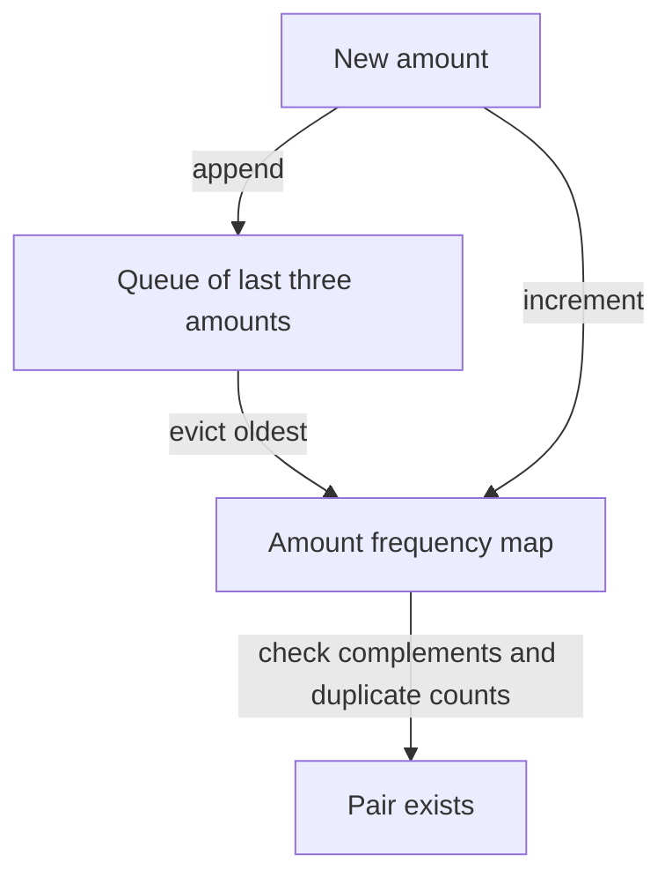

# Two sum: remember the useful past

[Curriculum](../../../../README.md) · [Data structures and algorithms](../../README.md) · [All coding problems](../../../../../indexes/coding.md)

Constructed practice problem; no company attribution. Prerequisites: [map lookup](../../lessons/01-maps.md).

## Candidate brief

> A reconciliation tool receives signed transaction amounts. Find two different positions whose amounts total a requested adjustment. Return the first pair found while scanning rightward. What should happen when amounts repeat or no pair exists?

| Contract | Decision |
|---|---|
| Input | Integer list/tuple `nums`, integer `target`; booleans excluded |
| Output | `(i, j)` with `i < j`; choose smallest `j`, then smallest `i`; otherwise `None` |
| Boundaries | Empty/singleton inputs cannot form a pair; inputs are not mutated |
| Invalid input | `ValueError` for invalid container, element, or target type |
| Excluded | Approximate floating-point money and distributed reconciliation |

`two_sum([3, 3, 2], 6) == (0, 1)`: equal values at distinct positions are allowed.
`two_sum([3], 6) is None`: one position cannot be reused.
`two_sum([True, 2], 3)` raises `ValueError`.

Before opening the explanation, restate the contract, trace the smallest useful
example, implement a baseline, and identify the repeated work. Then implement
your improvement independently and derive tests from the contract. Say what
your state means before saying which data structure stores it.

<details>
<summary>Worked lesson, changed requirements, and reference</summary>

### Derive the representation

Start with each possible right endpoint `j`, then try all earlier `i` in order.
That baseline directly implements the tie rule but performs O(n²) comparisons.
A candidate should identify the precise repeated question: “Have I already seen
`target - nums[j]`, and where was its earliest occurrence?” A map answers that
question without rescanning the prefix. A map associates a key with one stored
value; here an amount maps to its earliest index, not its frequency.

| j / value | Needed | Map before lookup | Result / next map |
|---|---:|---|---|
| 0 / 3 | 3 | `{}` | no pair; `{3: 0}` |
| 1 / 3 | 3 | `{3: 0}` | return `(0, 1)` |

The invariant is that, before processing `j`, the map contains exactly the
distinct amounts in `nums[:j]`, each at its earliest index. Lookup **before**
insertion prevents using `j` twice. Keeping the first index preserves the second
tie rule; returning on the first successful right endpoint preserves the first.
If lookup fails, adding only a previously unseen amount extends the invariant.
If every lookup fails, every eligible pair was ruled out when its right endpoint
was visited. Hash lookup has expected constant cost, so validation plus search
cost expected O(n) time and O(n) auxiliary space; adversarial hash behavior is
not a promised worst-case O(n) bound. No result-size term is needed for one pair.

### Follow-up 1: return every index pair

Predict the state change before reading the table. Storing one index now loses
answers. Map each amount to **all** prior indices and emit a pair for each match.
For `[3, 3, 3]`, target 6:

| Right index | Stored matching indices | Newly emitted pairs |
|---:|---|---|
| 0 | none | none |
| 1 | `[0]` | `(0, 1)` |
| 2 | `[0, 1]` | `(0, 2)`, `(1, 2)` |

The expected bound becomes O(n + p), where `p` is the number of returned pairs;
`p` can be quadratic. A generator reduces retained output, not required work.
Distinct value pairs would require a different deduplication contract.

### Follow-up 2: amounts arrive forever

Now accept `add(amount)` and ask whether a pair exists among the most recent
three arrivals. Redraw ownership of history: the old permanent map is incorrect
because expired values can produce false matches.



Counts, rather than a set, preserve duplicates during eviction. If an amount is
its own complement, require count at least two. A senior candidate separates
index-pair, value-pair, and existence semantics and explains output cost. A lead
candidate additionally defines ordering, retention, and backpressure for the
streaming API; the in-memory solution supplies no cross-process ordering.

### Run and check

From the repository root:

```bash
cd curriculum/01-code/02-data-structures-algorithms/problems/01-two-sum
python -m unittest -v test_solution.py
```

[Reference implementation](solution.py) · [Contract and oracle tests](test_solution.py).
Read the tests after your attempt. A green reference suite verifies the supplied
implementation; it does not demonstrate independent transfer. Reimplement one
follow-up with the reference closed and explain which old invariant no longer holds.

</details>

[Ordered foundation route](../foundations-index.md) · [Coding home](../../practice-sequence.md)
