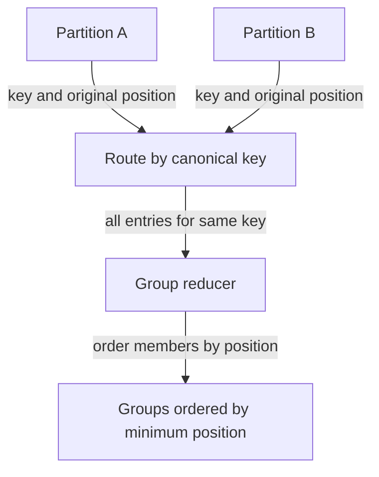

# Group anagrams: canonical keys

[Curriculum](../../../../README.md) · [Data structures and algorithms](../../README.md) · [All coding problems](../../../../../indexes/coding.md)

Constructed practice problem; no company attribution. Prerequisites: [valid anagram](../02-valid-anagram/README.md).

## Candidate brief

> The word-game service now receives a batch of words and must place words with identical character inventories together. Preserve duplicate entries and make output deterministic. How can you avoid checking every word against every previous word?

| Contract | Decision |
|---|---|
| Input | List/tuple of Python strings, exact Unicode code-point semantics |
| Output | List of groups; group order follows first occurrence; words retain input order |
| Boundaries | Empty batch gives `[]`; duplicate words and empty strings remain entries |
| Invalid input | Invalid container or non-string element raises `ValueError` |
| Excluded | Text normalization, approximate similarity, and sorting output alphabetically |

## The tool before the challenge

An anagram group needs a key that ignores order but preserves repeats. Python strings cannot be rearranged in place; a tuple of sorted characters is hashable and can key a dictionary:
```python
key = tuple(sorted("eat"))
groups = {key: ["eat"]}
groups.setdefault(tuple(sorted("tea")), []).append("tea")
print(groups[key])  # ['eat', 'tea']
```
State the output order contract before building groups. Two equal keys must share one group, but distinct original words keep their input order.

### A design choice worth saying aloud

`groups` uses an immutable tuple of sorted characters to collect the original words that share a signature. Append rather than sort the words in each group: sorting their contents would discard the promised input order. The signature is an internal key, never a substitute for the word shown to the user.

<!-- interview-rehearsal:start -->

## What the interviewer expects

The interviewer gives you the scenario and the contract above. Explain what a
successful call returns, walk through one example below, and name what your
state means *before* choosing a data structure.

**Done means:** List of groups; group order follows first occurrence; words retain input order.

Now predict each output before looking at the reference; invalid input should
leave any existing state unchanged unless the contract says otherwise.

### Test-case scenarios to settle before coding

| Case | Exact input or state | Expected result | What it is testing |
|---|---|---|---|
| Representative | `["eat","tea","tan","ate"]` | `[["eat","tea","ate"],["tan"]]` | Canonical keys form groups. |
| Empty batch | `[]` | `[]` | No synthetic empty group is created. |
| Empty words | `["",""]` | `[["",""]]` | Empty strings are real entries. |
| Duplicates | `["ab","ab","ba"]` | one group retaining all three entries | Do not deduplicate input. |
| Stable order | `["tan","eat","nat","tea"]` | groups and members follow first appearance | Sorting the final answer changes the contract. |
| Invalid/atomic | `["ok", 7]` | `ValueError`; input unchanged | Validate the whole batch. |

For each case, show which branch or state change produces that result.

<!-- interview-rehearsal:end -->

`group_anagrams(["eat", "tea", "tan", "eat", "ate"])`
returns `[["eat", "tea", "eat", "ate"], ["tan"]]`.
`group_anagrams(["", ""]) == [["", ""]]`.
`group_anagrams(["ok", 7])` raises `ValueError`.

Before opening the explanation, restate the contract, trace the smallest useful
example, implement a baseline, and identify the repeated work. Then implement
your improvement independently and derive tests from the contract. Say what
your state means before saying which data structure stores it.

<details>
<summary>Worked lesson, changed requirements, and reference</summary>

### Replace pairwise questions with a shared identity

A baseline compares each word with a representative of every existing group
using the previous anagram checker. In the worst case, each word starts a new
group, giving O(w² L) work for `w` words of maximum length `L`. The useful
question is no longer “Are these two equal?” but “Can all equivalent words
compute the same key independently?” A **canonical key** represents an entire
equivalence class: equality of keys must hold exactly when the words are
anagrams, not merely often.

| Word, in order | Sorted code-point key | Existing group? | Action |
|---|---|---|---|
| eat | aet | no | create group 0 |
| tea | aet | yes, 0 | append to group 0 |
| tan | ant | no | create group 1 |
| eat | aet | yes, 0 | append duplicate to group 0 |

Sorting the characters supplies such a key: equal inventories sort identically,
and identical sorted strings contain identical counts. After processing a prefix,
the map has one group for each key seen, with members in original order. Python
dictionaries preserve insertion order, so the map also preserves first-group
order. Append to an existing group or create one at first sight; both transitions
preserve the invariant. Avoid a set of words, which would destroy multiplicity.

Let `T` be total characters and `w` the number of words. The reference costs
O(w + Σ length(word) log(max(2, length(word)))) expected time. Key storage costs
O(T) auxiliary space in the worst case; group bookkeeping adds O(w), including
references in the output. Excluding returned groups, retained keys and the map
still cost O(T + w) worst case. No word contents are copied into the output.

### Follow-up 1: alphabet is exactly lowercase English

Predict a cheaper key when the contract restricts all characters to `a`–`z`.
Count into 26 slots and use a tuple, not a concatenated decimal string whose
field boundaries might be ambiguous.

| Word | a | b | c | Remaining 23 counts | Key construction |
|---|---:|---:|---:|---|---|
| cab | 1 | 1 | 1 | all zero | O(length + 26) |
| abb | 1 | 2 | 0 | all zero | O(length + 26) |

The new bound is O(T + 26w) time and O(26g) key space for `g` groups. Validate
the alphabet; applying this array to arbitrary Unicode breaks the original API.

### Follow-up 2: workers group separate partitions

Independent local grouping is insufficient if equivalent words land on different
workers. Redraw the data flow before selecting a transport:



Global ordering needs original positions; worker arrival order does not preserve
the contract. A senior candidate defends collision-free key semantics and counts
output storage. A lead candidate defines one key-encoding version across workers,
handles a single enormous group, and separates partitioning hashes from exact
key equality. Hash collisions may co-locate keys but must never merge groups.

### Run and check

From the repository root:

```bash
cd curriculum/01-code/02-data-structures-algorithms/problems/03-group-anagrams
python -m unittest -v test_solution.py
```

[Reference implementation](solution.py) · [Contract and oracle tests](test_solution.py).
Read the tests after your attempt. A green reference suite verifies the supplied
implementation; it does not demonstrate independent transfer. Reimplement one
follow-up with the reference closed and explain which old invariant no longer holds.

</details>

[Ordered foundation route](../foundations-index.md) · [Coding home](../../practice-sequence.md)
