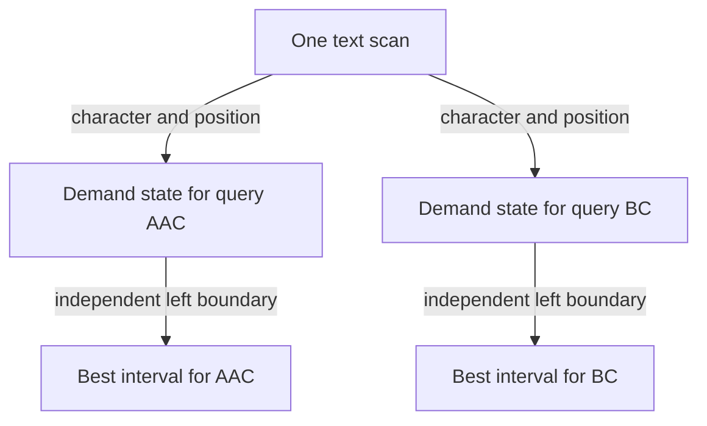

# Minimum covering window: track unmet demand

[Curriculum](../../../../README.md) · [Data structures and algorithms](../../README.md) · [All coding problems](../../../../../indexes/coding.md)

Constructed practice problem; no company attribution. Prerequisites: [longest unique window](../04-longest-unique-window/README.md) and [anagram counts](../02-valid-anagram/README.md).

## Candidate brief

> A log inspector receives a text and a multiset of required marker characters. Highlight the shortest contiguous slice containing every requested copy, allowing extra characters. Explain how duplicate requirements change your state before coding.

| Contract | Decision |
|---|---|
| Input | Python strings `text` and `required`; exact code points |
| Output | Shortest half-open `(start, end)`, earliest start on ties; `None` if impossible |
| Boundaries | Empty requirement returns `(0, 0)`; surplus copies are allowed |
| Invalid input | Either non-string argument raises `ValueError` |
| Excluded | Reordering characters or matching tokens across noncontiguous positions |

## The tool before the challenge

A covering window may contain characters the request does not need. Represent the outstanding demand as counts, not a set:
```python
from collections import Counter
need = Counter("AAB")  # A is required twice
print(need["A"])       # 2
```
With text `"AAAB"` and requirement `"AAB"`, the shortest cover is `"AAB"` at the end. Expanding earns characters; shrinking is safe only while every required count remains satisfied.

### A design choice worth saying aloud

Keep the requested counts separate from the mutable `remaining_by_character`. The latter answers how many more of each character the current window owes; a negative count means surplus, not failure. A single `missing` total can tell you when to shrink, while the count map tells you **which** removal would break coverage.

<!-- interview-rehearsal:start -->

## What the interviewer expects

The interviewer gives you the scenario and the contract above. Explain what a
successful call returns, walk through one example below, and name what your
state means *before* choosing a data structure.

**Done means:** Shortest half-open `(start, end)`, earliest start on ties; `None` if impossible.

Now predict each output before looking at the reference; invalid input should
leave any existing state unchanged unless the contract says otherwise.

### Test-case scenarios to settle before coding

| Case | Exact input or state | Expected result | What it is testing |
|---|---|---|---|
| Representative | `"ABAAC"`, required `"AAC"` | `(2, 5)` for `"AAC"` | Required multiplicities drive validity. |
| Empty requirement | any text, required `""` | `(0, 0)` | The empty need is already satisfied. |
| Impossible multiplicity | `"ab"`, required `"aa"` | `None` | Presence without enough copies is insufficient. |
| Surplus | `"AAABC"`, required `"AC"` | shortest window containing one A and one C | Extra required characters must not inflate unmet demand. |
| Tie | two equal-length valid windows | the one with the smallest start | State the deterministic result before coding. |
| Invalid | either argument is not a string | `ValueError` | Validation precedes scanning. |

For each case, show which branch or state change produces that result.

<!-- interview-rehearsal:end -->

`minimum_covering_window("ABAAC", "AAC") == (2, 5)` highlights `"AAC"`.
`minimum_covering_window("ab", "aa") is None`; `minimum_covering_window("", "") == (0, 0)`.
`minimum_covering_window("abc", None)` raises `ValueError`.

Before opening the explanation, restate the contract, trace the smallest useful
example, implement a baseline, and identify the repeated work. Then implement
your improvement independently and derive tests from the contract. Say what
your state means before saying which data structure stores it.

<details>
<summary>Worked lesson, changed requirements, and reference</summary>

### Make validity a cheap question

A baseline enumerates each start and extends a count map until all requirements
are covered. Repeating that scan costs O(n²) updates plus validity checks. A set
is insufficient: required `AAC` needs two `A`s. The reusable method is to name
the expensive question, then maintain its answer incrementally. Let `need[c]`
be required count minus current-window count, and `missing` be the number of
required **occurrences** still absent. Negative `need` means harmless surplus.

| Read / window | need A | need C | missing | Action |
|---|---:|---:|---:|---|
| initially | 2 | 1 | 3 | expand |
| A | 1 | 1 | 2 | expand |
| AB | 1 | 1 | 2 | ignore irrelevant B |
| ABAA | -1 | 1 | 1 | extra A is surplus |
| ABAAC | -1 | 0 | 0 | valid; start shrinking |
| BAAC, then AAC | 0 | 0 | 0 | improve to `[2, 5)` |
| AC after removing A | 1 | 0 | 1 | invalid; expand again |

When adding a required character, decrement `missing` only if its prior need was
positive, then decrement need. When removing one, increment need first; if it
becomes positive, increment missing. This update order distinguishes a required
copy from surplus. Non-required characters need no map entries.

While missing is zero, record the candidate and advance left. This visits the
shortest valid window ending at each right edge. A start discarded during
shrinking cannot improve at a later right edge: its window would only get
longer. Both boundaries move forward at most n times, giving expected O(n + m)
time and O(k) auxiliary space for `k` required code points. The returned indices
use O(1) space. Strictly shorter updates preserve the earliest tie. This proof
depends on coverage being preserved by expansion; arbitrary window predicates
do not automatically support two pointers.

### Follow-up 1: matches must appear in required order

Predict what breaks when `required="AC"` means a subsequence in that order.
Inventory sees `CA` as valid although the sequence is impossible.

| Text prefix | Coverage interpretation | Ordered interpretation |
|---|---|---|
| C | A still missing | no A has started a match |
| CA | complete inventory | A starts a future match |
| CAC | complete inventory | AC at `[1, 3)` completes |

Use state for progress through the required sequence, such as the latest viable
start for each matched prefix. Update matching states backward per text
character so one occurrence cannot advance several repeated required positions.
An O(nm) dynamic program is a defensible baseline; the count invariant is gone.

### Follow-up 2: several requirement sets share one text



Independent demand states remain correct but cost O(qn + total demand size).
Do not claim one universal left boundary: different queries become valid at
different positions. A senior candidate derives the exact update order and
tests multiplicity and ties. A lead candidate sets query-count and retained-text
budgets and measures whether shared preprocessing is justified by the workload.

### Run and check

From the repository root:

```bash
cd curriculum/01-code/02-data-structures-algorithms/problems/05-minimum-covering-window
python -m unittest -v test_solution.py
```

[Reference implementation](solution.py) · [Contract and oracle tests](test_solution.py).
Read the tests after your attempt. A green reference suite verifies the supplied
implementation; it does not demonstrate independent transfer. Reimplement one
follow-up with the reference closed and explain which old invariant no longer holds.

</details>

[Ordered foundation route](../foundations-index.md) · [Coding home](../../practice-sequence.md)
